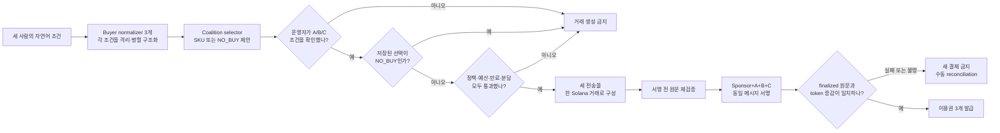

# Mandate Pool

> 세 사람의 구매 조건이 모두 맞을 때만, 세 결제를 하나의 Solana 거래로 실행하는 Agentic Commerce 프로토타입

Mandate Pool은 AI의 상품 제안과 돈을 움직이는 권한을 분리합니다. Google ADK와 Gemini가 세 구매자의 자연어 조건을 구조화하고 후보를 제안하면, 사람의 확인과 결정론적 정책이 예산·기능·기간·분담액을 다시 검증합니다. 모든 조건을 통과한 경우에만 세 전송을 하나의 Solana transaction으로 실행하며, 한 조건이라도 어긋나면 거래를 만들지 않습니다.

## 심사자용 바로가기

| 보고 싶은 것 | 링크 | 확인할 내용 |
|---|---|---|
| 2분 34초 데모 | [YouTube](https://youtu.be/of3GMQq8Qv8) · [직접 재생 MP4](https://storage.googleapis.com/project-682bea5f-ac81-4a36-8a1-mandate-pool-video/mandate-pool-demo.mp4?generation=1785769358677446) | 문제, Agent 역할, 거부 경로, Devnet 정상 거래, 한계 |
| 직접 조작하는 데모 | [Cloud Run 공개 fixture](https://mandate-pool-judge-x7id33dnyq-du.a.run.app) | 데모 키 `judge-fixture-key-v1`; 반복 실행 가능; **온체인 아님** |
| 6장 소개서 | [PDF](submission/deck.pdf) · [원고](submission/deck.md) | Why·What·How, 아키텍처, 검증 결과 |
| Devnet 정상 거래 | [Solana Explorer](https://explorer.solana.com/tx/2JMWb2wc4GTtD2XYsfD3T9F5UdQHkV7k5n88Mno9RDnBd5q7MKKyyziyRSoeQ28woWgvodqsckfuwDt2jaMy2ZAW?cluster=devnet) | 하나의 finalized transaction, slot `480936920` |
| 검증 장부 | [Submission manifest](submission/manifest.md) | 배포 source, 주문, signature, 잔액 변화, 증거 경계 |

공개 fixture는 제품 흐름을 안전하게 반복하기 위한 오프체인 환경입니다. 온체인 실행 주장은 fixture 화면이 아니라 고정된 Devnet transaction과 redacted receipt로 검증합니다.

## 30초 제품 설명

### Why

여러 사람을 대신하는 구매 Agent에는 좋은 추천만으로 부족합니다. 각 사용자의 지출 한도와 금지 조건이 유지됐는지, 한 사람만 결제되는 부분 실패가 없는지, 불명확한 네트워크 응답이 중복 결제로 이어지지 않는지를 설명하고 검증할 수 있어야 합니다.

### What

세 구매자는 각자의 예산·필수 기능·금지 기능·사용 기간을 자연어로 제시합니다. Mandate Pool은 세 조건의 교집합을 만족하는 고정 데모 상품만 선택하고, 총 `1.000000` Devnet 테스트 USDC를 A `0.333334`, B `0.333333`, C `0.333333`으로 나눕니다. B의 한도가 필요한 분담액보다 작으면 `NO_BUY`로 종료합니다.

### How

Gemini의 출력은 결제 명령이 아니라 제안입니다. 격리된 Buyer normalizer 세 개가 각 조건을 병렬로 구조화하고 coalition selector가 공통 후보 또는 `NO_BUY`를 제안합니다. BUY 후보가 있고 운영자가 A/B/C 역할의 조건을 모두 확인한 경우에만, 결정론적 정책이 승인 hash·한도·상품·만료·분담을 다시 계산합니다. 통과한 quote만 세 개의 `TransferChecked`와 memo를 담은 Solana version-0 transaction으로 바뀝니다. finalized 원문과 정확한 token 증감을 재검증한 뒤에만 애플리케이션 이용권을 발급합니다.

## 검증 결과

검증 기준은 배포 source commit [`2ac7eac`](https://github.com/procloudkim/2026-Solana-Google/tree/2ac7eac17ea803b4537b630234ac6507523e5325)과 evidence tag [`submission-v2`](https://github.com/procloudkim/2026-Solana-Google/tree/submission-v2)입니다.

| 시나리오 | 관찰 결과 | 판정 근거 |
|---|---|---|
| 정상 공동결제 | 주문 `ord_b6ab…abf9`가 `FULFILLED`; A/B/C 차감 `333334/333333/333333`; Merchant 입금 `1000000`; 이용권 3개 | [정상 order receipt](submission/evidence/normal-order-2ac7eac.json), [finalized 잔액 snapshot](submission/evidence/devnet-balance-post-normal-2ac7eac.json), [Devnet transaction](https://explorer.solana.com/tx/2JMWb2wc4GTtD2XYsfD3T9F5UdQHkV7k5n88Mno9RDnBd5q7MKKyyziyRSoeQ28woWgvodqsckfuwDt2jaMy2ZAW?cluster=devnet) |
| 한도 초과 거부 | B 한도 `300000` < 필요 분담 `333333`; 주문 `ord_82ac…6027`이 `NO_BUY`; settlement·signature 없음; 이용권 0개; 네 token 잔액 변화 0 | [거부 order receipt](submission/evidence/reject-order-2ac7eac.json), [잔액 불변 proof](submission/evidence/reject-balance-proof-2ac7eac.json) |
| Google Cloud live 의존성 | 비공개 Cloud Run live revision에서 domain·Firestore·Solana·Agent 구성 readiness 4/4 통과 | [Live preflight receipt](submission/evidence/live-preflight-2ac7eac.json), [deployment receipt](submission/evidence/deployment-2ac7eac.json) |
| 로컬 settlement gate | Agave localnet에서 같은 세 전송의 정상 원문·잔액과 거래 생성 전 거부를 검증 | [Localnet smoke receipt](submission/evidence/localnet-smoke-2026-08-03.json) |
| 현재 소스 회귀검사 | TypeScript typecheck·build와 Vitest `96/96` 통과 | 아래 [로컬 재현](#로컬-재현) 명령 |

`Devnet USDC`는 테스트 토큰이며 금전 가치가 없고 실제 달러로 담보되지 않습니다. 이 프로젝트는 Mainnet 또는 실제 자산을 사용하지 않습니다. [Circle testnet 안내](https://developers.circle.com/stablecoins/usdc-contract-addresses)

## 실행 흐름



## 권한 경계

| 주체 | 담당 | 허용하지 않는 일 |
|---|---|---|
| Google ADK·Gemini | Buyer normalizer 3개와 selector 1개로 조건 구조화·후보 제안 | 서명, RPC 호출, 정책 우회 |
| 데모 운영자 | A/B/C 역할의 mandate 확인 | 실패한 정책을 승인으로 덮어쓰기 |
| 결정론적 정책 | 승인·상품·예산·만료·분담액 재계산 | 자연어를 임의로 해석해 조건 변경 |
| Signer guard | 승인된 quote에서 원문을 파생하고 검증 | 저장된 quote와 다른 거래 서명 |
| Solana runtime | 같은 transaction의 세 token 전송을 원자적으로 실행 또는 rollback | 오프체인 정책·이용권 처리 |
| Finalized verifier | 원문·instruction·debit·credit 재검증 | 결과가 불명확할 때 새 결제 생성 |

현재 HITL은 실제 세 사용자가 각자 지갑으로 승인하는 구조가 아니라, 운영자 한 명이 A/B/C 역할을 순차 확인하는 **operator simulation**입니다. 서버가 Devnet 테스트 키를 보관하므로 비수탁 제품을 증명하지 않습니다.

## 공개 데모 사용법

1. [Cloud Run 공개 fixture](https://mandate-pool-judge-x7id33dnyq-du.a.run.app)를 엽니다.
2. 데모 운영 키에 `judge-fixture-key-v1`을 입력합니다.
3. `정상 결제`를 선택하고 새 주문을 만든 뒤 A/B/C 조건을 각각 승인합니다.
4. 실행 결과가 `FULFILLED`, 분담액 `[333334, 333333, 333333]`, 이용권 3개인지 확인합니다.
5. `한도 초과 거부`로 새 주문을 만들고 같은 순서를 반복합니다.
6. 결과가 `NO_BUY`이며 transaction evidence와 이용권이 없는지 확인합니다.

화면의 `FIXTURE · NOT ON-CHAIN` 표시는 의도된 경계입니다. 실제 Gemini·Firestore·Solana 실행은 고정된 live receipt와 Devnet transaction으로 제시합니다.

## 로컬 재현

전제 조건은 Node.js 22 이상과 npm입니다.

```bash
cd product/mandate-pool
npm ci --omit=peer
npm run typecheck
npm test
npm run build
APP_MODE=fixture DEMO_KEY=local-demo-key-1234 npm run dev
```

`http://localhost:8080`을 열고 운영 키 `local-demo-key-1234`로 공개 데모와 같은 두 시나리오를 실행합니다. 이 fixture는 네트워크·Gemini·Firestore·Solana RPC를 호출하지 않습니다. Live 구성, 무결성 불변식, API 판정법은 [제품·실행 가이드](product/mandate-pool/README.md)에 있습니다.

## 코드 지도

```text
product/mandate-pool/
├── src/agents/        ADK·Gemini adapter와 결정론적 fixture
├── src/domain/        canonical 계약, catalog, atomic 분담, 정책
├── src/workflow/      상태 머신과 idempotency
├── src/persistence/   메모리·Firestore 저장소, CAS, 감사 hash-chain
├── src/solana/        승인 quote에서 거래 의도 파생·원문 검증
├── src/runtime/       Solana Kit build·sign·submit·finalized 검증
├── src/service/       주문부터 fulfillment까지 orchestration
├── src/http/          Cloud Run HTTP API
└── public/            한국어 데모 UI
```

## 증명한 범위와 한계

| 증명한 것 | 증명하지 않은 것 |
|---|---|
| 세 승인과 정책을 통과한 한 Devnet transaction의 finalized 실행 | Mainnet·실제 자산·상용 결제 안전성 |
| 한도 초과 주문에서 transaction·signature·이용권이 생성되지 않음 | 모든 장애·공격·RPC 공급자에 대한 완전한 안전성 |
| Google ADK·Gemini 제안과 결정론적 결제 권한의 분리 | 실제 사용자 세 명의 독립 동의 또는 비수탁 custody |
| 같은 transaction 안의 세 token transfer 원자성 | Firestore와 Solana를 아우르는 분산 원자 transaction |
| custom Solana atomic settlement | x402·AP2·Solana Pay 호환 구현 |
| 고정 데모 상품의 애플리케이션 이용권 발급 | 외부 merchant 계약이나 실제 SaaS 판매 |

## 문서 안내

| 질문 | 문서 |
|---|---|
| 구현·실행·무결성 계약은? | [제품 README](product/mandate-pool/README.md) |
| 제출 release의 정확한 식별자는? | [Submission manifest](submission/manifest.md) |
| 왜 이 아이디어를 선택했나? | [아이디어 선택 보고서](research/decision-report/mece-hackathon-idea-selection.md) |
| 사람·Agent·정책의 역할은? | [HITL 설계 의사결정](research/decision-report/agentic-commerce-hitl-design-decision.md) |
| 행사 규칙과 기술 주장의 출처는? | [Official Docs Wiki](research/official-docs-wiki/README.md) |
| 환경을 다시 점검하거나 운영하려면? | [운영 런북](research/decision-report/hackathon-environment-codex-runbook.md) |

`research/`의 RPC·x402 문서는 아이디어 탐색 과정에서 보류한 후보 기록입니다. 현재 제품의 기능이나 구현 주장이 아닙니다. `참고레퍼런스/`와 `.harness/`의 원문·기계 추출 자료는 provenance 보존을 우선하므로 직접 윤문하지 않습니다.

## 보안 원칙

개인키, API key, credential payload, `.env`, entitlement token은 Git·로그·영상에 저장하지 않습니다. 저장소에는 공개 Devnet 주소·ATA·transaction signature와 Secret Manager 리소스 이름만 둡니다. 추가 온체인 거래, Mainnet, 실제 자산, 비공개 live 서비스 변경에는 별도의 사람 승인이 필요합니다.
