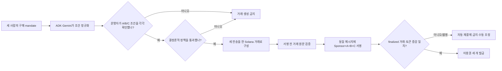

# Mandate Pool

> 세 구매자의 자연어 조건을 사람의 확인과 결정론적 정책으로 잠근 뒤, 총 1 Devnet 테스트 USDC를 하나의 Solana 거래로 공동 결제하는 Agentic Commerce 프로토타입

이 저장소는 Google Cloud × Solana AI Agentic Hackathon 출품작을 구현하고, 그 주장을 재현 가능한 증거로 관리합니다. 처음 방문한 심사자는 이 문서에서 제품의 이유와 현재 증거 수준을 확인할 수 있고, 개발자는 [제품 README](product/mandate-pool/README.md)에서 로컬 실행을 시작할 수 있으며, 운영자는 [제출 런북](research/decision-report/hackathon-environment-codex-runbook.md)에서 남은 작업을 이어갈 수 있습니다.

상태 표기는 **2026-08-03 KST에 고정한 소스 commit과 redacted receipt 기준**입니다. commit `2ac7eac17ea803b4537b630234ac6507523e5325`에서 비공개 live revision의 readiness와 정상·거절 경로를 실행해 검증했습니다. 이는 제품 릴리스의 실행 증거이며, 최종 제출 폼 작성이나 데모 영상 제출 완료를 뜻하지 않습니다.

## 한눈에 보는 현재 상태

| 영역 | 현재 사실 | 남은 행동 |
|---|---|---|
| 소스 | 검증 기준은 commit `2ac7eac17ea803b4537b630234ac6507523e5325`입니다. | 이후 변경이 있으면 검증과 receipt를 새 commit에 다시 고정합니다. |
| Google Cloud | 공개 fixture revision은 `mandate-pool-judge-00004-kxd`, 비공개 live revision은 `mandate-pool-live-00005-4tb`입니다. live image digest는 `sha256:5d22c850b5fb113eaff07d653368b1cfac6e8a00d49b5e1a2ebaa9a586f0b995`이며 readiness 네 항목이 모두 `true`입니다. | 심사자 접근 방식을 최종 확인합니다. |
| 정상 Devnet | 주문 `ord_b6ab984c23334cb0a3f8480d4c12abf9`가 `FULFILLED`됐습니다. finalized slot `480936920`에서 A/B/C debit `333334/333333/333333`, Merchant credit `1000000`, 이용권 3개를 확인했습니다. | 이 한 건의 receipt를 덱·영상과 동일하게 연결합니다. |
| 거절 경로 | 주문 `ord_82ac0530d4744e098f181aa5460e6027`가 `NO_BUY`로 끝났고 settlement evidence와 이용권이 생성되지 않았습니다. | 거절 화면과 receipt를 데모 영상에 함께 제시합니다. |
| 제출 | 최종 폼과 데모 영상 제출은 아직 완료됐다고 주장하지 않습니다. | 로그인 후 제출 조건·링크 접근성을 확인하고 사람이 최종 제출합니다. |

`Devnet USDC`는 테스트 토큰입니다. 금전 가치가 없고 실제 달러로 담보되지 않습니다. 이 프로젝트는 Mainnet 또는 실제 자산을 사용하지 않습니다. [Circle의 testnet 안내](https://developers.circle.com/stablecoins/usdc-contract-addresses)

검증 자료는 다음 순서로 읽을 수 있습니다.

- 배포 의존성: [live preflight receipt](submission/evidence/live-preflight-2ac7eac.json)
- 정상 주문: [normal order receipt](submission/evidence/normal-order-2ac7eac.json), [finalized 이후 잔액 snapshot](submission/evidence/devnet-balance-post-normal-2ac7eac.json)
- 거절 주문: [reject order receipt](submission/evidence/reject-order-2ac7eac.json)
- 선행 localnet gate: [localnet smoke receipt](submission/evidence/localnet-smoke-2026-08-03.json)

정상 transaction signature는 [`2JMW…2ZAW`](https://explorer.solana.com/tx/2JMWb2wc4GTtD2XYsfD3T9F5UdQHkV7k5n88Mno9RDnBd5q7MKKyyziyRSoeQ28woWgvodqsckfuwDt2jaMy2ZAW?cluster=devnet)입니다. 링크는 Solana **Devnet 테스트 토큰**의 실행 결과를 가리키며 Mainnet 또는 실제 자산 결제를 뜻하지 않습니다.

## IDEA: 에이전트의 추천이 아니라 결제 권한을 설계한다

이 프로젝트에서 Agentic Commerce는 “AI가 알아서 돈을 쓴다”는 뜻이 아닙니다. 사람이 미리 정한 mandate 안에서 에이전트가 후보를 찾고 조정하되, 결제는 검증 가능한 승인·예산·거래 불변식을 모두 만족할 때만 실행된다는 제품 원칙입니다.

### Why

여러 사람을 대신하는 에이전트가 공동 구매를 진행하면 추천 품질만으로는 부족합니다. 각 구매자의 한도와 금지 조건이 유지됐는지, 일부 사용자만 결제되는 실패가 없는지, 네트워크 재시도 때문에 중복 결제가 생기지 않는지를 설명하고 증명해야 합니다.

### What

Mandate Pool은 세 구매자의 자연어 구매 조건을 구조화하고, 프로토타입 운영자가 각 역할의 조건을 확인한 뒤, 모든 조건의 교집합을 만족하는 고정 데모 상품 `SignalDesk Team-3` 7일 이용권 세 개를 공동 구매합니다. 각 Buyer의 Devnet USDC ATA에서 한 Merchant ATA로 분담액을 보내고, Sponsor는 SOL network fee만 냅니다. 한 명의 조건이라도 맞지 않으면 거래를 만들지 않습니다. 이용권은 온체인 토큰이 아니라 결제 검증 뒤 애플리케이션이 발급하는 7일 접근 token입니다.

### How

Google ADK와 Gemini는 자연어를 정규화하고 후보를 제안합니다. 결정론적 정책 엔진은 승인·상품·예산·만료·정확한 분담액을 다시 계산합니다. 통과한 경우에만 Solana version-0 transaction 하나에 세 개의 `TransferChecked`를 넣습니다. 같은 runtime의 후속 verifier가 저장된 quote에서 기대한 원문과 finalized transaction·잔액 증감을 다시 대조한 뒤에만 이용권을 발급합니다. 별도 검증 서비스가 있다는 뜻은 아닙니다.

## 데모가 답해야 하는 질문

정상 경로와 거부 경로를 나란히 검증해야 제품 주장이 성립합니다. 위 릴리스에서 두 경로를 각각 별도 주문으로 실행했습니다.

- **정상:** 총 `1.000000` Devnet USDC를 A `0.333334`, B `0.333333`, C `0.333333`으로 정확히 나누고, 한 거래가 finalized된 뒤에만 이용권 세 개를 발급합니다.
- **거부:** B의 한도를 `0.300000`으로 낮추면 정책이 `NO_BUY`를 반환하며 거래 bytes와 signature를 만들지 않습니다.



## 누가 무엇을 결정하는가

| 주체 | 할 수 있는 일 | 할 수 없는 일 |
|---|---|---|
| Gemini·ADK | 자연어 조건 정규화, 상품 후보 제안 | 서명, RPC 호출, 정책 승인 |
| 데모 운영자 | A/B/C 역할의 조건을 순서대로 확인 | 정책 불일치 우회 |
| 정책 엔진 | 승인·예산·상품·만료·분담액 재계산 | 자연어 의미 추측 |
| 애플리케이션 signer guard | 승인된 quote에서 원문 구성·서명·제출 | 저장된 quote와 다른 거래 허용 |
| Solana runtime | 세 token instruction을 원자적으로 실행 또는 rollback | 오프체인 정책이나 이용권 발급 |
| 애플리케이션 finalized verifier | 메시지, instruction, debit·credit 검증 | 결과가 불명확할 때 자동 재결제 |

현재 HITL은 실제 세 사용자가 각자 지갑으로 승인하는 구조가 아니라, 한 명의 데모 운영자가 세 역할을 재현하는 **operator simulation**입니다. 실제 다자간 제품으로 확장하려면 buyer별 승인 서명과 외부 wallet/co-signer가 필요합니다.

따라서 v0가 증명하는 범위는 **서버가 보관한 Devnet 테스트 키로 세 승인 단계를 재현했을 때도 mandate hash·nonce·정책·거래 원문이 서로 묶여 우회되지 않는가**입니다. 실제 사용자 세 명의 독립 동의나 비수탁 보안을 증명하지 않습니다. 여기서 “v0 데모”는 제품 버전이고, “Solana version-0 transaction”은 transaction message 형식입니다.

## 5분 로컬 실행

전제 조건은 Node.js 22 이상과 npm입니다. 다음 fixture는 네트워크나 실제 온체인 거래를 사용하지 않습니다.

```bash
cd product/mandate-pool
npm ci --omit=peer
npm run typecheck
npm test
npm run build
APP_MODE=fixture DEMO_KEY=local-demo-key-1234 npm run dev
```

브라우저에서 `http://localhost:8080`을 열고 운영 키에 `local-demo-key-1234`를 입력합니다. `정상 결제` 또는 `한도 초과 거부`를 고른 뒤 `새 주문 만들기` → A/B/C의 `이 조건을 승인` → `검증 및 결제 실행` 순서로 진행합니다. 화면의 `fixture · NOT ON-CHAIN` 표시는 이 결과가 Solana 거래 증거가 아님을 뜻합니다. 정확한 판정값과 Live Devnet 구성은 [제품 README](product/mandate-pool/README.md#fixture-실행-제품-흐름만-빠르게-확인)에서 이어집니다.

## 기술 구조

```text
Browser / HTTP API
        |
        v
Live: Google ADK + Gemini -> 제안과 자연어 정규화만 수행
Fixture: deterministic adapter -> AI·network 호출 없이 흐름 재현
        |
        v
Deterministic policy -----> 승인·예산·상품·분담·만료 검증
        |
        v
Firestore workflow -------> 상태 CAS·idempotency·감사 hash-chain
        |
        v
Solana transaction -------> 3 transfers + memo + 4 signers
        |
        v
Finalized verifier -------> 원문·instruction·잔액 증감 검증 후 fulfillment
```

- `product/mandate-pool/src/agents/`: ADK/Gemini adapter와 결정론적 fixture
- `product/mandate-pool/src/domain/`: canonical 계약, atomic amount, catalog, 정책
- `product/mandate-pool/src/workflow/`, `src/persistence/`: 상태 머신, CAS, 감사 원장
- `product/mandate-pool/src/solana/`, `src/runtime/`: 거래 의도와 Solana Kit 실행·검증
- `product/mandate-pool/src/service/`: 주문부터 fulfillment까지 orchestration
- `product/mandate-pool/src/http/`, `public/`: Cloud Run API와 한국어 데모 UI

## 증거를 읽는 순서

| 독자 질문 | 문서 | 문서의 역할 |
|---|---|---|
| 제품을 어떻게 실행하고 검증하나? | [제품 README](product/mandate-pool/README.md) | 데모 계약, 로컬·Live 실행, 무결성 경계 |
| 지금 당장 무엇을 해야 하나? | [제출 런북](research/decision-report/hackathon-environment-codex-runbook.md) | 현재 상태, 사람/Codex 역할, 순서별 체크리스트 |
| 행사 규칙과 기술 주장의 출처는 무엇인가? | [Official Docs Wiki](research/official-docs-wiki/README.md) | 공식 출처, claim verdict, 프로젝트 적용점 |
| 실제로 무엇을 실행했나? | [Evidence receipts](research/decision-report/evidence/) | 방법, 관찰 결과, 한계, 재현 조건 |
| 제출 릴리스가 실제로 어떤 결과를 냈나? | [Submission evidence](submission/evidence/) | localnet gate, live readiness, 정상·거절 주문과 잔액 snapshot |
| 왜 이 아이디어를 선택했나? | [아이디어 선별 보고서](research/decision-report/mece-hackathon-idea-selection.md) | 후보의 계보와 현재 선택 이유 |
| 이전 RPC Rescue 안은 왜 중단했나? | [RPC Rescue Core PRD](research/decision-report/rpc-rescue-core-prd.md) | 폐기·보류된 가설과 재개 조건 |

`참고레퍼런스/`, `.harness/enrichment/`, `.harness/wiki/raw_references/`는 원문 또는 기계 추출 증거입니다. 문장 품질보다 원문 보존과 provenance가 우선이므로 직접 윤문하지 않습니다. `.harness/wiki/operations/`는 append-only readiness ledger에서 생성되는 보조 projection이며, 현재 실행 상태의 단일 기준은 제출 런북입니다.

## 증거 수준과 금지된 주장

- fixture 성공은 UI·정책·상태 흐름의 로컬 증거일 뿐 온체인 증거가 아닙니다.
- readiness 성공은 Vertex·Firestore·Solana 의존성 연결을 증명하지만 제품 주문의 성공을 증명하지 않습니다.
- 이번 제품 주문 성공은 readiness가 아니라 정상 order receipt, finalized transaction, 정확한 token delta와 entitlement count를 함께 대조해 판정했습니다.
- Devnet signature와 Explorer 링크는 테스트 네트워크 실행 증거이며 실제 금액 결제 증거가 아닙니다.
- 정상 경로만으로는 안전성을 주장하지 않습니다. 거부 경로에서 거래가 생성되지 않았다는 증거가 함께 필요합니다.
- x402는 조사한 결제 프로토콜이지만 Mandate Pool v0의 결제 rail은 custom Solana atomic settlement입니다. x402 호환을 주장하지 않습니다.

## 용어

- **mandate:** 구매자가 허용한 mint·판매자·기능·기간·개인 분담 한도·만료 조건의 구조화된 계약
- **HITL:** Human-in-the-Loop. 결제 경로 중 사람이 조건을 확인하는 단계
- **ATA:** Associated Token Account. 각 owner와 mint에 대응하는 SPL token 계정
- **quote:** 선택 상품, 세 분담액, 승인된 mandate hash, 수취인을 고정한 결제 의도
- **CAS:** Compare-and-swap. 읽은 version이 그대로일 때만 상태와 예산을 갱신하는 동시성 제어
- **fulfillment:** finalized 결제를 검증한 뒤 애플리케이션 이용권을 발급하는 단계

## 비밀정보와 비용 경계

지갑 개인키, API key, credential payload, `.env` 파일은 Git과 제출 자료에 넣지 않습니다. Devnet signer는 GCP Secret Manager에서 Cloud Run revision으로 주입하고, 저장소에는 공개 주소·ATA와 Secret Manager 리소스 이름만 둡니다. Mainnet 전환, 실제 자산 사용, 비공개 live 서비스의 공개 전환, 추가 온체인 거래, 최종 제출은 사람의 명시적 승인이 필요합니다.

## 보조 리서치 하네스

루트의 Python 하네스는 원문을 provenance와 함께 동기화하고, 코드·문서 graph와 bounded context pack을 생성하는 보조 도구입니다. 제품 runtime은 `product/mandate-pool/`의 TypeScript 앱이며 하네스와 구분합니다.

```bash
python -m pip install -r requirements-harness.txt
make harness-sync
make harness-graph
make test
```

Windows에서는 `make` 대신 `./harness.ps1 sync`, `./harness.ps1 graph`, `./harness.ps1 test`를 사용합니다. MP4 전사와 PDF OCR은 별도의 무거운 작업이며 `requirements-media.txt`와 `harness.ps1 media`를 사용합니다. 자동 생성 산출물은 직접 편집하지 않고 generator 또는 source of truth를 고친 뒤 다시 생성합니다.
