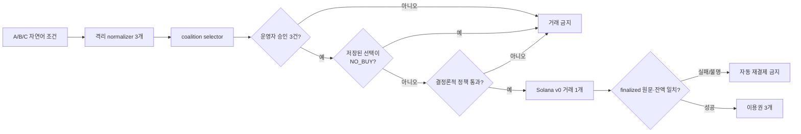

# Mandate Pool 구현·재현 계약

Mandate Pool은 세 구매자의 자연어 구매 조건을 네 개의 Google ADK 에이전트로 구조화하고, 사람의 확인과 결정론적 정책을 통과한 경우에만 세 분담금을 하나의 Solana 거래로 정산하는 Agentic Commerce 프로토타입입니다.

이 문서는 코드를 검토하거나 직접 실행할 심사자와 개발자를 위한 기준 문서입니다. 제품의 짧은 소개는 [저장소 README](../../README.md), 고정된 release와 증거 식별자는 [제출 evidence manifest](../../submission/manifest.md)를 따릅니다.

## 먼저 확인할 링크

- **공개 제품 흐름:** [Cloud Run fixture](https://mandate-pool-judge-x7id33dnyq-du.a.run.app/) · 데모 운영 코드 `judge-fixture-key-v1`
- **2분 34초 설명:** [YouTube 데모](https://youtu.be/of3GMQq8Qv8)
- **실제 Devnet 실행:** [Solana Explorer transaction `2JMW…2ZAW`](https://explorer.solana.com/tx/2JMWb2wc4GTtD2XYsfD3T9F5UdQHkV7k5n88Mno9RDnBd5q7MKKyyziyRSoeQ28woWgvodqsckfuwDt2jaMy2ZAW?cluster=devnet)
- **비밀 제거 증거:** [정상 주문](../../submission/evidence/normal-order-2ac7eac.json) · [거절 주문](../../submission/evidence/reject-order-2ac7eac.json)

공개 Cloud Run은 반복 가능한 **fixture**입니다. Gemini, Firestore, Solana RPC를 호출하지 않으며 화면에도 `FIXTURE · NOT ON-CHAIN`을 표시합니다. 실제 Devnet 실행은 Explorer와 저장된 receipt로 별도 검증합니다. 공개된 데모 운영 코드는 결제 권한이나 live 서비스 credential이 아닙니다.

### 공개 fixture를 검토하는 순서

1. 공개 Cloud Run을 열고 `judge-fixture-key-v1`을 입력합니다.
2. `정상 결제`로 새 주문을 만들고 A, B, C의 조건을 각각 승인합니다.
3. `검증 및 결제 실행` 뒤 `FULFILLED`, 분담 `[333334, 333333, 333333]`, 이용권 3개를 확인합니다.
4. `한도 초과 거부`로 별도 주문을 만들고 같은 승인 절차를 반복합니다.
5. `NO_BUY`, transaction evidence 없음, 이용권 0개를 확인합니다.
6. 온체인 주장은 fixture가 아니라 위 Devnet Explorer와 정상 receipt에서 확인합니다.

## 검증된 release

2026-08-04 KST 기준으로 배포 소스 commit `2ac7eac17ea803b4537b630234ac6507523e5325`에서 localnet gate, 비공개 live readiness, 정상 Devnet 정산과 한도 초과 거절을 검증했습니다.

| 구간 | 관찰 결과 | 증거 |
|---|---|---|
| 공개 fixture | `mandate-pool-judge-00004-kxd`; UI·정책·상태 흐름 재현, 온체인 아님 | 공개 Cloud Run과 `/api/v1/runtime`의 fixture 표시 |
| 비공개 live | `mandate-pool-live-00005-4tb`; image digest `sha256:5d22c850b5fb113eaff07d653368b1cfac6e8a00d49b5e1a2ebaa9a586f0b995`; readiness 4/4 | [live preflight](../../submission/evidence/live-preflight-2ac7eac.json) |
| 정상 주문 | `ord_b6ab984c23334cb0a3f8480d4c12abf9` → `FULFILLED`; finalized slot `480936920`; 이용권 3개 | [주문 receipt](../../submission/evidence/normal-order-2ac7eac.json) · [잔액 snapshot](../../submission/evidence/devnet-balance-post-normal-2ac7eac.json) |
| 거절 주문 | `ord_82ac0530d4744e098f181aa5460e6027` → `NO_BUY`; settlement evidence 없음; 이용권 0개; 잔액 불변 | [주문 receipt](../../submission/evidence/reject-order-2ac7eac.json) · [잔액 증거](../../submission/evidence/reject-balance-proof-2ac7eac.json) |

Devnet USDC는 테스트 토큰이며 실제 달러가 아닙니다. 이 release는 Mainnet 가치 이전이나 상용 결제 안전성을 증명하지 않습니다. [Circle testnet token 안내](https://developers.circle.com/stablecoins/usdc-contract-addresses)

## 제품 실행 계약

SignalDesk Team-3는 API·CSV·7일 이용·자동 갱신 없음 조건을 가진 고정 데모 상품입니다. 제품이 검증하는 대상은 외부 상품 시장이 아니라, 서로 다른 세 구매 권한을 한 quote와 한 원자 거래에 묶는 제어 방식입니다. 결제 뒤 발급되는 이용권도 NFT가 아니라 검증된 주문에 연결된 HMAC 서명 애플리케이션 token입니다.

### 정상 경로

총 `1,000,000` atomic unit, 즉 `1.000000` Devnet USDC를 고정된 A→B→C 순서로 나눕니다. USDC는 decimals `6`인 정수 amount로 계산하며, 나머지 1 atomic unit은 canonical 첫 구매자 A에게 배정합니다.

| 구매자 | 자연어 조건의 핵심 | 분담액 | 정상 한도 |
|---|---|---:|---:|
| A | API·CSV 필수 | `0.333334` | `0.400000` |
| B | API 필수·자동 갱신 금지 | `0.333333` | `0.340000` |
| C | 7일 일회성 이용 | `0.333333` | `0.400000` |
| 합계 | 세 조건의 교집합 | `1.000000` | - |

구조화된 mandate, canonical hash, 허용 predicate는 각각 [`src/domain/types.ts`](src/domain/types.ts), [`src/domain/canonical.ts`](src/domain/canonical.ts), [`src/domain/policy.ts`](src/domain/policy.ts)가 정의합니다. 문서의 자연어 설명보다 코드와 회귀 test가 실행 계약에 우선합니다.

### 거절 경로

Buyer B의 한도를 `0.300000`으로 낮추면 필요한 `0.333333`을 감당할 수 없습니다. 결과는 `NO_BUY`와 `NO_COMMON_PRODUCT`이며 다음 조건이 모두 성립해야 합니다.

- settlement plan이 없습니다.
- transaction bytes와 signature가 없습니다.
- entitlement가 0개입니다.
- Buyer A/B/C와 Merchant의 token 잔액이 변하지 않습니다.

## 에이전트와 권한 경계

Live runtime은 Gemini 2.5 Flash를 사용하는 네 개의 도구 없는 `LlmAgent`를 실행합니다.

1. Buyer A, B, C의 **격리된 normalizer 3개**가 자연어 조건을 병렬로 구조화합니다. 서로에게 transfer할 수 없고 signer·RPC 도구가 없습니다.
2. **Coalition selector 1개**가 세 제안과 서버의 canonical catalog만 보고 SKU 하나 또는 `NO_BUY`를 제안합니다.
3. 서버는 model이 고른 mint나 merchant를 받지 않습니다. 허용 mint·merchant와 catalog는 authoritative server configuration입니다.
4. selector가 제안한 **SKU BUY 후보만** 결정론적 정책 엔진이 승인·예산·기능·기간·분담·만료 조건과 다시 대조합니다. 저장된 선택이 `NO_BUY`면 세 역할 확인 뒤 quote·policy check·settlement 없이 종료합니다.

구현은 [`src/agents/adk-runtime.ts`](src/agents/adk-runtime.ts), agent 출력 계약은 [`src/agents/contracts.ts`](src/agents/contracts.ts)에서 확인할 수 있습니다.

| 단계 | 권위자 | 강제되는 경계 |
|---|---|---|
| 자연어 구조화·상품 제안 | Google ADK·Gemini | 비권위적 제안만 생성; signer·RPC 접근 없음 |
| 조건 확인 | 데모 운영자 | A/B/C 역할별 mandate hash와 일회성 nonce 확인 |
| 결제 결정 | 결정론적 정책 엔진 | model 출력을 신뢰하지 않고 모든 불변식 재계산 |
| 거래 구성·서명 | transaction builder·signer guard | 승인된 quote에서 파생한 원문만 서버 보관 Devnet 키로 서명 |
| token 전송 | Solana runtime | 같은 transaction의 세 instruction을 전부 실행하거나 rollback |
| 이용권 발급 | finalized verifier | 원문·instruction·잔액 증감이 모두 일치해야 함 |

현재 HITL은 실제 구매자 세 명이 각자 지갑으로 승인하는 구조가 아니라, 한 명의 데모 운영자가 A/B/C 역할을 순서대로 확인하는 **operator simulation**입니다. mandate hash와 nonce는 승인 대상을 고정하지만 실제 세 사람의 신원이나 독립 서명을 증명하지 않습니다.



## 거래와 상태 무결성

서명 전 verifier는 다음 조건을 모두 확인합니다.

- transaction version은 `0`이고 address lookup table이 없습니다.
- fee payer는 Sponsor이며 필수 signer는 Sponsor+A+B+C 네 명입니다.
- classic SPL Token Program의 `TransferChecked`가 A→B→C 순서로 정확히 세 개 있습니다.
- source ATA, Merchant destination ATA, mint, amount, decimals, authority가 quote와 같습니다.
- memo는 `MP1:<quoteHash>:<policyProofHash>` 하나이며 추가 instruction이 없습니다.
- decoder가 message 전체를 소비하고 재인코딩한 bytes가 원문과 같습니다.

세 token transfer는 한 Solana transaction 안에서 원자적으로 실행됩니다. 다만 실패한 transaction에서도 Sponsor의 SOL fee가 발생할 수 있고, Firestore 상태와 Solana 거래가 하나의 분산 원자 연산인 것은 아닙니다. 애플리케이션은 version CAS, 일회성 quote·settlement key, idempotency record로 상태를 보호합니다.

Fully signed bytes는 RPC 제출 전에 내구 저장합니다. 응답을 잃으면 새 거래를 만들지 않고 같은 bytes만 다시 제출합니다. blockhash가 만료됐는데 결과가 불명확하면 `RECONCILIATION_REQUIRED`로 멈추고 기존 signature를 읽기 전용으로 조사합니다. 이용권은 finalized transaction 원문과 A/B/C debit·Merchant credit을 확인한 뒤에만 발급합니다.

## 로컬 fixture 재현

### 전제 조건

- Node.js 22 이상
- npm
- 저장소 root에서 실행

```bash
cd product/mandate-pool
npm ci --omit=peer
npm run typecheck
npm test
npm run build
APP_MODE=fixture DEMO_KEY=local-demo-key-1234 npm run dev
```

`http://localhost:8080`을 열고 `local-demo-key-1234`를 입력한 뒤 공개 fixture와 같은 순서로 정상·거절 경로를 실행합니다. 시작 로그는 `FIXTURE MODE — NOT ON-CHAIN`과 `Mandate Pool listening on port 8080`을 포함해야 합니다.

Fixture는 `FixtureAgentRuntime`, 메모리 저장소, 모의 settlement를 사용합니다. 실제 Gemini, Vertex AI, Firestore, Solana RPC를 호출하지 않으므로 UI/API·정책·상태 전이만 증명합니다. idempotency replay와 내부 settlement plan·raw bytes·예산 예약 부재는 [`test/service.integration.test.ts`](test/service.integration.test.ts)가 판정합니다.

현재 검증 결과는 **11개 test file, 96/96 tests 통과**, typecheck 통과, build 통과입니다. 설치에서 `--omit=peer`를 사용하는 이유는 앱이 ADK `InMemoryRunner`만 사용하고 미사용 MikroORM database driver peer를 runtime에 설치하지 않기 위해서입니다. 자세한 판정은 [의존성 보안 receipt](../../research/decision-report/evidence/dependency-security-audit-2026-08-03.md)에 있습니다.

## Localnet settlement gate

Localnet은 fixture 다음, Devnet 전에 실제 transaction build·submit·finality·잔액 검증을 수행하는 격리 단계입니다. 일회용 mint와 signer만 사용하며 Devnet RPC, Circle Devnet mint, Secret Manager, 저장된 Devnet key를 읽지 않습니다. 출력은 기존 파일을 덮어쓰지 않으므로 새 임시 디렉터리를 만듭니다.

```bash
LOCALNET_RECEIPT_DIR="$(mktemp -d)"
SOLANA_TEST_VALIDATOR_BIN=/path/to/solana-test-validator \
  npm --prefix product/mandate-pool run localnet:smoke -- \
  --output="$LOCALNET_RECEIPT_DIR/localnet-smoke.json"
```

고정 release의 [localnet receipt](../../submission/evidence/localnet-smoke-2026-08-03.json)는 Agave 4.1.1에서 다음을 확인했습니다.

- B cap `300000` 거절은 transaction 생성 전에 멈췄습니다.
- 정상 경로는 v0 transaction 하나에 `[333334, 333333, 333333]` 세 `TransferChecked`와 memo 하나를 담았습니다.
- finalized 뒤 원문, signature, A/B/C debit과 Merchant `1000000` credit을 다시 검증했습니다.

Localnet signature는 폐기된 local ledger에만 존재하므로 Devnet Explorer 증거가 아닙니다.

## Live Devnet 계약

Live는 실제 외부 의존성을 사용하는 비공개 Cloud Run mode입니다. 공개 fixture와 달리 Vertex AI, Firestore, Solana Devnet RPC를 사용합니다. 추가 live 결제는 새 사람 승인과 새 evidence bundle이 필요한 별도 실행이며, 이 문서는 재실행을 지시하지 않습니다.

### 고정 설정과 fail-closed 시작

| 항목 | 값 |
|---|---|
| Solana cluster | Devnet |
| Devnet genesis hash | `EtWTRABZaYq6iMfeYKouRu166VU2xqa1wcaWoxPkrZBG` |
| Circle Devnet USDC mint | `4zMMC9srt5Ri5X14GAgXhaHii3GnPAEERYPJgZJDncDU` |
| Token program | classic SPL Token Program |
| decimals | `6` |
| Google model | Vertex AI `gemini-2.5-flash` |
| 상태 저장 | Firestore |

Cloud Run은 user-managed service account를 사용합니다. `DEMO_KEY`, entitlement HMAC key, Sponsor와 Buyer A/B/C signer는 Secret Manager의 명시적 version에서 주입하며 저장소에는 넣지 않습니다. 공개 owner와 ATA만 [devnet-wallets.public.json](devnet-wallets.public.json)에 기록합니다.

`APP_MODE=live npm start`는 HTTP listen 전에 signer 형식, Vertex `countTokens`, Devnet genesis, mint·decimals, Buyer·Merchant ATA, catalog Merchant 일치, Buyer 최대 분담 가능 잔액을 검사합니다. 하나라도 실패하면 서버를 열지 않습니다.

`/readyz`의 `domain`, `stateRepository`, `settlement`, `agentConfiguration`은 각각 catalog, Firestore read, Solana finalized block-height, 캐시된 Vertex probe를 뜻합니다. 네 값이 모두 true여도 실제 Gemini 생성이나 주문 성공을 증명하지 않습니다.

## 읽기 전용 evidence export

Exporter는 `/health`, `/readyz`, `/api/v1/runtime`, `/api/v1/orders/{id}`에 `GET`만 보내며 mutation header를 만들지 않습니다. Private Cloud Run identity token은 요청 header에만 사용하고 출력 JSON에는 포함하지 않습니다. `--output`은 기존 파일을 덮어쓰지 않습니다.

```bash
EVIDENCE_OUTPUT_DIR="$(mktemp -d)"

EVIDENCE_BASE_URL=https://SERVICE.run.app \
EVIDENCE_ID_TOKEN="$(gcloud auth print-identity-token)" \
  npm --prefix product/mandate-pool run evidence:export -- \
  --mode=preflight \
  --output="$EVIDENCE_OUTPUT_DIR/live-preflight.json"

EVIDENCE_ID_TOKEN="$(gcloud auth print-identity-token)" \
  npm --prefix product/mandate-pool run evidence:export -- \
  --mode=reject \
  --base-url=https://SERVICE.run.app \
  --order-id=ORDER_ID \
  --output="$EVIDENCE_OUTPUT_DIR/reject-order.json"
```

정상 order export는 `FULFILLED`, agent SKU 일치, 총 `1000000`, canonical 분담, finalized Devnet, `meta.err=null`, transfer 3개, signer 4명, 정확한 source debit·destination credit, 이용권 3개가 모두 맞을 때만 `PASS`입니다. 거절 export는 `NO_BUY` 또는 `POLICY_REJECTED`, settlement evidence 부재, 이용권 0개를 요구합니다.

## x402 경계

Mandate Pool v0는 **x402 구현이 아닙니다.** x402 `exact` buyer flow는 한 client wallet이 고정 가격의 payment payload를 만드는 단일 payer 구조입니다. 이 프로토타입의 핵심 계약은 세 source account, 세 개의 독립 한도, Sponsor를 포함한 네 signer, 세 전송의 한 transaction 정산이므로 custom Solana atomic settlement를 사용합니다. x402는 향후 단일 payer HTTP resource 구매가 필요할 때 별도 adapter로 검토합니다. [x402 buyer flow](https://docs.cdp.coinbase.com/x402/quickstart-for-buyers)

## 코드 지도

- [`src/agents/`](src/agents/): ADK normalizer 3개, coalition selector, 결정론적 fixture
- [`src/domain/`](src/domain/): canonical 계약, catalog, atomic 분담, 정책, hash
- [`src/workflow/`](src/workflow/), [`src/persistence/`](src/persistence/): 상태 머신, version CAS, 감사 hash-chain, Firestore adapter
- [`src/solana/`](src/solana/): 승인 quote에서 거래 의도를 파생하고 서명 전 원문 검증
- [`src/runtime/`](src/runtime/): Solana Kit build·sign·RPC·finalized verifier
- [`src/service/`](src/service/): 주문, 역할별 HITL, 정책, 결제, 이용권 orchestration
- [`src/evidence/`](src/evidence/), [`src/cli/`](src/cli/): mutation 권한 없는 evidence validator·exporter
- [`scripts/localnet-smoke.ts`](scripts/localnet-smoke.ts): 일회용 validator·mint·signer 기반 localnet gate
- [`src/http/`](src/http/), [`public/`](public/): Cloud Run API와 한국어 데모 UI

## 현재 한계

- HITL은 실제 세 사용자의 독립 지갑 승인이 아니라 운영자 역할 시뮬레이션입니다.
- Buyer Devnet key는 서버가 보관합니다. 비수탁 wallet 제품을 증명하지 않습니다.
- SignalDesk catalog와 이용권은 제품 제어 흐름을 검증하기 위한 내장 데모입니다. 외부 merchant 통합이나 시장 수요를 증명하지 않습니다.
- 공개 fixture는 온체인 증거가 아닙니다. 실제 Devnet 증거는 한 번의 정상 주문과 별도 거절 주문에 한정됩니다.
- Solana transaction의 세 token transfer는 원자적이지만 Firestore와 Solana 전체가 하나의 분산 transaction인 것은 아닙니다.
- Mainnet, 실제 자산, AP2 적합성, x402 호환성, 상용 custody와 운영 안정성은 범위 밖입니다.
