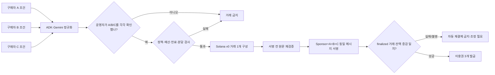

# Mandate Pool 제품·실행 가이드

Mandate Pool은 세 구매자의 조건을 하나의 공동 구매로 조정하되, 사람의 확인과 결정론적 정책을 모두 통과한 경우에만 총 1 Devnet 테스트 USDC를 하나의 Solana 거래로 결제하는 해커톤 프로토타입입니다.

**현재 증거 기준은 2026-08-03 KST입니다.** 로컬 fixture와 코드 검증, Agave 4.1.1 localnet 정상·거부 smoke, 비공개 Cloud Run 의존성 readiness, Devnet 지갑 준비는 끝났습니다. 현재 1 USDC 소스의 새 Cloud Run revision과 실제 제품 Devnet transaction은 아직 없으므로 구현 상태와 end-to-end 실행 증거를 구분해야 합니다.

이 문서는 세 질문에 답합니다.

1. 이 제품은 어떤 Agentic Commerce 문제를 해결하는가?
2. AI·사람·정책 엔진·블록체인의 권한은 어떻게 분리되는가?
3. fixture와 Live Devnet을 어떻게 실행하고 무엇을 증거로 인정하는가?

## 제품 IDEA: Why · What · How

### Why: 공동 구매에서는 추천보다 권한 보존이 어렵다

에이전트가 여러 사람을 대신해 결제할 때는 좋은 상품을 찾는 것만으로 부족합니다. 각 구매자의 한도와 금지 조건이 그대로 유지됐는지, 한 사람의 실패 때문에 일부만 결제되지 않는지, 네트워크 재시도 때문에 같은 주문이 두 번 결제되지 않는지를 검증할 수 있어야 합니다.

### What: 조건의 교집합만 원자적으로 결제한다

세 구매자가 자연어로 구매 조건을 제출합니다. Google ADK와 Gemini가 이를 구조화하고 상품 후보를 제안하면, 프로토타입 운영자가 A/B/C 역할의 조건을 차례로 확인합니다. 모든 조건과 예산을 만족하는 경우에만 SignalDesk Team-3 7일 이용권 세 개를 공동 구매합니다. 각 Buyer의 Devnet USDC ATA에서 하나의 Merchant ATA로 분담액을 보내고 Sponsor는 SOL network fee만 냅니다. 한 조건이라도 어긋나면 `NO_BUY`로 종료하며 거래를 만들지 않습니다.

SignalDesk는 이 프로토타입의 고정된 데모 상품입니다. 제품의 핵심은 상품 자체가 아니라 서로 다른 세 mandate를 한 결제 의도와 한 원자 거래로 묶는 제어 방식입니다. 발급되는 이용권은 NFT나 온체인 자산이 아니라, 검증된 주문 상태에 연결된 HMAC 서명 애플리케이션 접근 token입니다.

### How: AI의 제안과 결제 권한을 분리한다

Gemini에는 signer나 RPC 도구가 없습니다. 모델 출력은 결제 명령이 아니라 비권위적 제안입니다. 사람이 확인한 mandate와 결정론적 정책 엔진이 승인·예산·상품·만료·분담액을 다시 검증하고, 검사를 모두 통과한 quote만 Solana 거래로 바뀝니다. 같은 runtime의 후속 verifier는 저장된 quote에서 기대한 transaction을 다시 파생해 finalized 원문과 token 증감을 대조한 뒤에만 이용권을 발급합니다. 별도 검증 서비스가 있다는 뜻은 아닙니다.

## 데모 계약

### 정상 경로

총 `1,000,000` atomic unit, 즉 `1.000000` Devnet USDC를 고정된 A→B→C 순서로 나눕니다.

| 구매자 | 분담액 | 정상 mandate 한도 |
|---|---:|---:|
| A | `0.333334` | `0.400000` |
| B | `0.333333` | `0.340000` |
| C | `0.333333` | `0.400000` |
| 합계 | `1.000000` | - |

USDC는 소수점 6자리의 정수 atomic amount로 계산합니다. `1,000,000 ÷ 3`의 나머지 1 atomic unit은 canonical 첫 구매자 A에게 배정하므로 재시도할 때도 같은 quote와 hash가 생성됩니다.

정상 시나리오가 입력하는 자연어는 다음과 같습니다. 이 문장은 AI에 바로 결제 권한을 주는 명령이 아니라 구조화 제안의 입력입니다.

| 구매자 | 자연어 조건 | 정책이 보존할 핵심값 |
|---|---|---|
| A | “SignalDesk 공동 구매. 최대 0.4 USDC, API와 CSV가 모두 필요합니다.” | 한도 0.4, API·CSV 필수 |
| B | “최대 0.34 USDC. API가 필요하고 자동갱신은 금지합니다.” | 한도 0.34, API 필수, 자동갱신 금지 |
| C | “최대 0.4 USDC. 7일 동안 쓰는 일회성 상품만 허용합니다.” | 한도 0.4, 7일 이상, 자동갱신 금지 |

구조화 계약의 실제 필드는 [`src/domain/types.ts`](src/domain/types.ts), canonical hash는 [`src/domain/canonical.ts`](src/domain/canonical.ts), 허용 predicate는 [`src/domain/policy.ts`](src/domain/policy.ts)가 정의합니다. 문서의 자연어 설명보다 이 세 파일과 회귀 test가 실행 계약에 우선합니다.

### 거부 경로

B의 한도를 `0.300000`으로 낮춥니다. 필요한 `0.333333`보다 작으므로 정책은 `NO_BUY`를 반환해야 합니다. 성공 기준은 단순 오류 화면이 아니라 다음 세 가지입니다.

- settlement plan이 생성되지 않습니다.
- 서명할 transaction bytes와 signature가 생성되지 않습니다.
- 예약된 예산이 소비되지 않습니다.

## 전체 흐름



Solana는 transaction을 실행의 원자 단위로 정의합니다. 따라서 세 `TransferChecked`를 같은 transaction에 넣으면 전체 transaction이 성공하거나 실패하며, 한 구매자의 전송만 확정되는 상태를 만들지 않습니다. [Solana core concepts](https://solana.com/docs/core)

이 원자성은 **세 token transfer instruction**에 적용됩니다. 실패 transaction에서도 Sponsor의 SOL fee는 발생할 수 있으며, Firestore의 예산 상태와 이용권 발급은 Solana transaction과 하나의 분산 원자 연산이 아닙니다. 애플리케이션은 CAS 상태 머신으로 finalized success를 먼저 내구 기록하고 `FULFILLING → FULFILLED`를 재개 가능하게 만들어 이 경계를 다룹니다.

## 권한과 HITL 경계

| 단계 | 권위자 | 강제되는 조건 |
|---|---|---|
| 자연어 해석 | Gemini·ADK가 제안 | 모델은 signer와 RPC에 접근하지 못함 |
| 조건 확인 | v0 데모 운영자 | A/B/C 역할별 nonce와 mandate hash를 확인 |
| 결제 결정 | 결정론적 정책 엔진 | 모델 출력을 신뢰하지 않고 모든 불변식 재계산 |
| 거래 구성·서명 | 애플리케이션 transaction builder·signer guard | 승인된 quote에서 파생한 원문만 서버 보관 Devnet 키로 서명 |
| token 전송 | Solana runtime | 같은 transaction의 세 instruction을 원자적으로 실행 또는 rollback |
| fulfillment | 애플리케이션 finalized verifier | 확정 거래와 buyer debit·merchant credit가 모두 일치해야 함 |

현재 HITL은 한 명의 데모 운영자가 세 역할을 순차 확인하는 **operator simulation**입니다. 승인 nonce와 mandate hash는 결박되지만, 각 실제 구매자가 승인했다는 암호학적 증거는 아닙니다. Devnet buyer key도 서버가 보관합니다. 실제 다자간 제품으로 확장하려면 buyer별 domain-separated approval signature와 외부 wallet/co-signer가 필요합니다.

즉 현재 데모가 증명하는 것은 서버가 보관한 테스트 키 환경에서도 확인된 mandate와 서명 직전 정책, transaction 원문이 서로 다르게 바뀌지 않는다는 점입니다. 실제 사용자 세 명의 독립 동의나 비수탁 custody를 증명하지 않습니다. 이 문서의 “프로토타입 v0”와 “Solana version-0 transaction”은 서로 다른 버전 표기입니다.

주문 생성 시 서버는 canonical JSON mandate의 SHA-256 hash와 buyer별 무작위 order-scoped approval nonce를 만듭니다. 최초 승인 요청은 두 값을 함께 돌려보내며, 저장된 값과 다르거나 승인 창이 닫혔으면 HTTP 409로 거절됩니다. 승인이 저장된 뒤 같은 mandate hash의 재요청은 기존 결과를 반환하고, 다른 hash는 거절합니다. 승인 기록은 buyer ID, mandate hash, 승인 시각, mandate 만료를 같은 주문 audit에 남깁니다.

## fixture 실행: 제품 흐름만 빠르게 확인

### 전제 조건

- Node.js 22 이상
- npm
- 저장소의 `product/mandate-pool` 디렉터리

### 실행

```bash
npm ci --omit=peer
npm run typecheck
npm test
npm run build
APP_MODE=fixture DEMO_KEY=local-demo-key-1234 npm run dev
```

`http://localhost:8080`을 열어 정상 경로와 거부 경로를 각각 실행합니다. 화면과 API의 `fixture · NOT ON-CHAIN` 표시는 의도된 안전 경계입니다. fixture signature는 UI와 상태 전이를 재현하기 위한 값이며 Solana transaction signature가 아닙니다.

Fixture는 실제 Gemini, Vertex AI, Firestore, Solana RPC를 호출하지 않습니다. `FixtureAgentRuntime`, 메모리 저장소, fixture settlement를 사용해 같은 계약과 화면 흐름을 결정론적으로 재현합니다.

### 브라우저 조작 순서

두 시나리오는 서로 다른 새 주문으로 실행합니다.

1. `데모 운영 키`에 실행 명령과 같은 `local-demo-key-1234`를 입력합니다.
2. `정상 결제`를 선택하고 `새 주문 만들기`를 누릅니다.
3. A, B, C 카드에서 `이 조건을 승인`을 각각 누릅니다.
4. `검증 및 결제 실행`을 누르고 상태가 `FULFILLED`인지 확인합니다.
5. `접근 확인`을 눌러 SignalDesk 보호 리소스가 HTTP 200으로 열리는지 확인합니다.
6. `한도 초과 거부`를 선택해 새 주문을 만들고 같은 승인 절차를 반복합니다.
7. 실행 뒤 상태 `NO_BUY`, 선택 상품 없음과 B의 한도 사유, transaction evidence 없음, 이용권 없음이 함께 표시되는지 확인합니다.

서버 시작 로그는 `FIXTURE MODE — NOT ON-CHAIN`과 `Mandate Pool listening on port 8080`을 포함해야 합니다. 종료할 때는 실행한 terminal에서 `Ctrl+C`를 누릅니다.

### 기대 결과

- 정상 경로는 A가 1 atomic unit을 더 부담하고 B/C는 같은 `[333334, 333333, 333333]` 분담과 이용권 세 개를 표시합니다.
- 정상 경로의 상태는 `FULFILLED`, 총액은 `1 USDC`, 증거 badge는 `FIXTURE ONLY`여야 합니다.
- 거부 경로는 B의 예산 불일치를 설명하고 `NO_BUY`에서 멈추며 거래를 생성하지 않습니다.
- 같은 idempotency key를 재사용하면 새 결제가 아니라 기존 결과를 반환합니다. 브라우저 UI는 key를 자동 생성하므로 이 조건은 `service.integration.test.ts`의 replay test로 판정합니다.

브라우저는 거부 결과에 transaction evidence와 이용권이 없음을 보여주지만, 내부 settlement plan·raw bytes·예산 예약의 부재를 모두 노출하지는 않습니다. 이 세 부정 조건은 자동화된 service integration test와 제출용 redacted API receipt를 함께 사용해 판정합니다.

## Localnet settlement gate

Fixture 다음에는 실제 `solana-test-validator`에 일회용 mint와 일회용 signer만 사용해 settlement 원문을 제출합니다. 이 하네스는 Devnet RPC, Circle Devnet mint, Secret Manager, 저장된 Devnet key를 읽지 않습니다. 출력 파일이 이미 있으면 덮어쓰지 않습니다.

```bash
SOLANA_TEST_VALIDATOR_BIN=/path/to/solana-test-validator \
  npm run localnet:smoke -- \
  --output=../../submission/evidence/localnet-smoke-2026-08-03.json
```

현재 receipt는 [localnet-smoke-2026-08-03.json](../../submission/evidence/localnet-smoke-2026-08-03.json)입니다. Agave 4.1.1에서 B cap `300000` 거부가 transaction 생성 전에 멈췄고, 정상 경로는 v0 transaction 한 건에 `[333334, 333333, 333333]` 세 `TransferChecked`와 memo를 담아 finalized slot에서 원문·signature·잔액 증감을 다시 검증했습니다. 이 signature는 폐기된 local ledger에만 존재하므로 Devnet Explorer 증거가 아닙니다.

## Live Devnet 실행

Live는 실제 Solana **Devnet**에 기록된다는 뜻이지 실제 돈을 쓴다는 뜻이 아닙니다. Circle은 testnet USDC와 native test token에 금전 가치가 없고 실제 달러 담보도 없다고 명시합니다. [Circle USDC testnet 안내](https://developers.circle.com/stablecoins/usdc-contract-addresses)

운영진 전달본은 pay.sh 사용 경로에는 pay.sh sandbox, 직접 Solana blockchain을 사용하는 경로에는 localnet을 먼저 권장한 뒤 Devnet 확인으로 진행하라고 안내합니다. Mandate Pool은 pay.sh가 아니라 custom Solana settlement이므로 적용되는 선행 경로는 `solana-test-validator` localnet입니다. Fixture는 localnet이 아니며, 위 receipt가 이 선행 gate의 현재 증거입니다. [운영진 안내 기록](../../research/decision-report/evidence/organizer-devnet-guidance-2026-08-03.md)

계정·IAM·지갑·배포의 정확한 현재 상태와 순서별 명령은 [해커톤 실행 런북](../../research/decision-report/hackathon-environment-codex-runbook.md)을 따릅니다. 이 절은 애플리케이션이 요구하는 계약만 설명합니다.

### 구성 원칙

1. [.env.example](.env.example)은 변수 이름과 형식만 제공하며 실제 값을 저장하지 않습니다.
2. Cloud Run에는 user-managed service account를 연결하고 Vertex AI·Firestore에 필요한 최소 권한만 부여합니다.
3. `DEMO_KEY`, entitlement HMAC key, Sponsor와 Buyer A/B/C signer는 Secret Manager의 명시적 version에서 주입합니다.
4. Merchant는 수취만 하므로 runtime에는 공개 owner와 USDC ATA만 필요합니다.
5. 설정은 Solana Devnet genesis와 Circle Devnet USDC mint에 잠깁니다.

Live에서 고정하는 공개 식별자는 다음과 같습니다.

| 항목 | 값 |
|---|---|
| Devnet genesis hash | `EtWTRABZaYq6iMfeYKouRu166VU2xqa1wcaWoxPkrZBG` |
| Circle Devnet USDC mint | `4zMMC9srt5Ri5X14GAgXhaHii3GnPAEERYPJgZJDncDU` |
| Token program | classic SPL Token Program |
| decimals | `6` |

공개 owner 주소와 ATA는 [devnet-wallets.public.json](devnet-wallets.public.json)에 있습니다. 이 파일에는 개인키가 없습니다. 키 생성·Secret Manager round-trip·ATA 생성 결과는 [Devnet 지갑 영수증](../../research/decision-report/evidence/devnet-wallet-provisioning-2026-08-03.md)에서 확인할 수 있습니다.

### 시작 전 fail-closed 검사

`APP_MODE=live npm start`는 HTTP listen 전에 다음 조건을 검사하고, 하나라도 실패하면 종료합니다. 현재 provisioning script가 저장한 signer secret은 **canonical Base64로 인코딩된 64-byte keypair**입니다. Runtime은 같은 64 bytes의 JSON array도 읽을 수 있지만 이 프로젝트의 Secret Manager 계약은 Base64입니다.

- 모든 signer secret이 유효한 64-byte Solana keypair입니다.
- Vertex AI ADC·IAM·location·model의 캐시형 `countTokens` probe가 성공합니다.
- Buyer와 Merchant 계정이 classic SPL Token Devnet USDC ATA와 정확히 일치합니다.
- mint가 Circle Devnet USDC이고 decimals가 6입니다.
- 모든 catalog SKU가 같은 Merchant로 결제됩니다.
- 각 Buyer 잔액이 catalog에서 발생할 수 있는 최대 분담액 이상입니다.

`/readyz`는 `domain`, `stateRepository`, `settlement`, `agentConfiguration` 네 boolean을 반환합니다. Live에서는 각각 고정 catalog, Firestore read, Solana finalized block-height 조회, 캐시된 Vertex `countTokens` probe를 뜻합니다. 이는 실제 Gemini 생성이나 제품 주문 성공의 증거가 아닙니다.

### 결제 실행 순서

```text
quote와 policy proof 고정
  -> 거래 원문 로컬 생성·재디코딩 검증
  -> 네 signer가 동일 메시지 서명
  -> FULLY_SIGNED bytes 내구 저장
  -> 저장된 동일 bytes만 RPC 제출
  -> finalized 확인
  -> 확정 거래 재디코딩·잔액 증감 검증
  -> entitlement 발급
```

전송 응답을 잃어도 새 거래를 만들지 않고 저장된 동일 bytes만 다시 제출합니다. blockhash가 만료됐는데 결과가 불명확하면 자동 재결제하지 않고 `RECONCILIATION_REQUIRED`로 멈춥니다.

Live runtime은 최초 제출 뒤 최대 45초 동안 1초 간격으로 같은 signature의 status와 block height를 관찰합니다. finalized success이면 거래 원문과 잔액을 검증하고, finalized error이면 token 전송 실패로 종료합니다. RPC 응답이 없거나 검증 결과가 모순된 채 blockhash가 만료되면 새 transaction을 만들지 않고 같은 signature를 읽기 전용으로 재조정합니다. 브라우저의 세 번 재시도 한도는 HTTP 오류에 대한 UI polling 한도이지 새 결제 횟수가 아닙니다.

## 거래 무결성 계약

서명 전 verifier는 아래 불변식을 모두 확인합니다.

- transaction version은 0이고 address lookup table이 없습니다.
- fee payer는 Sponsor이며 필수 signer는 Sponsor+A+B+C 정확히 네 명입니다.
- classic SPL Token Program의 `TransferChecked`가 정확히 세 개이고 순서는 A→B→C입니다.
- 각 source ATA, Merchant destination ATA, mint, amount, decimals, authority가 quote와 같습니다.
- memo는 `MP1:<quoteHash>:<policyProofHash>` 하나이며 추가 instruction이 없습니다.
- decoder가 전체 message bytes를 소비하고 재인코딩한 결과가 원문과 같습니다.

정책 엔진은 quote의 buyer 순서와 `[333334, 333333, 333333]` 분담을 독립 재계산합니다. 따라서 합계만 1 USDC인 임의의 왜곡 배분은 통과하지 못합니다.

상태와 예산은 version 기반 compare-and-swap으로 갱신합니다. quote와 settlement key는 일회성 lock입니다. 서명 전 안전 중단 또는 명확한 finalized 실패에서는 예약 예산을 해제하고, finalized 성공에서만 예산을 소비합니다.

## Live 증거 receipt 계약

정상 거래를 실행한 뒤에는 다음 값을 같은 order ID 아래 redacted receipt로 묶어야 E3 증거로 인정합니다.

| 구간 | 필수 증거 |
|---|---|
| 소스·배포 | Git commit SHA, Cloud Run service·revision, 실행 시각 KST |
| Agent·HITL | provider·model·trace 시각, 세 mandate hash, 세 approval event |
| 정책·원문 | quote hash, policy proof hash, message hash, signer 4명, `TransferChecked` 3개, memo 1개 |
| 온체인 결과 | Devnet signature·Explorer, finalized slot, raw transaction 일치, `meta.err=null` |
| 잔액 | A/B/C의 정확한 debit과 Merchant `1000000` credit을 같은 RPC 응답의 pre/post balance로 비교 |
| 결과 | entitlement 3개와 보호 리소스 HTTP 200; token·secret payload 자체는 기록 금지 |

거부 receipt는 `NO_BUY` reason code, settlement evidence·signature·entitlement의 부재, 같은 시점의 잔액 불변을 기록합니다. 실행 명령과 중단 조건은 [해커톤 실행 런북](../../research/decision-report/hackathon-environment-codex-runbook.md#p5-hitl-뒤-정상거부-증거-확보)을 따릅니다.

배포 뒤의 공개 snapshot은 mutation endpoint를 호출하지 않는 exporter로 보존합니다. private Cloud Run에서는 identity token을 환경변수로만 전달하고, 출력 JSON에는 포함하지 않습니다.

```bash
EVIDENCE_BASE_URL=https://SERVICE.run.app \
EVIDENCE_ID_TOKEN="$(gcloud auth print-identity-token)" \
  npm run evidence:export -- \
  --mode=preflight --output=../../submission/evidence/live-preflight.json

npm run evidence:export -- \
  --mode=reject --base-url=https://SERVICE.run.app \
  --order-id=ORDER_ID --output=../../submission/evidence/reject.json
```

Exporter는 `/health`, `/readyz`, `/api/v1/runtime`, `/api/v1/orders/{id}`에 `GET`만 보내며 `X-Demo-Key`와 `Idempotency-Key`를 생성하지 않습니다. 정상 receipt는 finalized verifier의 exact 1,000,000 atomic contract가 모두 있을 때만 `PASS`가 됩니다.

## x402를 v0 결제 rail로 쓰지 않은 이유

Mandate Pool은 **x402 표준 구현이라고 주장하지 않습니다.** x402 reference client의 `exact` 흐름은 한 client wallet이 광고된 고정 가격의 payment payload를 만드는 구조입니다. 이 데모가 별도로 증명해야 하는 세 구매자의 독립 한도, 세 source account, 네 signer 계약을 직접 표현하지는 않습니다. 그래서 v0는 custom Solana atomic settlement를 사용합니다. x402는 이후 단일 payer 구매나 facilitator adapter가 필요할 때 별도 호환 계층으로 검토합니다. [x402 buyer flow](https://docs.cdp.coinbase.com/x402/quickstart-for-buyers)

## 검증과 증거 판정

```bash
npm run typecheck
npm test
npm run build
```

테스트 범위에는 canonical hash와 atomic amount, remainder 분담, 정책 mutation, 상태 전이와 예산 CAS, idempotency, 거래 의도, 실제 Solana Kit message build/decode, 정상·거부·권한 경로가 포함됩니다.

| 결과 | 증명하는 것 | 증명하지 않는 것 |
|---|---|---|
| typecheck·95 tests·build 통과 | 현재 소스의 정적 계약과 로컬 동작 | Cloud Run 또는 Devnet 실행 |
| fixture 정상·거부 | UI/API·정책·workflow 흐름 | 온체인 결제 |
| `/readyz` 통과 | Vertex·Firestore·Solana 의존성 접근 | 실제 주문 성공 |
| finalized Devnet receipt | 테스트 네트워크에서 승인된 거래 실행 | Mainnet 가치 이전 |

설치에는 `npm ci --omit=peer`를 사용합니다. 현재 앱은 ADK의 `InMemoryRunner`만 사용하므로 자동 설치되는 미사용 MikroORM DB driver peer를 제외합니다. 보안 판정과 남은 advisory는 [의존성 보안 영수증](../../research/decision-report/evidence/dependency-security-audit-2026-08-03.md)에 기록합니다.

## 코드 지도

- `src/agents/`: Google ADK agent와 결정론적 fixture
- `src/domain/`: canonical 계약, catalog, atomic 분담, 정책, hash
- `src/workflow/`, `src/persistence/`: 상태 머신, 감사 hash-chain, Firestore adapter
- `src/solana/`: 승인 quote에서 거래 의도를 파생하고 원문을 검증
- `src/runtime/`: Solana Kit build/sign/RPC/finalized verifier
- `src/service/`: 주문·HITL·결제·fulfillment orchestration
- `src/evidence/`, `src/cli/`: mutation 권한이 없는 제출 증거 validator·exporter
- `scripts/localnet-smoke.ts`: 일회용 validator·mint·signer 기반의 정상/거부 settlement gate
- `src/http/`, `public/`: Cloud Run HTTP API와 한국어 데모 UI

## 용어와 식별자

- **mandate:** 허용 mint·merchant, 필수/금지 기능, 개인 분담 한도, 만료를 고정한 구매자 계약
- **HITL:** Human-in-the-Loop. 이 버전에서는 운영자가 세 역할의 mandate hash와 nonce를 확인하는 단계
- **ATA:** Associated Token Account. owner와 mint의 조합에서 파생되는 SPL token 계정
- **quote:** 선택 SKU, 세 분담액, mandate hash, mint, merchant, 만료를 묶은 결제 의도
- **policy proof:** quote가 현재 승인·예산·상품 조건을 통과했다는 canonical hash 기반 판정
- **CAS:** Compare-and-swap. 저장된 version이 예상값과 같을 때만 상태·예산을 변경하는 방식
- **fulfillment:** finalized 검증 뒤 세 이용권을 만들고 보호 리소스 접근을 허용하는 단계

## 알려진 한계와 제출 전 행동

- 실제 사용자 세 명의 독립 승인이 아니라 operator simulation입니다.
- fixture, transaction build/verify test, 실제 local validator 정상·거부 receipt가 통과했습니다. 이는 Devnet 실행 증거를 대체하지 않습니다.
- 현재 Cloud Run 서비스는 비공개이며, 총 1 USDC 코드가 반영된 새 revision과 실제 제품 transaction receipt가 아직 필요합니다.
- 정상 경로 실행은 사람의 명시적 HITL 뒤 한 번만 수행하고, 전후 잔액·signature·Explorer·ADK trace를 함께 보존합니다.
- 거부 경로에서는 signature가 없다는 사실과 정책 reason code를 함께 보존합니다.
- 공개 접근, Mainnet, 실제 자산, 최종 제출은 이 프로토타입의 자동 실행 범위가 아닙니다.
