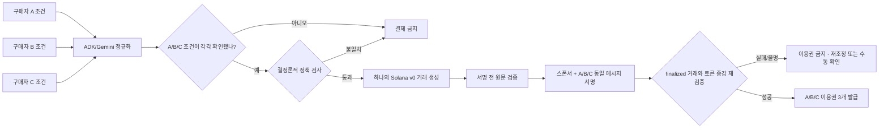

# Mandate Pool

세 명의 구매자 에이전트가 서로 다른 구매 조건을 제안하고, v0 데모 운영자가 각 역할의 조건을 확인한 뒤, 공통 조건을 만족하는 상품 하나를 Solana의 단일 원자적 USDC 거래로 공동 구매하는 해커톤 프로토타입입니다.

## Why · What · How

- **Why:** 에이전트가 여러 사람을 대신해 결제할 때는 “추천을 잘했다”만으로 부족합니다. 각 사람의 한도와 금지 조건이 보존되고, 일부만 결제되거나 재시도로 중복 결제되지 않는다는 증거가 필요합니다.
- **What:** 자연어 구매 조건 3개를 구조화하고, 역할별 HITL 확인을 받은 뒤, 조건의 교집합을 만족할 때만 SignalDesk 7일 이용권을 공동 구매합니다. 한 명이라도 조건이 맞지 않으면 거래를 만들지 않습니다.
- **How:** Google ADK/Gemini는 자연어 정규화와 후보 제안만 담당합니다. 결정론적 정책 엔진이 승인·예산·상품·만료를 다시 검사하고, Solana v0 거래 한 개에 정확히 3개의 `TransferChecked`와 memo를 넣어 4명이 같은 메시지에 서명합니다. 이용권은 finalized 거래를 독립 검증한 뒤에만 발급합니다.

## 핵심 흐름



LLM에는 signer나 RPC 도구가 없습니다. LLM 출력은 결제 권한이 아니라 제안이며, HITL 승인과 순수 함수 정책 검사가 온체인 거래 경계입니다.

현재 v0의 HITL은 **한 명의 데모 운영자가 A/B/C 역할을 순서대로 확인하는 operator simulation**입니다. 승인 nonce와 mandate hash는 묶이지만 각 구매자의 지갑 서명으로 승인자를 증명하지는 않으며, Devnet buyer key도 서버가 보관합니다. 따라서 실제 다자간 제품으로 확장할 때는 buyer별 domain-separated approval signature와 외부 wallet/co-signer가 필수입니다.

## 빠른 실행: 온체인이 아닌 fixture

Node.js 22 이상이 필요합니다.

```bash
npm ci --omit=peer
npm test
APP_MODE=fixture DEMO_KEY=local-demo-key-1234 npm run dev
```

`http://localhost:8080`에서 두 시나리오를 실행할 수 있습니다.

- 정상 경로: 총 1 Devnet USDC를 A `0.333334`, B/C 각 `0.333333`으로 분담하고 이용권 3개를 받습니다.
- 거부 경로: B의 한도를 0.3 USDC로 낮추면 `NO_BUY`가 되고 결제 거래가 생기지 않습니다.

fixture 모드는 화면과 API에 `fixture · NOT ON-CHAIN`으로 표시됩니다. fixture signature는 Solana 거래 증거로 취급하지 않습니다.

## Live Devnet 구성

`.env.example`의 값을 Secret Manager → Cloud Run 환경 변수로 주입한 뒤 `APP_MODE=live`로 실행합니다. 필수 항목은 GCP 프로젝트, Solana Devnet RPC, merchant owner/USDC ATA, sponsor 및 A/B/C signer secret, mutation key, entitlement HMAC secret입니다.

여기서 `live`는 실제 Solana Devnet에 기록된다는 뜻이며 실제 돈을 뜻하지 않습니다. 사용하는 SOL과 USDC는 faucet 테스트 토큰으로 금전 가치가 없고 실제 달러의 담보를 받지 않습니다. [Circle testnet 안내](https://developers.circle.com/stablecoins/usdc-contract-addresses)

현재 해커톤용 Devnet owner 주소와 ATA는 [`devnet-wallets.public.json`](devnet-wallets.public.json)에 있습니다. 개인키는 포함하지 않으며 Secret Manager version 1과의 주소 round-trip 및 ATA 네 개의 finalized 온체인 생성을 검증했습니다. 공개 transaction과 검증 경계는 [Devnet 지갑 프로비저닝 영수증](../../research/decision-report/evidence/devnet-wallet-provisioning-2026-08-03.md)에 있습니다. `npm run wallets:provision -- --execute`는 enabled version이 이미 있으면 회전을 거부하고, `--verify`는 secret payload를 출력하지 않은 채 저장된 키와 manifest 일치만 확인합니다.

이용권 HMAC 키를 회전할 때는 새 값을 `ENTITLEMENT_SECRET`에 두고, 아직 만료되지 않은 이용권의 이전 키를 `ENTITLEMENT_PREVIOUS_SECRETS`에 쉼표로 구분해 유지합니다. 모든 기존 이용권이 만료된 뒤에만 이전 키를 제거합니다.

```bash
npm run build
npm start
```

시작 시 다음 조건을 만족하지 않으면 서버가 fail-closed로 종료됩니다.

- 모든 signer secret이 유효한 64-byte Solana keypair일 것
- Vertex ADC/IAM/location/model에 대한 캐시형 `countTokens` 접근 probe가 성공할 것
- 구매자와 merchant의 계정이 classic SPL Token Devnet USDC ATA와 정확히 일치할 것
- mint가 Circle Devnet USDC이고 decimals가 6일 것
- merchant가 catalog 전체에서 동일할 것

Live 결제는 `로컬 생성·검증·서명 → 서명 원문 내구 저장 → 동일 원문 제출과 RPC preflight → finalized 확인 → 확정 거래 재디코딩 → 메시지/의도/잔액 증감 검증 → fulfillment` 순서입니다. 서명된 bytes는 `FULLY_SIGNED` 저장 전에는 외부 RPC로 보내지 않습니다. 전송 응답을 잃어도 새 거래를 만들지 않고 저장된 동일 바이트만 다시 제출합니다. blockhash 만료 뒤 결과가 불명확하면 자동 재결제 대신 `RECONCILIATION_REQUIRED`로 멈춥니다.

## 무결성 계약

서명 전 verifier가 아래 항목을 하나라도 다르게 보면 결제를 중단합니다.

- version 0, address lookup table 없음
- fee payer는 sponsor이고 필수 signer는 sponsor+A+B+C 정확히 4개
- classic SPL Token 프로그램의 `TransferChecked` 정확히 3개, 순서 A→B→C
- source ATA, merchant destination ATA, mint, amount, decimals, authority가 승인된 quote와 정확히 일치
- memo는 `MP1:<quoteHash>:<policyProofHash>` 하나이며 추가 instruction 없음
- canonical message decode가 전체 bytes를 소비하고 재인코딩 결과가 동일

상태와 예산은 version 기반 CAS로 갱신합니다. quote/settlement key는 일회성 lock이며, finalized 실패 또는 서명 전 안전 중단에서는 예약 예산을 해제합니다. finalized 성공에서만 예산을 소비합니다.

## x402 경계

이 v0는 **x402 표준 구현이라고 주장하지 않습니다.** x402 `exact`의 일반적인 단일 payer·단일 결제 요구와 달리, 이 제품의 핵심 증명은 세 구매자의 독립 한도를 한 거래의 세 전송과 네 서명으로 묶는 것입니다. 따라서 결제 rail은 의도적으로 custom Solana atomic settlement이며, x402 어댑터는 후속 범위입니다.

## 검증 명령

```bash
npm run typecheck
npm test
npm run build
```

테스트는 canonical hash/atomic amount, 정책 mutation, 상태 전이와 예산 CAS, idempotency, signer-safe 거래 의도, 실제 Solana Kit 메시지 생성, 서비스 정상·거부·권한 경로를 포함합니다. 로컬 통과는 Devnet 결제나 GCP 배포의 증거가 아닙니다. 제출 전에는 실제 Devnet signature, Explorer 링크, Gemini/ADK 실행 trace, Cloud Run revision을 별도 receipt로 보존해야 합니다.

설치에는 `npm ci --omit=peer`를 사용합니다. 현재 앱은 ADK의 `InMemoryRunner`만 사용하므로 자동 설치되는 미사용 MikroORM DB driver peer를 제외하며, Docker build/runtime도 같은 정책을 강제합니다. audit 판정과 남은 moderate advisory는 [의존성 보안 영수증](../../research/decision-report/evidence/dependency-security-audit-2026-08-03.md)에 공개합니다.

## 코드 지도

- `src/agents/`: Google ADK 에이전트와 결정론적 fixture
- `src/domain/`: canonical 계약, catalog, 정책, hash
- `src/workflow/`, `src/persistence/`: 상태 머신, 감사 hash-chain, Firestore adapter
- `src/solana/`: 독립 거래 의도 decoder/verifier
- `src/runtime/`: Solana Kit build/sign/RPC/finalized verifier
- `src/service/`: 주문·HITL·결제·fulfillment orchestration
- `src/http/`, `public/`: Cloud Run HTTP API와 한국어 데모 UI
