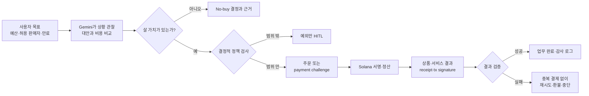
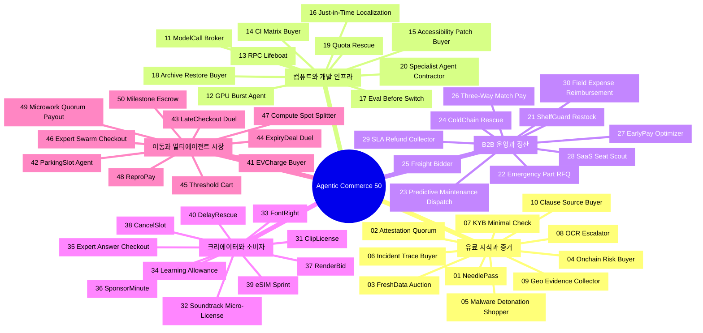
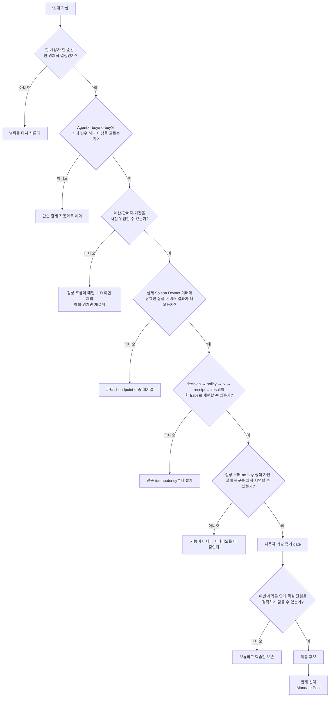

# Agentic Commerce 아이디어 지도: 50개 가설에서 Mandate Pool까지

- 최초 작성: 2026-08-01 KST
- 현재화: 2026-08-03 KST
- 독자: 탐색 범위, 아이디어 계보, 선택 근거를 빠르게 이해하려는 제품·기술·심사 담당자.
- 문서 역할: 50개 가설을 보존하는 발산 지도다. 현재 구현 백로그나 후보 순위가 아니다.
- 현재 제품: **Mandate Pool**. `#45 Threshold Cart`의 다중 구매자 구조를 mandate 교집합과 원자적 정산 문제로 다시 정의한 후속안이다.

## 먼저 읽을 결론

이 목록은 “50개 중 가장 멋진 이름을 고르기” 위해 만든 것이 아니다. 서로 다른 사용자 순간과 경제적 결정을 넓게 펼친 뒤, 외부 의존성·HITL·실제 거래·fulfillment를 증거로 좁히기 위해 만들었다.

현재 제출 제품은 목록에 원래 이름으로 없던 **Mandate Pool**이다. 세 구매자 Agent의 자연어 조건을 Gemini/ADK로 구조화하고 역할별 HITL 확인과 결정론적 정책을 거친 뒤, 공통 조건을 만족할 때만 총 1 Devnet 테스트 USDC를 하나의 Solana v0 거래로 공동 결제한다. A는 `0.333334`, B/C는 각각 `0.333333`을 부담한다. 한 명의 cap이라도 부족하면 거래를 만들지 않는다.

선택 과정에서 `RPC Lifeboat → Duplicate Payout Guard`, `NeedlePass/Onchain Risk Buyer → Query-to-Act`도 검토했지만 사용자 사건과 결제 후 외부 fulfillment가 닫히지 않아 보류했다. 상세 처분은 [아이디어 선택 보고서](decision-report/mece-hackathon-idea-selection.md), 현재 구현은 [Mandate Pool README](../product/mandate-pool/README.md), 실행 상태는 [환경 런북](decision-report/hackathon-environment-codex-runbook.md)을 따른다.

이 문서의 50개 항목은 모두 시장·사용자 검증 전 가설이다. 번호와 표의 위치는 순위나 우승 확률이 아니다.

## 우리가 사용하는 정의

> 사용자가 개별 거래가 아니라 경제적 목표와 권한의 경계를 위임하면, AI Agent가 상황에 따라 거래 여부·대상·상대·금액·시점을 판단하고, 허용 범위에서 주문·결제·정산을 실제 실행한 뒤, 결과와 증빙을 확인해 다음 행동까지 이어가는 상거래.

모든 아이디어는 최소한 다음 폐쇄루프를 전제로 한다.



공식 페이지의 A~D는 별도 트랙이 아니라 선택적 시작점이다. 아래 표의 태그도 분류를 돕기 위한 주된 출발점일 뿐이다.

- `A`: Agent-Initiated Commerce
- `B`: Autonomous On-chain Settlement
- `C`: Multi-Agent Commerce
- `D`: Verifiable Distribution at Scale

## 50개 전체 지도



## 1. 유료 지식과 증거

| ID | 출발점 | 사용자와 정확한 순간 | Agent의 경제적 결정 | 실제 거래와 완료 증거 | 가장 큰 검증 리스크 |
|---|---|---|---|---|---|
| 01 **NeedlePass** | A | 독립 리서처가 한 주장만 검증하려는데 무료 근거가 부족한 순간 | 어떤 유료 원문·데이터 한 건이 불확실성을 가장 싸게 줄이는지, 아니면 사지 않을지 | x402 유료 조회 1회; 402 요구, Solana tx, 응답 hash, 최종 인용 | 실제 유료 endpoint와 사용자의 지불의사 확보 |
| 02 **Attestation Quorum** | A | 자동화가 가격·날씨·배송 상태 같은 외부 사실을 확인해야 하는 순간 | 필요한 독립 공급자 수, freshness, 허용 편차, 총비용 | 서명된 attestation들을 건별 구매; 서명 묶음, quorum 계산, tx | 여러 판매자가 같은 원천을 재판매할 수 있음 |
| 03 **FreshData Auction** | C | 경로·재고 Agent가 지금 가장 최신 센서값 하나를 필요로 하는 순간 | 데이터별 timestamp·coverage·confidence·가격을 비교해 한 공급자를 선택 | 판매자 Agent의 signed reading 구매; reading hash, timestamp, tx | 원 데이터와 판매자 신뢰성 |
| 04 **Onchain Risk Buyer** | A | DAO 재무 담당자가 처음 보는 주소로 큰 금액을 보내기 직전 | 노출액에 따라 무료 검사로 충분한지, 어떤 risk report를 살지 | wallet risk API 1회 구매; 대상 address·slot·report hash·tx | 불투명한 위험 점수와 오탐 |
| 05 **Malware Detonation Shopper** | A | SOC가 의심 파일·URL을 격리 분석해야 하는 순간 | sandbox OS, 분석 깊이, 공급자, timeout, 교차검증 여부 | detonation report 구매; sample hash, IOC, report, tx | 민감 파일 유출과 sandbox 회피 |
| 06 **Incident Trace Buyer** | A | SRE가 장애를 조사하지만 기본 로그 보존 범위가 부족한 순간 | 필요한 서비스·시간창·trace depth와 구매 상한 | archive trace query 구매; incident ID, trace hash, root-cause 근거, tx | 로그 개인정보와 불완전한 trace |
| 07 **KYB Minimal Check** | A | B2B 마켓이 신규 판매자의 고액 거래를 승인하기 직전 | 거래 위험에 필요한 최소 KYB·제재·문서 진위 검사 조합 | 검증 신호별 결제; provider-signed result, consent, tx | 개인정보 규제와 공급자 법적 범위 |
| 08 **OCR Escalator** | A | 송장·영수증의 특정 페이지만 무료 OCR confidence가 낮은 순간 | 재처리 가치, 공급자, 페이지 수, 최고 비용 | premium OCR 페이지 단위 구매; 원본/결과 hash, confidence 개선, tx | 품질 향상이 실제 후속 업무 정확도를 보장하지 않음 |
| 09 **Geo Evidence Collector** | A | 보험 담당자가 특정 시각·장소의 침수·폭풍 주장을 확인하는 순간 | 위성·기상·센서 중 어떤 증거를 어느 해상도로 살지 | imagery 또는 historical weather query 구매; 좌표·시간·provenance·tx | chain-of-custody와 시공간 해상도 |
| 10 **Clause Source Buyer** | A | 스타트업이 계약서의 낯선 관할권 조항 하나를 확인하는 순간 | 필요한 법령 corpus, 검색 범위, 인용 최소 수, 구매 상한 | 권위 있는 법률 원문 query 구매; 원문 citation·문서 hash·tx | 오래된 자료와 법률 자문으로의 오인 |

## 2. 컴퓨트와 개발 인프라

| ID | 출발점 | 사용자와 정확한 순간 | Agent의 경제적 결정 | 실제 거래와 완료 증거 | 가장 큰 검증 리스크 |
|---|---|---|---|---|---|
| 11 **ModelCall Broker** | A | SaaS가 현재 모델로 처리하기 어려운 전문·멀티모달 요청을 받은 순간 | 모델, 예상 품질, 지연, 호출가, 재시도 한도 또는 no-buy | 외부 inference 1회 구매; 입력/응답 hash, 품질 검사, tx | 결제 전 품질 예측과 prompt 유출 |
| 12 **GPU Burst Agent** | B | 렌더링·학습 작업이 마감 전에 끝나지 않을 것으로 예측된 순간 | GPU 종류, queue, 실행시간, SLA, 가격, checkpoint 전략 | compute job 구매; job ID, 사용량, output hash, tx | 결제 후 작업 지연·오류 |
| 13 **RPC Lifeboat** | B | Solana 앱의 기본 RPC가 latency·error SLO를 넘긴 순간 | 대체 RPC의 최신 slot, method 지원, 가격, 필요한 burst 크기 | premium RPC 호출 묶음 구매; 전후 성공률, 응답 hash, tx | 악성·뒤처진 RPC와 실제 x402 공급자 확보 |
| 14 **CI Matrix Buyer** | A | PR merge 전에 로컬에서 재현 불가능한 OS·architecture 검사가 필요한 순간 | 필요한 matrix, runner, 테스트 범위, 중단 조건, 비용 | ephemeral runner 또는 scan 구매; commit SHA, signed log, artifact, tx | flaky test와 repository secret |
| 15 **Accessibility Patch Buyer** | A | 영상을 공개하기 직전 자막·화자분리·오디오 설명이 빠진 순간 | 필요한 기능과 언어, 분당 가격, confidence 기준 | 접근성 처리 구매; timestamp 정렬 artifact, 검사 결과, tx | 개인정보가 든 음성과 처리 지연 |
| 16 **Just-in-Time Localization** | A | 소규모 상점에 처음 보는 언어의 주문이 들어온 순간 | OCR·번역·TTS 조합, 전문 도메인, 품질 기준, 비용 | 처리 단계별 API 구매; source/target hash, 용어 검사, tx | 문화·법률 문맥 오역 |
| 17 **Eval Before Switch** | A | 운영 모델의 품질 저하가 의심되어 공급자 교체를 결정하기 직전 | 어떤 독립 eval set·runner가 전환 비용보다 가치 있는지 | eval run 구매; model/version, dataset hash, 결과와 tx | 합성 평가가 실제 사용자 품질을 대표하지 않을 수 있음 |
| 18 **Archive Restore Buyer** | B | 서비스가 삭제·손상된 객체를 발견해 원격 보관본이 필요한 순간 | 어느 snapshot을 어느 속도로 복구할지, 복구 가치와 비용 | restore job 구매; object hash, restore status, checksum, tx | 공급자가 가진 backup의 진위와 복구 SLA |
| 19 **Quota Rescue** | A | 고가치 요청이 API quota에 막혔고 다음 reset까지 기다릴 수 없는 순간 | 요청 가치가 top-up 비용보다 큰지, 얼마만큼 살지 | pay-per-call 또는 작은 quota bundle 구매; request ID, 결과, tx | 공급자가 미세 top-up을 지원하지 않을 수 있음 |
| 20 **Specialist Agent Contractor** | C | 범용 Agent가 코드 감사·수학 증명·포맷 변환 같은 한 subtask를 못 푸는 순간 | 전문 Agent, schema 적합성, 평판, 납기, 가격, 재작업 횟수 | x402-gated Agent 호출; task/result hash, validator 통과, tx | Sybil 평판, prompt injection, 표절 결과 |

## 3. B2B 운영과 정산

| ID | 출발점 | 사용자와 정확한 순간 | Agent의 경제적 결정 | 실제 거래와 완료 증거 | 가장 큰 검증 리스크 |
|---|---|---|---|---|---|
| 21 **ShelfGuard Restock** | A | 카페·소매점의 핵심 품목이 예상 수요 전에 품절될 순간 | 발주 여부, 수량, 공급자, 유통기한, MOQ, 납기, 가격 | 선택 공급자 재고 주문; checkout receipt, tx, 시뮬레이션 재고 증가 | 합성 수요·ERP 데이터로는 실제 pain 입증이 약함 |
| 22 **Emergency Part RFQ** | C | 생산라인 결품의 시간당 손실이 부품 가격을 넘기기 시작한 순간 | 호환성, 도착시간, 총도착원가, 공급자 신뢰, 보증금 | 판매자 Agent 견적 중 낙찰·결제; quote transcript, order ID, tx | mock 공급자 약속의 현실성 |
| 23 **Predictive Maintenance Dispatch** | A | 설비 telemetry가 고장 전 부품·기술자 투입을 요구하는 순간 | 고장확률, downtime 비용, 부품과 기술자 조합, 보증조건 | 부품 또는 출장 서비스 주문; telemetry→work order→tx→정상화 로그 | 진단 오판이 불필요한 지출로 이어짐 |
| 24 **ColdChain Rescue** | A | 창고 온도가 허용범위를 벗어나 폐기·이송·긴급 냉장을 골라야 하는 순간 | 물품가치, 이탈 시간, 대체창고 거리, 긴급운송비 | 냉장창고·운송 서비스 구매; 센서 이벤트, 주문, tx, 상태 복귀 | 센서 신뢰성과 규제 대상 안전판단 |
| 25 **Freight Bidder** | C | 한 출고 건의 운송사를 즉시 확정해야 하는 순간 | 운임, ETA, 용량, 파손이력, SLA, 경로를 비교해 낙찰 | 예약금과 배송 완료 잔금; 입찰 기록, pickup/delivery event, tx | 배송 완료를 증명할 외부 oracle |
| 26 **Three-Way Match Pay** | B | AP 담당자가 PO·입고·송장을 대조해 지급할 순간 | 품목·수량·단가 허용오차, 중복, 공급자 allowlist, 만기 | 일치 송장만 Solana 지급; deterministic match trace, memo, tx | 위조 송장과 허위 입고 증거 |
| 27 **EarlyPay Optimizer** | B | CFO가 현금을 보존할지 할인받아 송장을 조기 지급할지 정하는 순간 | 할인율, runway, 만기, 기회비용, 공급자 위험 | 선택 송장 조기지급; 할인 전후 금액, balance, receipt, tx | ROI가 현금흐름 예측에 의존 |
| 28 **SaaS Seat Scout** | A | 입·퇴사나 갱신으로 SaaS 좌석을 증감해야 하는 순간 | 실제 사용률, 요금구간, 최소계약, 만료일, 추가·회수 여부 | 좌석 entitlement 구매·갱신; 수량 변화, 로그인 테스트, tx | 실제 SaaS의 machine checkout API 부족 |
| 29 **SLA Refund Collector** | D | 공급자 장애가 계약 임계치를 넘겼지만 청구가 자동화되지 않은 순간 | 면책구간, uptime 증거, 크레딧 공식, 청구 가치와 기한 | seller Agent가 서비스 크레딧·환불 지급; signed metric, claim, refund tx | 공급자가 구매자 측 관측치를 인정하지 않을 수 있음 |
| 30 **Field Expense Reimbursement** | D | 현장 직원이 영수증을 제출해 즉시 환급받아야 하는 순간 | 정책 카테고리, 한도, 중복, 출장 맥락, 예외 여부 | 허용 경비만 직원에게 지급; receipt hash, policy trace, payout tx | 영수증 진위, 개인정보, 고용 규정 |

## 4. 크리에이터와 소비자

| ID | 출발점 | 사용자와 정확한 순간 | Agent의 경제적 결정 | 실제 거래와 완료 증거 | 가장 큰 검증 리스크 |
|---|---|---|---|---|---|
| 31 **ClipLicense** | A | 영상 편집자가 특정 장면에 맞는 8초짜리 클립을 지금 써야 하는 순간 | asset 적합도, 매체·기간·지역 권리, 해상도, 가격 | 권리자에게 사용권 결제; asset hash, signed license JSON, tx | 판매자가 실제 권리자인지 증명하기 어려움 |
| 32 **Soundtrack Micro-License** | A | 숏폼 제작자가 길이·분위기·지역에 맞는 한 곡을 골라야 하는 순간 | 곡 적합도, 사용 범위, 기간, 가격, 대체곡 | 음악 사용권 구매; audio hash, license receipt, tx | 저작권 chain과 플랫폼별 권리 차이 |
| 33 **FontRight** | A | 글로벌 캠페인 빌드가 특정 문자 누락과 라이선스 문제를 발견한 순간 | glyph coverage, 브랜드 적합성, web/app 권리, 가격 | font license 구매; font hash, coverage test, license, tx | EULA를 기계가 집행 가능한 조건으로 변환하기 어려움 |
| 34 **Learning Allowance** | A | 학생이 한 개념에서 막혀 무료 문제로는 진전이 없는 순간 | 오개념, 난이도, 예상 학습효과, 가격, 주간 잔여예산 | 맞춤 문제·해설 한 건 구매; content hash, 풀이 전후, tx | 미성년자 동의와 학습효과 측정 |
| 35 **Expert Answer Checkout** | C | 분석 Agent의 한 subquestion confidence가 기준 아래인 순간 | 필요한 전문가, 응답기한, 가격, 검증 rubric 또는 no-buy | 전문가 답변 구매; question/answer hash, rubric 결과, tx | 정성적 전문 품질과 책임 범위 |
| 36 **SponsorMinute** | C | 뉴스레터의 빈 광고 슬롯 마감이 임박한 순간 | creator Agent는 브랜드 적합도·floor를, buyer Agent는 audience·최고가를 판단 | offer/accept 후 예약금·잔금; 협상 기록, 게시물 hash, tx | 실제 게재와 광고 표시 의무 검증 |
| 37 **RenderBid** | C | 1인 크리에이터의 렌더 작업이 오늘 마감을 놓칠 순간 | provider, bid, deadline, 해상도, 실패 penalty | seller Agent에게 결과 수락 후 지급; input/output hash, SLA, tx | 시각적 품질 수락을 완전 자동화하기 어려움 |
| 38 **CancelSlot** | A | 사용자가 당일 병원·코워킹·스포츠 취소 슬롯을 찾는 순간 | 시간, 이동거리, 가격, 환불성, 기존 일정 충돌 | 예약금 또는 전액 결제; merchant-signed booking, inventory 감소, tx | 이중예약과 실제 예약 API |
| 39 **eSIM Sprint** | A | 여행자가 공항 도착 직후 데이터 연결 없이 요금제를 사야 하는 순간 | 국가 coverage, GB, 유효기간, 가격, 활성화 시간 | eSIM 상품 구매; activation-token hash, receipt, tx | 실제 발급 파트너와 환불 처리 |
| 40 **DelayRescue** | A | 항공편 지연 직후 lounge·식사·교통·eSIM 중 하나가 필요한 순간 | 지연시간, 새 ETA, 효용, 가격, 환불성, 회사 정책 | 선택 voucher 구매; delay event, quote set, voucher, tx | 실시간 재고와 지연 데이터 API |

## 5. 이동과 멀티에이전트 시장

| ID | 출발점 | 사용자와 정확한 순간 | Agent의 경제적 결정 | 실제 거래와 완료 증거 | 가장 큰 검증 리스크 |
|---|---|---|---|---|---|
| 41 **EVCharge Buyer** | C | 주행 중 배터리·도착시간 때문에 충전소를 확정해야 하는 순간 | 가격, 대기열, 우회거리, 충전속도, 잔여거리 | station Agent와 slot·전력량 예약 결제; quote, reservation, tx | 실시간 충전소 상태와 실제 전력 공급 증명 |
| 42 **ParkingSlot Agent** | C | 목적지 도착 전에 주차 실패 비용이 커지는 순간 | 도보거리, 가격, 혼잡, 예약시간, 취소조건 | parking Agent에 예약금 지급; signed slot, 상태 변경, tx | 현장 점유와 이중판매 |
| 43 **LateCheckout Duel** | C | 호텔 체크아웃 당일 여행자가 3시간 연장을 원하는 순간 | guest Agent 최고가와 hotel Agent 점유율·청소 buffer·최저가 | A2A 협상 가격 결제; quote/accept, 예약 변경, tx | 실제 PMS 연동과 객실 상태 |
| 44 **ExpiryDeal Duel** | C | 식품·좌석·광고처럼 곧 소멸하는 재고가 남은 순간 | merchant Agent 할인곡선과 buyer Agent 필요·최고가·거리 | 제한시간 offer 체결; 협상 transcript, inventory 감소, tx | 합성 재고만으로 실제 수요를 증명하기 어려움 |
| 45 **Threshold Cart** | C | 여러 buyer가 공동구매 최소수량을 채워야 하는 순간 | 각자의 최고가, 최소 인원, 최종 단가, expiry, 이탈 조건 | threshold 충족 시 seller에게 개별 지급; commitments, order receipt, tx들 | 미달·이탈 때 환불과 자금 보관 |
| 46 **Expert Swarm Checkout** | C | 주 Agent가 지도·날씨·번역 등 여러 specialist 결과를 조합해야 하는 순간 | subtask 분할, Agent별 가격·신뢰도·deadline, 중단 시점 | 수락한 결과별 micropayment; task/result hash, acceptance trace, tx들 | verifier가 틀리거나 Agent들이 담합할 수 있음 |
| 47 **Compute Spot Splitter** | C | 마감 있는 batch 작업을 여러 compute seller에게 나눠야 하는 순간 | chunk 크기, bid, deadline, redundancy, 실패 재배정 | 검증된 chunk별 지급; deterministic output hash, provider log, tx | 데모 workload가 실제 구매가치를 대표하는지 |
| 48 **ReproPay** | D | 오픈소스 maintainer가 모호한 버그의 재현 테스트를 확보해야 하는 순간 | bounty, 기한, 중복 보상, 어떤 재현 artifact가 충분한지 | CI에서 특정 commit에 실패하는 test 제출자에게 지급; SHA, test artifact, tx | test gaming과 이미 알려진 재현의 복제. 버그 수정 검증은 범위 밖 |
| 49 **Microwork Quorum Payout** | D | 라벨링·현장점검 같은 다수 작업 결과를 정산해야 하는 순간 | consensus, gold question, 담합 신호, rate, batch 시점 | 검증 통과 작업자에게 batch payout; artifact, 품질 trace, 수취인별 tx | 작업자 담합, 노동·KYC 규정, 편향된 verifier |
| 50 **Milestone Escrow** | D | 외주 결과물이 객관적 milestone을 통과해 대금을 해제할 순간 | test·schema·checksum·기한 조건, 부분지급, 예외 전환 | escrow 또는 지급 release; spec/artifact hash, test log, tx | 디자인·보안처럼 정성적 품질에는 부적합 |

## 점수 없이 줄인 의사결정 흐름



## 과거 shortlist와 현재 처분

아래 표는 당시 무엇을 먼저 반증하려 했는지와 현재 결정을 함께 보여 준다. “탈락”은 장기 사업 가치가 없다는 뜻이 아니라 이번 제출에서 핵심 증거를 닫지 못했다는 뜻이다.

| 계보 | 당시 먼저 검증하려던 것 | 현재 처분 | 결정적 이유 |
|---|---|---|---|
| `#45 Threshold Cart` → **Mandate Pool** | 세 buyer의 서로 다른 조건을 한 원자 거래로 보존할 수 있는가 | **현재 제출 제품** | 외부 유료 merchant 없이도 mandate→정책→Solana→fulfillment를 검증 가능 |
| `#13 RPC Lifeboat` → Duplicate Payout Guard | 402→유료 RPC 결과가 실제 replacement payout을 거부하는가 | 보류 | 사용자 사건과 결제 후 valid RPC fulfillment 미완료 |
| `#01 NeedlePass + #04 Onchain Risk Buyer` → Query-to-Act | 유료 Solana 이력이 payout allow/block을 바꾸는가 | 보류 | exact query·유료 결과·달라진 downstream action 미완료 |
| `#26 Three-Way Match Pay` | PO·입고·송장 일치가 실제 지급을 허용·차단하는가 | 이번 제출 제외 | 실제 문서·supplier·지급 authority 없음 |
| `#31 ClipLicense` | 기계 판독형 license와 실제 권리자를 연결할 수 있는가 | 제외 | 권리 provenance를 정직하게 닫지 못함 |
| `#44 ExpiryDeal Duel` | 실제 소멸 재고와 buyer/seller 협상을 닫을 수 있는가 | 제외 | 실제 재고·hold·refund 경계 없음 |
| `#48 ReproPay` | 유용한 재현과 duplicate/gaming을 자동 구분할 수 있는가 | 제외 | untrusted code·appeal 범위가 마감 대비 큼 |
| `#29 SLA Refund Collector` | seller가 인정하는 증거로 실제 refund를 만들 수 있는가 | 제외 | telemetry·refund authority 없음 |

## 현재 제품에 적용한 증거 계약

모든 후보에 요구했던 네 경로를 Mandate Pool에서는 다음처럼 구체화했다.

1. **정상:** A cap 0.4, B 0.34, C 0.4에서 총 1 Devnet 테스트 USDC를 `333334/333333/333333` base units로 결제하고 이용권 세 개를 발급한다.
2. **no-buy/거부:** B cap 0.3에서는 거래와 이용권이 모두 0건이다.
3. **정책·무결성 차단:** 승인, 금액, merchant, mint, expiry, instruction, signer가 다르면 서명 전에 차단한다.
4. **실패 복구:** fully signed bytes만 재제출하고 결과가 불명확하면 새 결제 없이 `RECONCILIATION_REQUIRED`로 멈춘다.

필수 trace:

```text
natural-language conditions A/B/C
  -> Gemini/ADK normalized mandates and selection
  -> role-by-role operator-simulated approval
  -> deterministic policy proof and quote
  -> exact Solana v0 message and four signatures
  -> transaction signature and finalized verification
  -> token deltas and entitlement receipt
  -> final state and failure history
```

merchant와 상품은 데모용임을 밝히고 fixture에는 `NOT ON-CHAIN`을 표시한다. sandbox·fixture 성공이나 mock signature를 실제 온체인 증거로 표현하지 않는다. Devnet USDC는 금전 가치가 없으므로 “실제 1달러 결제”라고 말하지 않는다.

## 근거

- [공식 해커톤 홈페이지](https://www.gcp-solana-ai-agentic-hacks-kr.xyz/): 단일 트랙, 선택적 시작점, 실제 트랜잭션·로그 요구
- [로컬 행사 규칙](official-docs-wiki/modules/event-rules.md): 현재 제출 계약과 최소 증거 묶음
- [AP2 v0.2](https://ap2-protocol.org/ap2/specification/): human-present/autonomous mode, mandate, deterministic verification
- [Google Agent Protocol Guide](https://developers.googleblog.com/en/developers-guide-to-ai-agent-protocols/): UCP와 AP2의 역할 분리
- [Solana x402](https://solana.com/x402/what-is-x402): Agent의 API·데이터·compute 구매와 Solana settlement
- [Solana Kora x402 Guide](https://solana.com/docs/tools/kora/guides/x402): 402 → verify → settle → resource/receipt 실행 흐름
- [Circle testnet USDC](https://developers.circle.com/stablecoins/usdc-contract-addresses): Solana Devnet mint와 테스트 토큰의 금전 가치 없음
