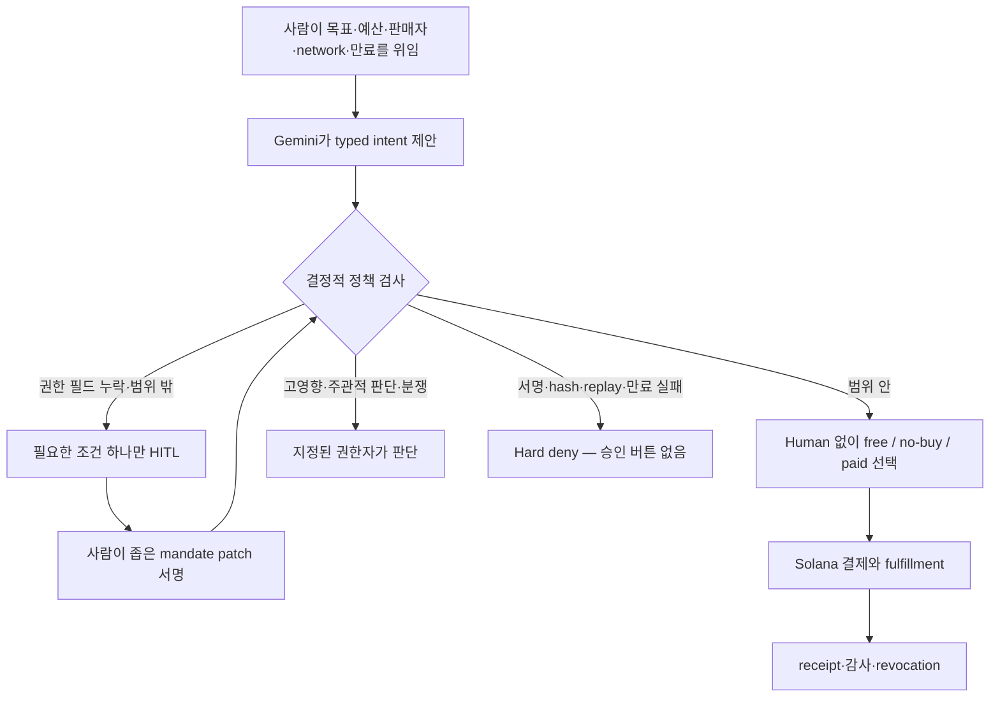

# 한 번 묻고, 그다음은 자율 실행

- 기준 시각: 2026-08-02 14:17 KST
- 의사결정 대상: 2026-08-03 23:59 KST 제출을 앞둔 1인 해커톤 팀
- 방법: Stanford d.school 디자인씽킹 모드, 필수 HITL 통제 분류, Prism 독립 렌즈, 외부 사실 양방향 검증
- 상태: **Share with caveats** — 프로토콜·공식 행사·공개 결제 요구는 확인했지만 사용자 인터뷰와 유료 fulfillment는 미완료

## 결론

기존 `RPC Lifeboat`을 그대로 만들지 않는다. **`Just-Enough RPC Rescue`**로 재정의한다.

> 장애 대응 중인 사용자가 결제마다 승인하지 않아도 된다. Agent는 완전한 mandate 안에서는 질문 없이 `free fallback / no-buy / paid`를 고르고, 인간만 채울 수 있는 권한 필드가 실제로 빠졌을 때만 한 번 묻는다. 서명·hash·replay·만료 실패는 묻지 않고 차단한다.

독립 `Mandate Repair`는 결제 결과가 없는 approval middleware로 보이므로 탈락이다. RPC라는 실제 사용자 순간과 QuickNode라는 실제 외부 상품에 붙을 때만 제품이 된다.

현재 우선순위는 다음과 같다.

1. **선두:** Just-Enough RPC Rescue
2. **전환안:** Query-to-Act — 기존 NeedlePass를 “유료 Solana 이력이 실제 지급 여부를 바꾸는 한 건”으로 더 좁힌다.
3. **보류:** Invoice Line Rescue — 사용자 문제는 명확하지만 2026-08-02 직접 probe에서 Document AI gateway가 `challenge_generation_failed`를 반환했다.

`ReproPay`는 최종 백업에서 제거한다. untrusted code 격리, duplicate/gaming, appeal을 deadline 안에 정직하게 닫기 어렵고 Agentic Commerce보다 CI bounty로 보일 위험이 크다.

## 사실 경계

| 주장 | 판정 | 근거와 경계 |
|---|---|---|
| 행사의 목적은 정해진 한도 안에서 매 단계 사람 승인 없이 Agent가 결제를 처리하는 제품이다. | 확인 | [공식 행사 사이트](https://www.gcp-solana-ai-agentic-hacks-kr.xyz/)의 현재 배포 asset을 2026-08-02 직접 확인했다. 최초 권한 위임까지 불필요하다는 뜻은 아니다. |
| 평가는 혁신·UX, Gemini/GCP AI, Solana·프로토콜 통합, live 거래·로그를 본다. | 확인 | 공식 사이트의 현재 `Criteria` 네 항목. 공개 가중치는 없다. |
| AP2 autonomous mode는 모든 거래마다 사용자 승인을 요구한다. | 반증 | [AP2 specification](https://ap2-protocol.org/ap2/specification/)은 사용자가 open mandate 제약을 승인한 뒤 Agent가 closed mandate를 만들 수 있게 한다. 검증·처리는 deterministic code여야 한다. |
| 모든 AI 행동에는 같은 수준의 인간 감독이 필요하다. | 반증 | [NIST AI RMF Appendix C](https://airc.nist.gov/airmf-resources/airmf/appendices/app-c-ai-risk-management-and-human-ai-interaction/)는 완전 자율부터 완전 수동까지 역할을 구분하며 일부 시스템에는 인간 감독이 필요 없을 수 있다고 설명한다. |
| Stanford 디자인씽킹은 5단계를 한 번씩 통과하는 선형 체크리스트다. | 반증 | [d.school Bootleg](https://dschool.stanford.edu/tools/design-thinking-bootleg)은 Empathize·Define·Ideate·Prototype·Test를 모드와 도구 모음으로 설명하고 어디서든 시작할 수 있다고 밝힌다. |
| QuickNode 유료 RPC는 현재 외부 상품으로 존재한다. | 부분 확인 | 2026-08-02 직접 POST가 HTTP 402와 Solana Devnet 결제 옵션을 반환했다. 이 프로젝트의 실제 payment·settlement·RPC fulfillment는 아직 없다. |
| pay.sh BigQuery gateway는 현재 결제 요구를 반환한다. | 부분 확인 | 2026-08-02 직접 POST가 Solana 기반 402를 반환했다. 결제 후 query 결과는 미확인이다. |
| pay.sh Document AI listing이면 지금 바로 Invoice Rescue를 만들 수 있다. | 반증됨 | listing은 존재하지만 공개 예시 경로와 단건 경로 모두 직접 probe에서 HTTP 500 `challenge_generation_failed`였다. 복구 전에는 후보를 올리지 않는다. |
| 아래 사용자 pain과 지불의사는 검증됐다. | 미확인 | 현재 target-user 인터뷰가 없다. 아래 POV는 desk-empathy와 프로젝트 대화에서 만든 가설이다. |

## Stanford d.school 적용

Stanford d.school은 다섯 모드를 제공하지만, 이 보고서는 이를 순위표로 바꾸지 않는다. Define 단계의 POV는 사용자·필요·인사이트를 구체화하고, HMW는 넓게 발산할 수 있으면서도 구체적 행동이 나올 만큼 좁혀야 한다. Prototype과 Test는 한 변수만 저해상도로 반증한다. [공식 Method Cards](https://dschool.stanford.edu/s/METHODCARDS-v3-slim.pdf)

### Empathize — 지금 가진 것과 없는 것

가진 증거는 사용자가 반복 승인과 자동화 난이도를 우려했다는 프로젝트 대화, 현재 저장소 상태, 공식 프로토콜과 live 공개 endpoint다. 없는 것은 “자동화가 돈을 써야 해서 멈춘 마지막 순간”을 보여 준 target user의 행동·로그다. 따라서 공감 단계는 완료가 아니라 **인터뷰 가능한 가설** 상태다.

### Define — 세 개의 잠정 POV

1. **1인 온콜 개발자**는 새벽 장애 중 통제권을 잃지 않으면서도 복구를 계속해야 한다. 필요한 것은 매 결제 승인이나 blank check가 아니라 빠진 권한 경계 한 개의 보충이다.
2. **지급·리서치 운영자**는 무료 근거가 부족할 때 유료 증거 한 건만 사고 싶다. 유료 결과는 보고서를 길게 만드는 것이 아니라 실제 `allow / block` 행동을 바꿔야 한다.
3. **AP 운영자**는 전체 송장을 다시 검토하는 대신 결정에 필요한 불명확 필드 하나만 재처리하고 싶다. 다만 실제 문서와 지급 authority가 없으면 해커톤 fixture가 된다.

### HMW — 발산을 여는 좁은 질문

- 어떻게 하면 Agent가 거래 승인이 아니라 **빠진 권한 하나만** 물을 수 있을까?
- 어떻게 하면 Agent가 “쓸 수 있다”가 아니라 **쓸 가치가 있을 때만** 유료 API를 살 수 있을까?
- 어떻게 하면 결제 전 성공 계약과 결제 후 결과를 연결해 **사람이 정상 거래를 재승인하지 않게** 할 수 있을까?
- 어떻게 하면 보안 실패를 “그래도 승인”으로 우회하지 않고 **새 mandate 또는 no-go**로 돌릴 수 있을까?

## 필수 HITL 구분

엄밀히 말해 최초 mandate 설정은 runtime HITL이 아니라 **human-in-command**, 사후 감사는 **human-on-the-loop**다. runtime의 필수 HITL은 권한 또는 자격 있는 판단이 실제로 비어 있을 때뿐이다.

| 모드 | 실행을 막는 인간 승인인가 | 필수 조건 | 정확한 역할 |
|---|---|---|---|
| `H-PRE` human-in-command | 실행 전 1회 | autonomous spend 전 | 목적, payee·상품 범위, network·asset, 건별·누적 상한, 만료, retry, data disclosure를 인증한다. |
| `A-NORMAL` autonomous | 아니오 | signed mandate 범위 안 | Agent가 `buy / no-buy / free fallback`을 실행한다. 정상 거래에서 승인창이 뜨면 실패다. |
| `H-EXC` runtime HITL | 예 | 인간만 제공 가능한 권한 필드가 빠졌거나 범위를 넓힐 때 | 정확히 빠진 필드만 새 mandate 또는 좁은 patch로 서명한다. provider 선택을 사람에게 떠넘기지 않는다. |
| `H-DOMAIN` qualified HITL | 예 | 권리·고영향·주관적 수락·분쟁을 기계 증거로 닫을 수 없을 때 | 일반 사용자가 아니라 지정된 권한자·도메인 담당자가 판단한다. |
| `H-POST` human-on-the-loop | 아니오 | 모든 거래 후 capability로 필요 | receipt·override·tx를 감사하고 mandate를 revoke한다. 동기 승인이 아니다. |
| `D-DENY` machine-only deny | 승인 불가 | invalid signature/hash, unknown constraint, replay·duplicate, expiry·revocation | deterministic hard block. `approve anyway`를 제공하지 않는다. |
| `X-NOGO` external-authority gap | 승인으로 해결 불가 | 실제 권리자·seller refund authority·재고·oracle가 없음 | 일반 사용자의 클릭으로 외부 진실을 만들지 않고 후보를 중단한다. |

공통 이유 코드는 `P1 pre-authorization`, `H1 authority gap`, `H2 high impact`, `H3 evidence gap`, `H4 data consent`, `H5 rights/authority`, `H6 dispute`, `D1 integrity`, `D2 replay/duplicate`, `D3 unknown constraint`, `D4 expired/revoked`, `O1 audit/revocation`으로 고정한다.

## 새로 발굴하거나 더 좁힌 기회 16개

`신작`은 전 세계 최초라는 뜻이 아니라 기존 로컬 50개 목록에서 사용자 문제의 중심이 달라졌다는 뜻이다.

| 기회 | 기존 50개 대비 | 정확한 사용자 순간과 Agent 결정 | 필수 HITL | 전략적 처분 |
|---|---|---|---|---|
| **Just-Enough RPC Rescue** | `#13`에 새 control UX 결합 | 장애 중 `free/no-buy/ask/paid/block`을 고르고, authority field 하나만 빠졌을 때 질문 | `H-PRE`, 실제 `H1` patch만 | **지금 선두** |
| **Shadow-to-Live** | 신작 | 첫 Agent wallet을 켜기 전 과거 요청을 shadow 판정하고 불일치만 묻고 첫 실제 구매 | policy 활성화 때 human-in-command | 인터뷰 후 연구 |
| **ApprovalDelta** | 신작 | 기존 mandate에서 바뀐 권한 필드만 설명·서명 | scope가 넓어질 때 `H1` | 선두의 UI 패턴으로 흡수 |
| **ConstraintPing** | 신작 | merchant가 반환한 unresolved constraint 중 인간만 답할 수 있는 한 조건만 질문 | 의미·권한 조건에만 `H1` | 선두의 예외 패턴으로 흡수 |
| **ProofBeforePay** | 신작 | 결제 전 seller가 schema·freshness·성공 계약을 제공하지 않으면 no-buy | 객관적 validator가 불가능할 때 `H3` | 선두의 구매 gate로 흡수 |
| **DuplicatePay Sentinel** | 신작 | tx 뒤 HTTP가 끊기면 chain·receipt를 보고 resource-only retry 또는 중단 | seller 분쟁에만 `H6` | 공통 안전계층, 별도 제품 아님 |
| **Session Stop-Loss** | 신작 | 반복 유료 호출 중 완료 조건이 충족되면 다음 호출을 사지 않음 | 업무 scope나 cap을 넓힐 때 `H1` | MPP 반복결제 인터뷰 후 연구 |
| **PrivacyBid Checkout** | 신작 | seller별 가격과 요구 disclosure를 비교해 최소 공개 seller 또는 no-buy | 새 민감 데이터 공개에 `H4` | 기업 사용자 인터뷰 전 보류 |
| **Address Cutoff Rescue** | 신작 | 택배 cutoff 직전 주소 오류만 유료 검증하고 의미 변경이면 고객에게 질문 | 수취인·동호수·국가 변경에 `H1/H4` | gateway probe와 상점 인터뷰 전 보류 |
| **DisputeReady** | 신작 | 결제 후 빈 결과면 evidence capsule을 만들고 redelivery/refund/switch를 선택 | remedy 분쟁에 `H6` | 공통 recovery 패턴 |
| **CanaryPay** | 신작 | 낯선 seller에게 최소 유료 call 한 건만 사고 검증 후 후속 예산을 연다 | canary 결과가 모호할 때 `H3` | 선두의 실험 gate로 흡수 |
| **SimBeforeSign** | `#13` 재정의 | 큰 Solana tx 전 무료 simulation이 불충분할 때 premium simulation 한 번 구매 | 최종 고액 tx에 `H2`; simulation 구매는 자동 | 별도 제품이 아니라 RPC 시나리오 |
| **Query-to-Act** | `#01/#04` 결합 | 과거 Solana 이력 query를 사고 그 결과가 지급 `allow/block`을 바꿈 | 고액·모호한 결과에 `H2/H3` | **선두 실패 시 전환안** |
| **Invoice Line Rescue** | `#08/#26` 결합 | 한 필드만 premium OCR로 사고 deterministic match를 갱신 | 재처리 후 충돌에 `H3`; 문서 공개에 `H4` | **gateway 복구 전 보류** |
| **Scope-Sealed Delegation** | `#20/#46` 재정의 | specialist Agent에는 task만 주고 지갑 권한은 주지 않으며 결과 검증 뒤 지급 | subtask scope 확대에 `H1` | 보안 레이어, 별도 제품 아님 |
| **Reversible Hold Checkout** | 신작 | 불확실하면 최종 송금 대신 짧은 refundable hold만 만들고 조건 충족 시 capture | irreversible capture가 mandate 밖이면 `H1/H2` | deadline상 구현 보류 |

## Prism 독립 렌즈

| 렌즈 | 판정 | 한 가지 결정적 이유 |
|---|---|---|
| 사용자 가치 | **불명확** | 반복 승인과 blank check 사이의 긴장은 분명하지만 target user의 마지막 실제 사건이 없다. |
| 심사위원 | **통과** | 질문 0회, 질문 1회, hard block의 대비가 혁신·UX와 실제 거래 로그를 한 장면에 묶는다. |
| 운영·라이브 데모 | **불명확** | QuickNode 402는 live지만 settlement→session→유효 RPC 결과가 아직 없다. |
| 안전·권한 | **통과 조건부** | 사람이 missing authority만 공급하고 deterministic deny를 우회하지 않을 때만 통과한다. |
| 사업·판매자 | **불명확** | incident micro-payment의 반복 빈도와 지불의사는 인터뷰되지 않았다. |

모든 렌즈는 **Mandate Repair 단독은 실패**라는 데 합의한다. 쟁점은 vertical이 RPC여야 하는지, Query-to-Act여야 하는지다. 이를 가르는 단일 질문은 다음이다.

> 사전 등록된 장애에서 사람이 정확히 하나의 누락 권한만 보충한 뒤, Agent가 provider 선택을 떠넘기지 않고 `free/no-buy/paid`를 결정해 실제 QuickNode Solana Devnet 결제와 유효 RPC 결과까지 만들 수 있는가?

`yes`면 Just-Enough RPC Rescue를 동결한다. `no`면 RPC와 standalone mandate UI를 함께 버리고 Query-to-Act로 전환한다.

## 선두의 최소 제품 계약

**한 method, free endpoint 두 개, QuickNode paid 한 개, short-lived mandate 하나, one-field patch 하나, 네 장면만 만든다.**

1. 완전한 mandate + 무료 대안 충족: 질문 0회, 결제 0회.
2. 완전한 mandate + 무료 후보 모두 요구 위반: 질문 0회, 실제 x402 결제 1회, 유효 RPC 결과.
3. `max_spend` 한 필드 누락: tx 0건 → 질문 정확히 1회 → 그 필드만 바뀐 signed patch → Agent가 경로 선택.
4. 만료·invalid signature·replay: 질문과 승인 버튼 없이 hard deny.

Gemini는 자연어 incident mandate를 typed intent로 만들고 사람이 이해할 최소 질문·diff를 제안한다. policy evaluation, endpoint eligibility, signature/hash, cap, expiry, idempotency는 deterministic code가 담당한다. Cloud Run이 실행하고 Cloud Logging이 `decision_id`, `mandate_hash`, `reason_code`, `human_mode`, `tx_signature`, `receipt_hash`, `fulfillment_hash`를 잇는다.

### 보고서 차트 맵

- **질문:** 네 데모 경로에서 동기 인간 prompt를 몇 회까지 허용하는가?
- **차트:** 경로별 허용 prompt 수를 비교하는 단순 막대 차트다. `무료 대안`, `mandate 안의 유료 구매`, `보안·만료 실패`는 0회이고, 인간만 제공할 수 있는 `max_spend`가 빠진 경로만 1회다.
- **필드:** `scenario`, `human_prompts`, 보조 tooltip용 `expected_tx`, `decision_path`.
- **해석:** 이는 관측된 제품 성과가 아니라 사전 등록한 acceptance contract다. 실행 결과가 이 계약과 다르면 제품 가설이 실패한 것으로 판정한다.
- **의도적 제외:** 후보별 품질·우승 확률 차트는 비교 가능한 관측 데이터가 없으므로 만들지 않았다.

## HITL acceptance tests

| ID | 입력 | 반드시 나와야 하는 결과 | 실패 판정 |
|---|---|---|---|
| `PREAUTH-01` | signed mandate 없음 | tx 0건, pre-authorization 요청 | 자연어 채팅만으로 wallet 실행 |
| `AUTO-01` | free alternative가 SLO 충족 | prompt 0회, tx 0건, free fallback | 유료 전환 승인 요청 또는 결제 |
| `AUTO-02` | 두 free 후보가 사전 요구 위반, paid는 충족 | prompt 0회, tx 1건, fulfillment 확인 | 사람에게 provider 선택을 요청 |
| `EXC-01` | `max_spend`만 누락 | tx 0건, 이유코드 `H1`, one-field signed patch | patch가 seller·network 등 다른 권한까지 넓힘 |
| `DENY-01` | invalid signature/hash, replay, revoked mandate | tx 0건, 승인 버튼 없음 | `approve anyway` 제공 |
| `LLM-01` | Gemini가 cap 초과 구매 추천 | deterministic policy block | LLM 권고가 wallet authority가 됨 |
| `FAIL-01` | 결제 뒤 fulfillment timeout | 허용된 idempotent retry, 중복 tx 0건 | 두 번째 지급 발생 |
| `AUDIT-01` | 성공 또는 예외 거래 | mandate·reason·actor·tx·result가 한 trace, revoke 후 차단 | UI receipt만 있고 원장·로그 연결 없음 |
| `OVER-HITL-01` | 정상 시나리오 전체 | 동기 인간 승인 0회 | 정상 결제마다 승인 요구 |

## 실제 사용자 테스트

기능 선호를 묻지 않고 마지막 행동을 묻는다.

- “자동화가 돈을 써야 해서 멈췄던 마지막 순간을 보여주세요.”
- “그때 직접 확인한 것은 금액, 판매자, 결과 중 무엇이었나요?”
- “어떤 조건이면 자리를 비운 동안 진행하게 둘 수 있었나요?”
- `묻지 말고 실행 / 반드시 질문 / 무조건 차단` 카드로 실제 사례를 분류하게 한다.
- `매번 승인 / 무제한 위임 / 빠진 조건 한 번 질문` 저해상도 프로토타입을 행동으로 비교한다.

통과 증거는 칭찬이 아니다. 사용자가 실제 사건·로그를 보여 주고, mandate를 직접 설정하며, 정상 결제에는 개입하지 않고 예외 질문에서만 권한을 고친 뒤, 실제 거래와 결과가 닫혀야 한다.

## 다음 행동

기존 48시간 전환 계획은 현재 시각 기준으로 실행 불가능하므로 폐기한다. 지금은 후보 세 개를 병렬 구현하지 않는다.

1. 위 네 장면을 paper/API prototype으로 고정하고 target user에게 카드 분류와 one-field patch를 테스트한다.
2. 동시에 QuickNode의 실제 Devnet payment→settlement→session→RPC result를 끝까지 확인한다.
3. 둘 다 통과하면 즉시 제품을 동결한다.
4. QuickNode fulfillment가 실패하면 mock seller를 만들지 않고 Query-to-Act의 BigQuery 결제·결과를 한 번만 확인한다.
5. Document AI는 500이 해결되고 실제 AP 문서·authority가 생길 때까지 건드리지 않는다.

## 남는 한계

- 대상 사용자 인터뷰와 지불의사 데이터가 없다.
- QuickNode, BigQuery 모두 payment challenge까지만 직접 확인했고 실제 결제·fulfillment는 없다.
- Document AI gateway 500은 일시 장애 또는 요청 계약 문제일 수 있지만, 원인이 확인되기 전에는 이용 가능하다고 간주하지 않는다.
- AP2 원칙을 참고했지만 full AP2 conformance를 구현·주장하지 않는다. 데모가 signed local mandate와 deterministic verifier라면 그대로 표기한다.
- 신작 판정은 기존 로컬 50개 대비이며 시장의 글로벌 신규성 주장이 아니다.
- 공식 사이트와 endpoint는 바뀔 수 있으므로 제출 직전에 다시 확인해야 한다.
