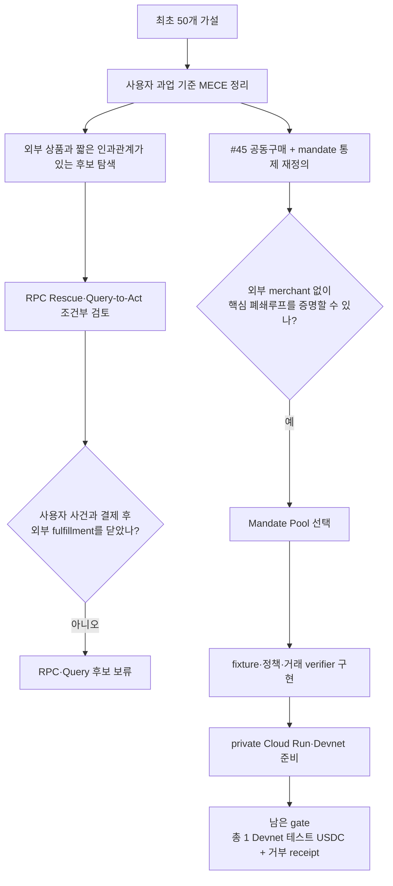
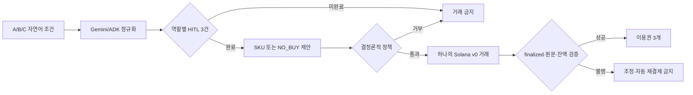

# Agentic Commerce 아이디어 선택 보고서

- 기준일: 2026-08-03 KST
- 독자: 왜 이 아이디어를 만들고 다른 후보를 보류했는지 확인하려는 팀원·심사자.
- 범위: 최초 50개 가설, HITL 후속 아이디어, RPC/Query 후보, 현재 제품 Mandate Pool.
- 방법: 사용자 과업 기준 MECE 정규화 → 공식 심사 계약 → 증거 gate → 구현 가능성과 정직한 데모 경계.
- 현재 결정: **Mandate Pool을 제출 제품으로 구현한다.** 과거 선두였던 RPC Rescue와 Query-to-Act는 보류한다.

## 30초 요약

Mandate Pool은 세 구매자 Agent가 서로 다른 예산·기능·기간 조건을 제시했을 때 공통 조건을 만족하는 상품만 공동 구매하는 프로토타입이다. 한 명의 조건이라도 맞지 않으면 거래를 만들지 않는다. 정상 경로에서는 총 1 Devnet 테스트 USDC를 A `0.333334`, B/C 각 `0.333333`으로 나누고, 하나의 Solana v0 거래가 finalized된 뒤 이용권 세 개를 발급한다.

이 아이디어는 최초 50개 목록의 `#45 Threshold Cart`에서 “최소 인원 달성”보다 **서로 다른 mandate의 교집합과 원자적 결제**를 중심 문제로 다시 정의한 결과다. 여기에 초기 탐색에서 얻은 approval binding, deterministic policy, idempotency, reconciliation 통제를 결합했다.

선택 이유는 점수가 높아서가 아니다. 현재 저장소와 Devnet 환경에서 다음 폐쇄루프를 외부 merchant의 미검증 fulfillment 없이 증명할 수 있기 때문이다.

```text
자연어 조건 3개
  → Gemini/ADK 구조화
  → 역할별 HITL 확인
  → Agent의 상품/NO_BUY 제안
  → 결정론적 정책
  → 한 Solana 원자 거래
  → finalized·잔액 변화 검증
  → 이용권 3개 또는 거래 0건
```

현재 실행 완료 상태는 [환경·실행 런북](hackathon-environment-codex-runbook.md)이 단일 source of truth다.

## 공식 해커톤 계약을 제품 언어로 번역하기

[공식 홈페이지](https://www.gcp-solana-ai-agentic-hacks-kr.xyz/)는 `Solana 기반 Agentic Commerce` 단일 트랙과 다음 네 심사 영역을 제시한다.

- 혁신성과 사용자 경험
- Gemini·Google Cloud AI 활용
- Solana 결제·인프라·프로토콜 연동
- localnet/testnet/devnet에서 실제 transaction과 실행 로그

공개 가중치는 확인되지 않았다. 따라서 후보마다 임의의 숫자를 붙여 우승 확률처럼 사용하지 않았다. 대신 다음 질문에 모두 답할 수 있는지 확인했다.

1. 한 사용자의 한 순간과 비용 있는 결과를 한 문장으로 설명할 수 있는가?
2. Agent가 사전 위임 안에서 `buy / no-buy / 거래 변수`를 고르는가?
3. Gemini의 출력이 실행 경로에 쓰이되 지갑 권한과 분리되는가?
4. Solana 거래가 장식이 아니라 제품의 핵심 불변조건을 증명하는가?
5. 거래 뒤 유효한 상품·서비스 결과가 생기는가?
6. 정상·거부·무결성 실패·결과 불명 경로를 같은 trace에서 보여 줄 수 있는가?
7. fixture와 live Devnet 증거를 정직하게 구분할 수 있는가?

## 아이디어 집합을 어떻게 정리했나

문서에 등장한 이름 수와 독립 제품 수는 같지 않았다.

| 종류 | 처리 원칙 |
|---|---|
| 최초 50개 제품 가설 | 사용자가 결제 뒤 끝내려는 주된 과업 하나에만 배치 |
| 후속 신작 | 기존 50개와 사용자 문제의 중심이 다를 때만 별도 가설로 인정 |
| 재명명·결합·시나리오 | 원래 계보에 흡수 |
| approval·중복 방지·분쟁 처리 패턴 | 독립 제품이 아니라 공통 통제로 분류 |
| 현재 Mandate Pool | `#45` 계보의 후속 재정의로 기록 |

초기 분석의 55개 독립 가설은 다음과 같이 중복 없이 정리됐다. 이 지도는 후보 순위가 아니라 탐색 범위를 찾는 색인이다.

| 주된 사용자 과업 | 수 | 제품 가설 |
|---|---:|---|
| 중요한 행동 전에 외부 사실·위험·적격성을 확인 | 9 | `#01 NeedlePass`, `#02 Attestation Quorum`, `#03 FreshData Auction`, `#04 Onchain Risk Buyer`, `#05 Malware Detonation Shopper`, `#07 KYB Minimal Check`, `#09 Geo Evidence Collector`, `#10 Clause Source Buyer`, `#17 Eval Before Switch` |
| 디지털 장애에서 상태를 복구하거나 안전한 다음 행동을 결정 | 4 | `#06 Incident Trace Buyer`, `#13 RPC Lifeboat`, `#18 Archive Restore Buyer`, `#19 Quota Rescue` |
| 디지털 산출물을 마감 안에 생성·테스트·변환 | 7 | `#11 ModelCall Broker`, `#12 GPU Burst Agent`, `#14 CI Matrix Buyer`, `#15 Accessibility Patch Buyer`, `#16 Just-in-Time Localization`, `#37 RenderBid`, `#47 Compute Spot Splitter` |
| 외부 사람·Agent에게 일을 맡기고 결과로 정산 | 6 | `#20 Specialist Agent Contractor`, `#35 Expert Answer Checkout`, `#46 Expert Swarm Checkout`, `#48 ReproPay`, `#49 Microwork Quorum Payout`, `#50 Milestone Escrow` |
| 물리 운영의 품절·고장·배송 실패를 방지 | 6 | `#21 ShelfGuard Restock`, `#22 Emergency Part RFQ`, `#23 Predictive Maintenance Dispatch`, `#24 ColdChain Rescue`, `#25 Freight Bidder`, `N4 Address Cutoff Rescue` |
| 지급 증빙을 해석해 적정 금액을 지급·환급 | 4 | `#08 OCR Escalator`, `#26 Three-Way Match Pay`, `#27 EarlyPay Optimizer`, `#30 Field Expense Reimbursement` |
| 반복 서비스 비용을 줄이거나 계약상 회수 | 3 | `#28 SaaS Seat Scout`, `#29 SLA Refund Collector`, `N2 Session Stop-Loss` |
| 콘텐츠 배포 권리를 확보 | 3 | `#31 ClipLicense`, `#32 Soundtrack Micro-License`, `#33 FontRight` |
| 개인의 학습 막힘을 해결 | 1 | `#34 Learning Allowance` |
| 급박한 일정·이동 중 자리·연결·서비스를 확보 | 6 | `#38 CancelSlot`, `#39 eSIM Sprint`, `#40 DelayRescue`, `#41 EVCharge Buyer`, `#42 ParkingSlot Agent`, `#43 LateCheckout Duel` |
| 소멸성 재고를 팔거나 집단 수요를 성립 | 3 | `#36 SponsorMinute`, `#44 ExpiryDeal Duel`, `#45 Threshold Cart` |
| 자율 구매 권한을 시작·제한·되돌림 | 3 | `N1 Shadow-to-Live`, `N3 PrivacyBid Checkout`, `N5 Reversible Hold Checkout` |
| 합계 | **55** | 모든 초기 독립 가설을 정확히 한 번 포함 |

경계 사례는 최종 산출물로 분류했다. 예를 들어 OCR Escalator의 출력은 텍스트지만 최종 목적이 송장 지급 판단이므로 지급 증빙 과업에 둔다. Threshold Cart는 소멸 재고·집단 수요 계열이지만 Mandate Pool로 발전하면서 핵심 문제가 “인원 임계치”에서 “다자 권한의 교집합”으로 바뀌었다.

## 점수 대신 사용한 증거 gate

| Gate | 통과 조건 | Mandate Pool의 현재 근거 |
|---|---|---|
| G1 한 사용자 순간 | 세 사람이 공동 이용권을 사려 하지만 조건이 다름 | 문제 문장과 정상·거부 fixture가 고정됨; 실제 사용자 인터뷰는 미완료 |
| G2 Agentic decision | Agent가 후보 또는 `NO_BUY`를 제안 | ADK/Gemini runtime과 typed trace 구현 |
| G3 권한 분리 | LLM과 signer를 분리하고 모든 조건을 코드가 재검사 | policy engine, transaction verifier, signer guard 구현 |
| G4 Solana 인과성 | 다자 분담이 한 원자 거래로 전부 성공 또는 전부 실패 | v0 message, 세 `TransferChecked`, 네 signer 계약과 테스트 |
| G5 fulfillment | finalized 거래 뒤에만 상품을 제공 | transaction·balance verifier 뒤 entitlement 발급 |
| G6 실패 안전 | cap 위반 0 tx, 재시도 중복 없음, 불명 결과 정지 | 상태 머신·CAS·idempotency·reconciliation 구현과 테스트 |
| G7 제출 증거 | live Devnet tx와 linked trace | private readiness까지 완료; 총 1 Devnet 테스트 USDC receipt는 런북상 남음 |

“구현돼 있다”와 “live로 증명됐다”를 같은 열에 두지 않았다. G7이 닫히기 전에는 온체인 제품 검증 완료라고 표현하지 않는다.

## 실제 선택 경로



이 흐름은 RPC 후보가 기술적으로 틀렸다는 뜻이 아니다. 현재 마감과 증거에서 외부 유료 fulfillment 의존성을 감수할 이유가 부족했다는 뜻이다.

## 현재 선택안: Mandate Pool

### Why

여러 Agent가 함께 돈을 낼 때 일부만 결제되거나 한 사람의 금지 조건이 사라지면 추천이 아무리 좋아도 제품은 실패한다. 따라서 사용자 가치는 “싸게 골랐다”보다 **각 사람의 권한을 보존한 채 전부 성공 또는 전부 실패한다**에 있다.

### What

- 입력: 구매자 A/B/C의 자연어 cap·필수 기능·금지 기능·기간.
- HITL: 한 데모 운영자가 A/B/C 역할별 canonical mandate를 각각 확인.
- Agent 결과: catalog에서 공통 상품 한 개 또는 `NO_BUY`.
- 정상 결제: Team-3, 총 1 Devnet 테스트 USDC, `333334/333333/333333` base units.
- 거부 결제: B cap 0.3이면 거래 0건.
- 결과: finalized 거래와 token 증감을 확인한 경우에만 이용권 세 개.

### How



Google의 역할은 자연어를 구조화하고 의사결정 trace를 만드는 데 있다. Solana의 역할은 세 buyer의 분담과 네 signer가 동의한 정확한 메시지를 하나의 원자 거래로 기록하는 데 있다. 둘 중 하나를 빼면 제품의 핵심 증명이 약해진다.

## 과거 후보의 처분

| 후보 | 당시 강점 | 현재 처분 | 결정적 공백 |
|---|---|---|---|
| Duplicate Payout Guard | paid RPC 결과가 중복 payout 거부를 만드는 좁은 인과관계 | 보류 | 사용자 사건, payment→valid result→job refusal 미완료 |
| Query-to-Act | 유료 Solana 이력이 실제 지급 allow/block을 바꿈 | 보류 | exact query, 결제 후 결과, 달라진 downstream action 미완료 |
| Invoice Line Rescue | 한 송장 필드만 유료 재처리 | 보류 | 실제 문서·supplier·지급 authority와 안정적 endpoint 없음 |
| Three-Way Match Pay | 기업 지급 문제와 결정적 match | 이번 제출 제외 | Solana 지급이 핵심이어야 한다는 인과 증거 부족 |
| ClipLicense | 시각적 결과와 사용권 receipt | 제외 | 실제 권리자와 기계 검증 가능한 라이선스 없음 |
| ExpiryDeal Duel | Multi-Agent 협상이 화면에서 명확 | 제외 | 실제 소멸 재고와 안전한 hold/refund 없음 |
| ReproPay | CI test로 결과를 객관화 가능 | 제외 | untrusted code·gaming·appeal 범위가 큼 |
| SLA Refund Collector | Agent가 돈을 쓰지 않고 회수하는 참신성 | 제외 | seller가 인정하는 telemetry와 refund authority 없음 |

“제외”는 아이디어의 영구 가치 판정이 아니다. 이번 제출에서 핵심 진실을 정직하게 증명하지 못한다는 뜻이다.

## 제출 전 실행·검증

1. 최신 source에서 typecheck·test·build를 통과한다.
2. fixture 정상·cap 거부·승인 누락·변조 경로를 실행하고 `NOT ON-CHAIN` 라벨을 확인한다.
3. private live revision의 read-only readiness와 Devnet wallet·ATA·mint를 확인한다.
4. 명시적 HITL 뒤 정상 경로를 한 번 실행해 총 1 Devnet 테스트 USDC의 finalized transaction을 만든다.
5. 같은 revision에서 B cap 0.3 거부 경로가 transaction을 만들지 않았음을 확인한다.
6. order ID로 agent trace, mandate hash, policy proof, message hash, transaction signature, entitlement receipt를 연결한다.
7. 영상과 소개서에서 operator simulation, fixture, live Devnet, x402 비적용을 명시한다.

정확한 명령과 현재 체크박스는 [실행 런북](hackathon-environment-codex-runbook.md)을 따른다.

## 남는 한계

- 실제 공동구매 사용자 인터뷰와 지불의사가 없다.
- merchant와 SignalDesk 이용권은 데모용 경계다.
- 한 운영자가 세 역할을 확인하므로 실제 다자 신원을 증명하지 않는다.
- buyer별 외부 wallet approval과 production custody를 구현하지 않았다.
- 현재 rail은 custom Solana atomic settlement이며 x402/AP2 적합성을 주장하지 않는다.
- Devnet USDC는 금전 가치가 없다. [Circle testnet 안내](https://developers.circle.com/stablecoins/usdc-contract-addresses)
- 공식 페이지와 제출 폼은 바뀔 수 있으므로 제출 직전에 다시 확인한다.

## 읽기 순서

1. [Mandate Pool README](../../product/mandate-pool/README.md): 현재 제품 계약.
2. [HITL 설계](agentic-commerce-hitl-design-decision.md): 사람·Agent·정책·signer의 역할.
3. [실행 런북](hackathon-environment-codex-runbook.md): 현재 상태와 다음 명령.
4. [50개 아이디어 지도](../agentic-commerce-50-ideas.md): 탐색 공간과 계보.
5. [RPC 보류 PRD](rpc-rescue-core-prd.md): 과거 후보와 재개 gate.
