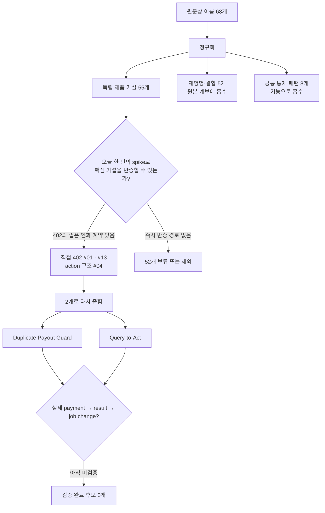

# Agentic Commerce 아이디어 MECE 색출 보고서

- 기준 시각: 2026-08-02 16:54 KST
- 대상: 2026-08-03 23:59 KST 제출을 준비하는 1인 팀
- 범위: 이 디렉토리의 최초 50개 아이디어, HITL 후속 16개, 후속 PRD의 추가 명칭
- 방법: 주된 사용자 과업 기준 MECE 정규화 → 공식 심사항목과 내부 우승·안전 기준 분리 → 현재 직접 증거로 반증
- 판정: **검증 완료 후보 0개 · 조건부 선두 1개 · 단일 전환안 1개**

## 결론

지금 제출 제품으로 발전시킬 계보는 두 개만 남는다.

1. **조건부 선두: `Duplicate Payout Guard`**
   `#13 RPC Lifeboat → Just-Enough RPC Rescue → Duplicate Payout Guard`로 좁힌 형태다. 결제 자체가 목적이 아니라, 유료 RPC 한 건으로 기존 payout의 `finalized` 상태를 확인하고 **중복 replacement payout 생성을 거부**하는 제품이다.
2. **단일 전환안: `Query-to-Act`**
   `#01 NeedlePass + #04 Onchain Risk Buyer`를 합쳐, 유료 Solana 이력 query의 결과가 실제 지급을 `allow / block`하도록 좁힌 형태다.

다만 두 후보 모두 아직 결제 후 유효 결과까지 얻지 못했다. 따라서 현재 `G1 Candidate pending` 상태를 유지한다. 선두를 “확정”했다고 쓰면 증거보다 앞서간다.

`Three-Way Match Pay`, `ClipLicense`, `ExpiryDeal Duel`, `ReproPay`, `SLA Refund Collector`를 제3 후보로 두지 않는다. 이번 마감 안에 외부 권한·실재 상품·검증자·안전 범위를 정직하게 닫을 근거가 없기 때문이다.

## 1. 해커톤 적합성 계약

[공식 홈페이지](https://www.gcp-solana-ai-agentic-hacks-kr.xyz/)와 현재 배포 asset을 약 16:50 KST에 다시 확인했고 [read-only 관측 기록](evidence/hitl-opportunity-probes-2026-08-02.md)을 남겼다.

- 단일 트랙은 `Solana 기반 Agentic Commerce`다. A–D는 별도 트랙이 아니라 예시다.
- 목표는 정해진 한도 안에서 AI Agent가 매 단계 승인 없이 스스로 결제를 처리하는 제품이다.
- 심사는 `혁신성·UX`, `Gemini/GCP AI 활용`, `Solana·인프라·결제 프로토콜 연동`, `localnet/testnet/devnet 실제 거래와 로그`를 본다.
- 공식 가중치는 공개되어 있지 않다. 따라서 근거 없는 점수표는 만들지 않는다.
- 제출 최소 묶음은 제품 소개, GitHub, 데모 영상이다. live URL은 권장이며 Mainnet은 필수가 아니다. 자세한 로컬 계약은 [event-rules.md](../official-docs-wiki/modules/event-rules.md)에 있다.

우리의 선택 기준은 공식 문구를 다음 폐쇄루프로 번역한 것이다.

```text
사용자 목표·권한
  → Gemini가 상황을 구조화
  → Agent가 buy / no-buy / 거래 변수를 선택
  → 결정적 정책이 권한을 검사
  → 실제 Solana 거래
  → 유효한 상품·서비스 결과
  → 그 결과 때문에 사용자 업무 상태가 바뀜
  → tx·receipt·result가 한 trace로 남음
```

## 2. 먼저 이름의 중복을 제거했다

디렉토리에는 이름 기준 68개가 있지만, 68개의 독립 제품이 있는 것은 아니다.

| 종류 | 수 | 처리 |
|---|---:|---|
| 최초 제품 가설 | 50 | 제품으로 한 번씩 분류 |
| 실질적 신작 | 5 | `N1–N5` 임시 ID를 부여해 제품으로 분류 |
| 기존 후보의 재명명·결합·시나리오 | 5 | 원본 계보에 흡수, 별도 후보로 세지 않음 |
| 공통 통제 패턴·독립 제품 탈락안 | 8 | 살아남은 vertical의 기능으로 흡수 |
| 원문상 이름 합계 | 68 | 독립 제품 가설은 55개 |

실질적 신작은 `N1 Shadow-to-Live`, `N2 Session Stop-Loss`, `N3 PrivacyBid Checkout`, `N4 Address Cutoff Rescue`, `N5 Reversible Hold Checkout`이다.

재명명·결합 5개는 다음 계보로만 센다.

- `Just-Enough RPC Rescue`, `Duplicate Payout Guard`, `SimBeforeSign` → `#13 RPC Lifeboat` 계보
- `Query-to-Act` → `#01 NeedlePass + #04 Onchain Risk Buyer`
- `Invoice Line Rescue` → `#08 OCR Escalator + #26 Three-Way Match Pay`

별도 제품으로 세지 않는 8개는 `Mandate Repair`, `ApprovalDelta`, `ConstraintPing`, `ProofBeforePay`, `DuplicatePay Sentinel`, `DisputeReady`, `CanaryPay`, `Scope-Sealed Delegation`이다. 이들은 승인 UX, 구매 전 검증, 중복 방지, 분쟁 복구 같은 공통 제어장치다.

> `DuplicatePay Sentinel`은 모든 결제에 붙는 idempotency 패턴이고, `Duplicate Payout Guard`는 기존 지급의 상태를 유료 RPC로 확인해 재지급을 막는 구체적 제품이다. 이름은 비슷하지만 같은 후보가 아니다.

## 3. 55개 제품 가설의 MECE 지도

분류축은 기술, 프로토콜, A–D 예시가 아니라 **결제 뒤 사용자가 끝내려는 주된 과업**이다. 아이디어가 여러 기능을 가져도 가장 마지막에 바뀌는 사용자 상태 하나에만 배치했다. 그래서 아래 목록은 중복 0개, 누락 0개다.

| 주된 사용자 과업 | 수 | 한 번만 배치한 제품 가설 |
|---|---:|---|
| 1. 중요한 행동 전에 외부 사실·위험·적격성을 확인 | 9 | `#01 NeedlePass`, `#02 Attestation Quorum`, `#03 FreshData Auction`, `#04 Onchain Risk Buyer`, `#05 Malware Detonation Shopper`, `#07 KYB Minimal Check`, `#09 Geo Evidence Collector`, `#10 Clause Source Buyer`, `#17 Eval Before Switch` |
| 2. 디지털 장애 중 상태를 복구하거나 안전한 다음 행동을 결정 | 4 | `#06 Incident Trace Buyer`, `#13 RPC Lifeboat`, `#18 Archive Restore Buyer`, `#19 Quota Rescue` |
| 3. 디지털 산출물을 마감 안에 생성·테스트·변환 | 7 | `#11 ModelCall Broker`, `#12 GPU Burst Agent`, `#14 CI Matrix Buyer`, `#15 Accessibility Patch Buyer`, `#16 Just-in-Time Localization`, `#37 RenderBid`, `#47 Compute Spot Splitter` |
| 4. 외부 사람·Agent에게 일을 맡기고 결과 기준으로 정산 | 6 | `#20 Specialist Agent Contractor`, `#35 Expert Answer Checkout`, `#46 Expert Swarm Checkout`, `#48 ReproPay`, `#49 Microwork Quorum Payout`, `#50 Milestone Escrow` |
| 5. 물리 운영의 품절·고장·배송 실패를 방지 | 6 | `#21 ShelfGuard Restock`, `#22 Emergency Part RFQ`, `#23 Predictive Maintenance Dispatch`, `#24 ColdChain Rescue`, `#25 Freight Bidder`, `N4 Address Cutoff Rescue` |
| 6. 지급 증빙을 해석해 적정 금액을 승인·지급·환급 | 4 | `#08 OCR Escalator`, `#26 Three-Way Match Pay`, `#27 EarlyPay Optimizer`, `#30 Field Expense Reimbursement` |
| 7. 반복 서비스 비용을 줄이거나 계약상 회수 | 3 | `#28 SaaS Seat Scout`, `#29 SLA Refund Collector`, `N2 Session Stop-Loss` |
| 8. 콘텐츠 배포에 필요한 권리를 확보 | 3 | `#31 ClipLicense`, `#32 Soundtrack Micro-License`, `#33 FontRight` |
| 9. 개인의 학습 막힘을 해결 | 1 | `#34 Learning Allowance` |
| 10. 급박한 일정·이동 중 자리·연결·서비스를 확보 | 6 | `#38 CancelSlot`, `#39 eSIM Sprint`, `#40 DelayRescue`, `#41 EVCharge Buyer`, `#42 ParkingSlot Agent`, `#43 LateCheckout Duel` |
| 11. 소멸성 재고를 기한 내 팔거나 집단 수요를 성립 | 3 | `#36 SponsorMinute`, `#44 ExpiryDeal Duel`, `#45 Threshold Cart` |
| 12. 자율 구매 권한을 안전하게 시작하거나 되돌림 | 3 | `N1 Shadow-to-Live`, `N3 PrivacyBid Checkout`, `N5 Reversible Hold Checkout` |
| 합계 | **55** | 모든 제품 가설을 정확히 한 번 포함 |

경계가 헷갈리는 예시는 이렇게 정했다.

- `#08 OCR Escalator`의 출력은 텍스트지만 최종 과업은 송장 지급 판단이므로 6번이다.
- `#35 Expert Answer Checkout`은 정보를 얻지만 최종 과업은 외부 전문가에게 일을 맡기고 수락하는 것이므로 4번이다.
- `#36 SponsorMinute`는 광고권 라이선스보다 마감 직전 소멸 슬롯을 판매하는 과업이 중심이므로 11번이다.
- `N1/N3/N5`는 control-plane 성격이 강하다. 특정 vertical 상품과 결합하기 전에는 제출 제품이 아니다.

## 4. 점수 대신 적용한 내부 S1–S7 동결 gate

후보별 품질·우승 확률을 숫자로 만들 관측 데이터가 없다. 공식 공개 심사항목은 혁신·UX, Gemini/GCP, Solana·프로토콜 통합, live 거래·로그 네 가지다. 아래 S1–S7은 그 공식 항목을 대신하는 규칙이 아니라, 우리가 **제품을 동결하고 검증 완료라고 부르기 위해 추가한 내부 우승·안전 gate**다.

S1–S7 중 하나라도 실패하면 제품을 동결하지 않는다. 다만 아직 실행하지 않은 live spike를 exact endpoint와 명확한 kill condition으로 즉시 수행할 수 있으면 `조건부 가설`로만 잠시 유지한다.

| Gate | 통과 조건 | 실패 예 |
|---|---|---|
| S1 한 사용자·한 순간 | 한 사람이 어떤 비용 있는 상태를 바꾸는지 한 문장으로 말할 수 있음 | “모든 RPC 장애”, “모든 소멸 재고”처럼 범위가 넓음 |
| S2 Agentic decision | 사전 위임 안에서 Agent가 `buy / no-buy / 변수`를 고르고 정상 경로에서 매번 묻지 않음 | 결제 버튼을 대신 누르거나 provider 선택을 사람에게 넘김 |
| S3 Gemini/GCP 인과성 | Gemini의 typed intent가 실제 실행 경로를 바꾸고 Cloud Run·Logging trace로 이어짐 | 슬라이드에 Gemini 로고만 있음 |
| S4 실제 Solana 거래 | localnet/testnet/devnet의 서명·confirmation·receipt가 있음 | sandbox, mock tx, UI 애니메이션뿐임 |
| S5 fulfillment 인과성 | 결제가 유효한 결과를 열고 그 결과가 업무 상태를 바꿈 | 결제 전후 사용자 결과가 같음 |
| S6 권한·HITL 안전 | 최초 mandate 후 정상 0-prompt, 권한 필드 누락만 1-prompt, 무결성 실패는 hard deny | 외부 권리·재고·환불권한을 사용자의 승인 클릭으로 꾸밈 |
| S7 마감 내 정직한 증거 | 지금 접근 가능한 exact endpoint와 검증자로 짧은 폐쇄루프를 만들 수 있음 | 미래 파트너, 미구현 oracle, 가짜 merchant가 핵심 |

## 5. 색출 결과



### 조건부 선두 — Duplicate Payout Guard

| 항목 | 현재 판정 |
|---|---|
| 한 사용자 순간 | 기존 Solana payout 상태가 안 보여 replacement transaction을 만들기 직전인 운영자 |
| Agent의 경제적 결정 | 무료 RPC 두 곳이 요구를 못 채우면, signed cap 안에서 QuickNode `getSignatureStatuses` 한 건을 살지 결정 |
| Gemini/GCP 역할 | 자연어의 부정·조건·deadline을 typed intent로 변환; Cloud Run 실행; 같은 `decision_id`로 Cloud Logging trace |
| Solana가 필요한 이유 | RPC 상품 구매 자체가 Solana x402이고, 구매한 결과도 Solana payout의 상태를 판정 |
| 검증할 업무 변화 | target signature가 `finalized`이면 replacement payout 생성을 거부 |
| 직접 관측 | exact Devnet method가 unsigned HTTP 402까지 도달 |
| 아직 없음 | 사용자 사건 0/3, non-zero Devnet settlement, paid RPC result, job refusal, joined GCP trace |
| 즉시 탈락 | `402 → payment → valid status → replacement 거부` 중 하나라도 실패, 이중 sign/payment, 지속적인 null result |

이 후보가 일반적인 “RPC 자동 전환”보다 강한 이유는 RPC 성능을 자랑하는 것이 아니라 **같은 돈을 두 번 보내지 않는 단 하나의 사용자 결과를 증명하도록 좁혔기 때문**이다. 반대로 실제 paid fulfillment 전에는 `CONDITIONAL GO` 이상으로 표현하지 않는다. 상세 계약은 [rpc-rescue-core-prd.md](rpc-rescue-core-prd.md)에 있다.

### 단일 전환안 — Query-to-Act

| 항목 | 현재 판정 |
|---|---|
| 한 사용자 순간 | 지급 직전 무료 근거가 부족해 Solana 과거 이력 한 건을 사야 하는 운영자 |
| Agent의 경제적 결정 | query 비용과 노출액을 비교해 `free / no-buy / paid`를 선택 |
| Gemini/GCP 역할 | 자연어 claim을 허용된 parameterized query와 `allow / block` 계약으로 변환 |
| Solana가 필요한 이유 | Solana 이력 자체가 판단 대상이고 gateway가 Solana 결제를 요구 |
| 검증할 업무 변화 | 유료 결과가 payout을 실제로 허용하거나 차단 |
| 직접 관측 | pay.sh BigQuery gateway가 HTTP 402와 USD 0.001/request, Solana Mainnet payment option을 반환 |
| 아직 없음 | exact claim, 결제, query result, 결과로 달라진 지급, 사용자 사건 |
| 즉시 탈락 | 유료 결과를 제거해도 결정이 같음, exact query를 고정하지 못함, payment 뒤 결과를 받지 못함 |

이는 선두와 병렬 구현할 후보가 아니다. 선두의 live paid fulfillment가 실패했을 때 **한 번만** 확인할 전환안이다.

## 6. 나머지 52개 가설의 첫 실패 지점

아래는 중복 판단을 피하기 위해 각 가설의 **첫 번째 결정적 공백만** 적었다. 수량은 `7 + 3 + 42 = 52`로 Mermaid의 제외 분기와 일치한다.

| 과업군 | 수 | 이번 마감의 처분 | 첫 번째 결정적 공백 |
|---|---:|---|---|
| 외부 사실·위험·적격성의 잔여 가설 | 7 | 보류·제외 | `#01/#04` 외에는 지금 결제 가능한 exact seller와 결과 provenance가 없음 |
| 디지털 장애 대응의 잔여 가설 | 3 | 보류 | `#13` 외에는 trace·restore·quota의 live paid fulfillment가 없음 |
| 디지털 산출물 생성 | 7 | 보류 | 실제 유료 seller와 결제 후 결과를 검증한 endpoint 없음 |
| 외부 일 위임·성과 정산 | 6 | 제외 | 주관적 verifier, untrusted code, duplicate/gaming, 다중 지급 범위가 큼 |
| 물리 운영·물류 | 6 | 제외 | 실제 재고·배송·설비 oracle와 seller authority 없음 |
| 지급 증빙 처리 | 4 | 보류 | Document AI gateway 직접 probe가 HTTP 500이며 실제 문서·supplier·지급 authority 없음 |
| 반복 비용 회수 | 3 | 제외 | seller가 인정하는 계약·telemetry·refund authority 없음 |
| 콘텐츠 권리 | 3 | 제외 | 실제 권리자와 법적으로 신뢰할 license provenance 없음 |
| 학습 | 1 | 보류 | 미성년자 동의·학습효과·실제 유료 상품이 모두 미검증 |
| 급박한 예약·이동 | 6 | 제외 | 실시간 재고·예약 API·현장 이행 증거 없음 |
| 소멸 재고·집단 수요 | 3 | 제외 | 실제 merchant 재고가 없고 escrow·환불 범위가 커짐 |
| 자율 권한 lifecycle | 3 | 기능으로 흡수 | 독립 상품 결과가 없어 approval middleware로 보임 |
| 합계 | **52** | 현재 구현하지 않음 | 각 행의 첫 실패 gate가 해소될 때만 재개 |

여기서 `보류`는 장기적으로 나쁜 아이디어라는 뜻이 아니다. **이번 제출 마감까지 핵심 진실을 증명할 수 없다는 뜻**이다.

## 7. 기존 7개 검증 대기열의 최종 처분

| 기존 후보 | 최종 처분 | 이유 |
|---|---|---|
| `#13 RPC Lifeboat` | 조건부 생존 | 범용 router는 버리고 `Duplicate Payout Guard`로 좁힐 때만 생존 |
| `#01 NeedlePass` | 단일 전환안에 흡수 | `#04`와 결합해 유료 근거가 실제 payout을 바꾸는 `Query-to-Act`로 한정 |
| `#26 Three-Way Match Pay` | 이번 마감 보류 | Document AI 500과 실제 AP 지급 authority 공백 |
| `#31 ClipLicense` | 제외 | rights holder와 법적 license merchant가 없음 |
| `#44 ExpiryDeal Duel` | 제외 | “식품·좌석·광고”가 한 후보에 섞였고 실제 소멸 재고가 없음 |
| `#48 ReproPay` | 제외 | untrusted code 격리, 중복·gaming·appeal을 닫기 어려우며 CI bounty로 보일 위험 |
| `#29 SLA Refund Collector` | 제외 | seller-recognized telemetry와 signed refund authority가 없음 |

## 8. 의사결정 상태와 증거 경계

| 구분 | 사실 |
|---|---|
| 공식·직접 확인 | 단일 Agentic Commerce 트랙, 네 심사항목, Devnet 허용, 실제 거래·로그 요구 |
| 로컬 직접 확인 | workflow는 `DISCOVERY / G1 pending`, product·receipt 없음 |
| 외부 endpoint 직접 확인 | QuickNode exact Devnet RPC와 pay.sh BigQuery가 402 반환; Document AI는 500 반환 |
| 추론 | 이 증거와 마감에서는 `Duplicate Payout Guard`와 `Query-to-Act`만 즉시 반증할 가치가 있음 |
| 아직 주장 금지 | 사용자 pain·지불의사, paid fulfillment, 실제 중복 지급 방지, 우승 가능성 |

최소 증거는 다음 전부다.

```text
agent decision
  → fresh payment challenge
  → bounded signed authorization
  → confirmed Solana transaction
  → valid paid result
  → downstream job transition
  → application receipt + joined GCP trace
```

402만으로는 결제 성공도, 상품 수령도, 제품 가치도 증명되지 않는다. mock seller를 붙여 이 공백을 감추지 않는다.

## 근거

- [공식 해커톤 홈페이지](https://www.gcp-solana-ai-agentic-hacks-kr.xyz/)
- [행사 규칙과 최소 증거 묶음](../official-docs-wiki/modules/event-rules.md)
- [인프라·ADK 경계](../official-docs-wiki/modules/infrastructure-and-billing.md)
- [50개 원본 아이디어](../agentic-commerce-50-ideas.md)
- [HITL 디자인 의사결정과 후속 16개](agentic-commerce-hitl-design-decision.md)
- [직접 endpoint 관측](evidence/hitl-opportunity-probes-2026-08-02.md)
- [QuickNode exact method 관측](evidence/quicknode-x402-probe.md)
- [선두 Core PRD](rpc-rescue-core-prd.md)
- [기존 전략 보고서의 source notes](source-notes.md)

## 단 하나의 다음 결정

UI를 만들기 전에 exact QuickNode 경로에서 `402 → non-zero Devnet payment → receipt → valid getSignatureStatuses → replacement payout 거부`를 한 번 닫는다. 성공하면 `Duplicate Payout Guard`를 G1 후보로 동결하고, 실패하면 관련 RPC·mandate UI를 모두 버린 뒤 `Query-to-Act`의 paid BigQuery result를 한 번만 검사한다.
