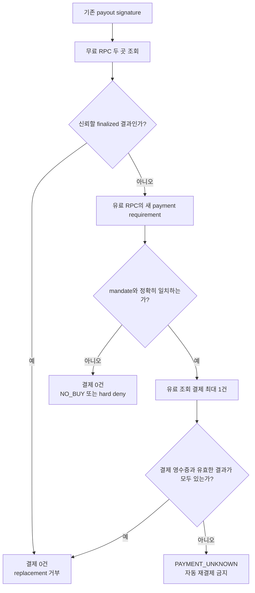

# Duplicate Payout Guard — 보류된 후보 PRD

- 문서 역할: 2026-08-02에 검토한 `RPC Lifeboat` 계보의 제품 계약과 보류 근거를 보존한다.
- 현재 제품: **Mandate Pool**. 이 문서는 현재 구현 지시서가 아니다.
- 독자: 아이디어 선택 과정을 검토하거나 RPC 후보를 다시 평가할 제품·기술 담당자.
- 상태: **PARKED**. HTTP 402 요구까지 관측했지만 사용자 필요와 결제 후 RPC 결과를 닫지 못했다.

## 먼저 읽을 결론

Duplicate Payout Guard의 아이디어는 간단하다. 기존 Solana 지급의 상태가 불분명할 때 곧바로 새 지급을 만들지 않고, 무료 RPC로 먼저 확인한 뒤 필요하면 유료 RPC 조회 한 건을 구매한다. 조회 결과가 `finalized`이면 replacement payout을 거부한다.

이 문제는 기술적으로 타당하지만, 해커톤 제품으로 채택하지 않았다. 저장소에 남은 증거는 unsigned HTTP 402 응답뿐이고, 다음 두 질문에 답할 근거가 없었기 때문이다.

1. 실제 운영자가 이 조회에 비용을 지불할 만큼 자주 곤란을 겪는가?
2. 결제한 RPC 결과가 무료 조회보다 낫고 실제 재지급 차단까지 인과적으로 이어지는가?

현재 구현과 제출 판단은 [Mandate Pool README](../../product/mandate-pool/README.md)와 [실행 런북](hackathon-environment-codex-runbook.md)을 따른다.

## IDEA: Why · What · How

### Why

Solana 공식 재시도 가이드는 최초 거래의 blockhash가 아직 유효한 상태에서 새로 서명하면 두 거래가 모두 수락될 수 있으므로, 재서명 전에 기존 거래의 상태와 만료를 확인하라고 설명한다. 이는 “상태가 안 보이니 새 거래를 만든다”는 대응에 중복 지급 위험이 있음을 뒷받침한다. 다만 공식 문서는 문제의 존재를 설명할 뿐, 유료 RPC 상품의 수요를 증명하지는 않는다. [Solana Retrying Transactions](https://solana.com/developers/cookbook/transactions/retry)

### What

한 payout signature만 조회하는 좁은 보호 장치다.

- 무료 RPC 두 곳에서 `getSignatureStatuses`를 먼저 시도한다.
- 두 결과가 사전 정의한 freshness·commitment 조건을 충족하지 못할 때만 유료 endpoint의 조건을 가져온다.
- 서명된 예산·network·asset·payee·요청 본문과 정확히 일치할 때 결제 한 건을 허용한다.
- 유료 결과가 target signature의 `finalized`를 확인하면 replacement builder를 잠근다.
- 결과가 불명확하면 새 payout이나 새 결제를 자동 생성하지 않고 조정 상태로 멈춘다.

### How



## 당시 잠근 MVP 경계

| 축 | 계약 |
|---|---|
| 사용자 순간 | 기존 지급 상태를 확인하지 못해 replacement를 만들기 직전 |
| 조회 | Solana Devnet `getSignatureStatuses`, signature 한 개 |
| 공급 | free primary, free alternative, paid endpoint 각 한 곳 |
| Agent 결정 | `free / paid / no-buy` 중 하나 |
| 결제 상한 | decision당 한 건, 사전 mandate 안에서만 |
| 성공 | 결제 확인과 유효한 RPC 결과가 함께 있고 target-job fixture가 replacement 생성을 거부 |
| 실패 안전 | 서명 뒤 결과 불명은 `PAYMENT_UNKNOWN`; 자동 재서명·재결제 없음 |
| 범위 밖 | payout 자동 재실행, Mainnet 자금, 범용 RPC router, production HA |

`target-job fixture`는 실제 지급 시스템이 아니다. 시연했다면 반드시 fixture라고 표시해야 했다.

## HITL과 결정권

사람은 최초 mandate에서 network, asset, payee, 최대 금액, 만료를 정한다. 정상 범위의 `free / paid / no-buy` 선택에는 다시 개입하지 않는다. 반면 signature·hash·replay·expiry·payment binding 실패는 사람이 “그래도 승인”할 수 있는 예외가 아니라 결정론적 차단이다.

| 상태 | 사람의 역할 | 시스템 행동 |
|---|---|---|
| 완전한 mandate | 사전 권한 설정 | 정상 경로를 자동 실행 |
| 실행 권한이 없는 초안 | 누락 필드를 채우고 전체 권한을 새로 확인 | 활성화 전까지 결제 금지 |
| 한도 초과·무결성 실패 | 승인으로 우회하지 않음 | hard deny |
| 서명 뒤 결과 불명 | 원장과 영수증을 수동 확인 | 새 결제 금지 |

이 HITL 원칙은 현재 Mandate Pool의 `사람이 조건을 확인하고, LLM이 아니라 정책·거래 verifier가 돈을 통제한다`는 설계로 이어졌다. AP2도 autonomous mode에서 사용자가 제약을 먼저 승인하고 Agent가 그 제약 안에서 closed checkout과 payment를 구성하는 모델을 설명하며, 검증·처리는 결정론적 코드에서 수행하도록 요구한다. Mandate Pool은 이 원칙을 참고하지만 AP2 구현이나 적합성을 주장하지 않는다. [AP2 v0.2](https://ap2-protocol.org/ap2/specification/)

## 당시 필요한 검증 계약

다음 두 gate를 모두 통과해야 후보를 다시 열 수 있다.

### 사용자 gate

- 최근 실제 replacement/stop 결정을 맡았던 Solana 운영자에게 사건과 로그를 받는다.
- 기존 Explorer·무료 RPC·기존 provider가 왜 시간 안에 충분하지 않았는지 확인한다.
- 개별 조회마다 승인하는 방식과 사전 한도 안의 자동 조회 중 실제 선호를 행동으로 검증한다.

칭찬이나 일반적인 “중복 지급은 위험하다”는 답은 통과 증거가 아니다.

### 기술 gate

```text
fresh 402 requirement
  → exact offer binding
  → non-zero Devnet test-token settlement
  → payment receipt
  → valid getSignatureStatuses result
  → target-job replacement refusal
  → 한 decision trace
```

동시 worker, 서명 직후 crash, 응답 유실에서도 sign과 payment가 각각 최대 한 번이어야 한다. 402 응답만으로 결제·상품 수령·사용자 가치를 주장할 수 없다.

## 보류 결정과 현재 제품의 차이

| 질문 | Duplicate Payout Guard | 현재 Mandate Pool |
|---|---|---|
| 핵심 사용자 결과 | 기존 payout의 중복 재생성 방지 | 세 구매 조건의 교집합 상품을 일부 결제 없이 공동 구매 |
| 외부 의존성 | 유료 RPC merchant와 post-payment fulfillment | 고정 데모 catalog와 자체 entitlement verifier |
| 온체인 증명 | RPC 서비스 결제 한 건 | 한 v0 거래의 세 `TransferChecked`와 네 signer |
| 현재 증거 상태 | 과거 unsigned 402 관측만 보존 | 코드·테스트·private Cloud Run 준비 완료, 1 Devnet 테스트 USDC 실행 증거는 런북상 미완료 |
| 처분 | 보류 | 제출 제품 |

Mandate Pool을 선택한 이유는 RPC 아이디어가 나빠서가 아니다. 외부 유료 fulfillment에 의존하지 않고도 `의도 → HITL → 정책 → 원자적 거래 → finalized 검증 → entitlement`를 한 제품 경계 안에서 더 정직하게 증명할 수 있기 때문이다.

## 재개 조건

RPC 후보를 다시 검토하려면 UI부터 만들지 않는다. 사용자 gate의 실제 사건과 기술 gate의 end-to-end trace를 먼저 확보한다. 둘 중 하나라도 실패하면 다시 보류한다. 재개 시에는 [중학생용 시각 설명](rpc-rescue-middle-school-visual-guide.md)과 [과거 직접 probe](evidence/quicknode-x402-probe.md)를 출발 자료로 사용하되, endpoint의 현재 가용성과 가격은 새로 확인한다.

## 근거와 한계

- [Solana 재시도 가이드](https://solana.com/developers/cookbook/transactions/retry): 재서명 전 blockhash 만료 확인과 중복 가능성.
- [Solana `getSignatureStatuses`](https://solana.com/docs/rpc/http/getsignaturestatuses): 조회 메서드 계약.
- [QuickNode x402 guide](https://www.quicknode.com/guides/solana-development/ai-agents/how-to-access-solana-rpc-with-x402-solana): 당시 검토한 유료 RPC 흐름.
- [과거 직접 probe](evidence/quicknode-x402-probe.md): 2026-08-02 unsigned HTTP 402 관측. 현재 가용성의 보증이 아니다.

사용자 수요, 결제 후 fulfillment, 무료 대비 유료 결과의 우위는 검증되지 않았다. 이 문서에 있는 흐름은 구현 완료 보고가 아니라 보류된 제품 계약이다.
