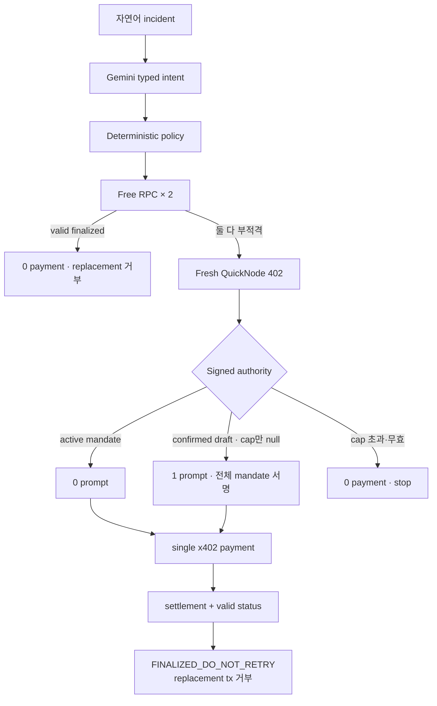

# Duplicate Payout Guard

> Just-Enough RPC Rescue · Core PRD v0 · 2026-08-02 KST

**판정: CONDITIONAL GO** · 사용자 증거 0/3 · live 증거 unsigned HTTP 402까지 · 제출 2026-08-03 23:59 KST
상세 구현 계약: [Technical PRD](../../.ouroboros/pm.md)
중학생용 시각 설명: [Mermaid Visual Guide](rpc-rescue-middle-school-visual-guide.md)

**증거 시제:** 현재 성취한 runtime evidence는 HTTP 402뿐이다. 아래 동작과 데모는 Gate 0A·0B 통과 후 증명해야 할 acceptance contract이며 현재 capability가 아니다.

## 1. Executive decision

구축할 제품은 기존 Solana payout의 상태가 보이지 않아 replacement transaction을 만들려는 운영자를 위해 무료 RPC를 먼저 확인하고, 필요할 때만 QuickNode RPC 한 건을 x402로 구매해야 한다. 정확한 target signature가 `finalized`로 확인되면 target-job fixture가 replacement transaction 생성을 거부해야 한다.

**사용자 outcome은 “같은 payout을 두 번 만들지 않는다”다.** Gate 통과 후 active mandate hero가 증명할 계약은 `human prompt 0 · RPC payment 1 · replacement payout 0`이다. Cap 하나만 없는 confirmed draft에서만 정확히 한 번 묻고 같은 decision을 자동 완주해야 한다.

Gate 통과 후 Agent는 무료 결과·deadline·가격·signed budget을 비교해 buy/no-buy를 결정하고, Solana Devnet USDC로 digital service를 구매하며, 그 결과로 후속 업무를 바꿔야 한다. 이 acceptance가 runtime evidence로 닫힐 때만 단순 wallet wrapper가 아닌 `observe → decide → transact → consume → prove`의 Agentic Commerce로 인정한다.

## 2. WHY — problem and evidence boundary

사용자 Why는 미검증이다. payout 상태 불확실성이 replacement 판단을 실제로 방해하는지, Explorer·무료 RPC·기존 provider로 deadline 안에 해결하지 못하는지 확인하지 않았다. 현재 증거는 duplicate 가능성과 paid-query 구현 가능성뿐이며 desirability의 증거가 아니다.

Primary-user 가설은 기존 payout이 보이지 않을 때 replacement/stop을 직접 결정하고, 현재 확인 경로가 필요한 시간 안에 신뢰할 status를 주지 못했던 Solana 운영자다. `1–3인`, `free/shared RPC`, `premium HA 미사용`은 모집 필터이지 pain의 증거가 아니다.

> 기존 payout의 상태가 보이지 않아 새 transaction을 만들지 결정해야 할 때, 무료 경로 또는 최소 유료 RPC로 `finalized`를 확인해 같은 수취인에게 다시 지급하지 않되, 이미 정한 지출 경계 안의 정상 선택마다 나를 깨우지 말라.

| 근거 | 현재 아는 것 | 경계 |
|---|---|---|
| 공식 사실 | Solana는 기존 blockhash가 유효한 동안 새 transaction도 수락되어 duplicate send가 될 수 있다고 경고한다. | status-before-replacement 문제만 성립한다. |
| 공식 사실 | QuickNode는 x402 pay-per-request와 요청별 settlement를 문서화한다. SDK 기본값은 credit-drawdown이다. | PPR을 명시해야 하며 live 성공은 별도다. |
| 직접 관측 | exact Devnet `getSignatureStatuses` unsigned request가 2026-08-02 HTTP 402에 도달했다. | challenge 이후는 전부 미검증이다. |
| 미검증 | 실제 incident·workaround 실패·위임 의사, non-zero settlement·paid result·job refusal | User/Technical Gate 중 하나라도 kill이면 후보를 버린다. |

근거: [QuickNode x402 guide](https://www.quicknode.com/guides/solana-development/ai-agents/how-to-access-solana-rpc-with-x402-solana), [QuickNode payments](https://www.quicknode.com/docs/build-with-ai/x402-payments), [Solana retry guide](https://solana.com/developers/guides/advanced/retry), [getSignatureStatuses](https://solana.com/docs/rpc/http/getsignaturestatuses), [local probe](evidence/quicknode-x402-probe.md)

## 3. WHAT — locked MVP

| 축 | 계약 |
|---|---|
| incident | 제출된 payout 하나의 confirmation 불명확 |
| query | Solana Devnet `getSignatureStatuses`, signature 1개, `finalized`만 성공 |
| supply | free primary + free alternative + QuickNode x402 paid 각 1개 |
| payment | `pay-per-request`, Devnet USDC, decision당 최대 1건 |
| intelligence | Gemini가 부정·조건·deadline 자연어를 typed intent와 unresolved field 후보로 변환 |
| GCP runtime | Cloud Run orchestration, Firestore atomic state, Cloud Logging joined trace |
| authority | deterministic code가 operator, mandate, cap, expiry, offer binding, idempotency, signer를 판정 |
| done | confirmed settlement + valid result + job transition + builder refusal + joined trace |

범용 RPC router, 장애 예측, payout 자동 재실행, Mainnet treasury, subscription 최적화, production HA는 제외한다. target-job은 명시적인 fixture이며 production payout system 전체를 막는다고 주장하지 않는다.

## 4. HOW — decision and HITL

| 경계 | 사람 | 결제 | 종료 |
|---|---:|---:|---|
| active mandate의 free/paid/no-buy | 0회 | 0 또는 1 | Agent 완주 |
| confirmed draft에서 cap만 null | 정확히 1회 | activation 전 0 | 같은 decision 자동 재개 |
| cap 초과 또는 integrity/replay/expiry/binding 실패 | 0회 | 0 | no-buy 또는 hard deny; 증액·override 없음 |
| sign attempt 뒤 결과 불명확 | 동기 승인 0회 | 최대 1 | `PAYMENT_UNKNOWN`; 자동 재결제 없음 |

### Runtime invariants

- `authenticated operator == intent operator == mandate authority signer`; draft만으로 signer를 호출할 수 없다.
- payment 전 mandate budget·count와 decision reservation을 원자적으로 차감한다.
- signer는 fresh offer의 version, scheme, CAIP-2 network, asset, payTo, amount, resource, method, body hash에 정확히 묶인 single-use capability만 받는다.
- signer 호출 직전 capability 소비와 `SIGN_ATTEMPT_STARTED`를 durable CAS로 기록한다. 이후 불명확성은 동결하며 reservation 해제, takeover, 새 request, 재서명·재결제를 금지한다.
- confirmed settlement와 exact target signature의 valid `finalized` result가 모두 있어야 job을 `FINALIZED_DO_NOT_RETRY`로 바꾼다.

## 5. PROOF — acceptance and demo

아래 표와 영상은 아직 존재하는 성취가 아니라 제출 전에 runtime으로 닫아야 할 proof contract다.

| 경로 | 필수 인과 증거 | 수치 |
|---|---|---|
| HERO paid | live 402 → verified offer → confirmed Devnet tx → PAYMENT-RESPONSE → valid status → builder refusal | prompt 0, sign 1, payment 1, replacement 0 |
| FREE / NO-BUY / DENY | free valid 또는 cap·binding·replay 차단 | prompt 0, payment 0 |
| JUST-ENOUGH | cap-null diff → 질문 → full mandate → 같은 decision paid completion | prompt 총 1, payment 최대 1 |
| UNKNOWN / RACE | sign 직후 crash·response loss·concurrent worker | sign/payment 최대 1, retryable=false |

Gate 0A·0B가 통과하면 90초 데모를 `자연어→typed intent` 12초, `free FAULT FIXTURE→live 402→prompt 0→payment` 33초, `paid result→job transition→builder refusal` 20초, cap-null 예외 trace 13초, joined trace와 안전 matrix 12초로 고정한다.

화면과 로그는 target payout signature와 RPC payment signature를 분리하고 `LIVE`, `FAULT FIXTURE`, `TARGET-JOB FIXTURE`를 표시한다. mock transaction이나 fixture outage를 live 증거로 세지 않으며 실제 outage 복구율이나 QuickNode 우월성을 주장하지 않는다.

## 6. GATES — falsify before UI

마감 때문에 Gate 0A와 0B를 병렬 실행한다. **둘 다 통과하기 전에는 UI와 mandate framework를 확장하지 않는다.**

### Gate 0A — User desirability

최근 6개월 안에 replacement/stop을 직접 결정한 Solana 운영자 3명에게 실제 artifact, 결정 순간, workaround, 소요 시간, 오판 결과를 받는다. 판정은 `kill → continue → revise` 순서다.

- **kill:** incident가 2건 미만, 또는 2명 이상이 deadline 안에 기존 경로로 충분히 해결, 또는 2명 이상이 모든 개별 결제를 승인하겠다고 함
- **continue:** kill이 아니고, 2명 이상이 기존 경로의 부족을 artifact로 보이며 bounded payment를 무질문 실행으로 분류하고, 3명 모두 payment-unknown을 halt로 분류
- **revise:** 나머지 결과; 실패한 problem/interaction 가설을 바꾸고 재검증

### Gate 0B — Live causal and safety spike

Direct script가 다음을 모두 통과해야 한다.

1. `402 → non-zero confirmed Devnet settlement → PAYMENT-RESPONSE → valid getSignatureStatuses → target-job refusal`
2. fresh offer와 signing payload의 version/scheme/network/asset/payTo/amount/resource/method/body hash exact match 및 target/payment signature 분리
3. concurrent worker, sign 직후 crash, response loss에서 추가 sign·payment 0건

Non-zero payment 불가, policy 전 SDK auto-sign, paid result의 job 미반영, double sign/payment, 지속적 null result는 즉시 kill이다.

## 7. Decision status

**CONDITIONAL GO를 유지한다.** 현재 성취한 핵심 증거는 unsigned HTTP 402 하나뿐이다. 다음 행동은 n=3 incident interview와 direct live spike의 병렬 실행이며, 어느 gate든 kill이면 RPC 후보를 중단하고 차순위 후보를 재검토한다.

Schema, API, state machine, reason code, timeout과 abuse tests의 단일 source of truth는 [Technical PRD](../../.ouroboros/pm.md)다.
