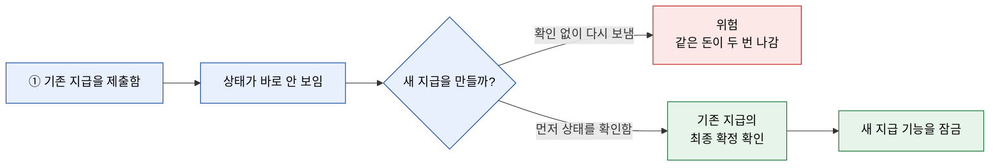
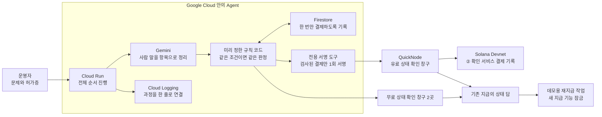
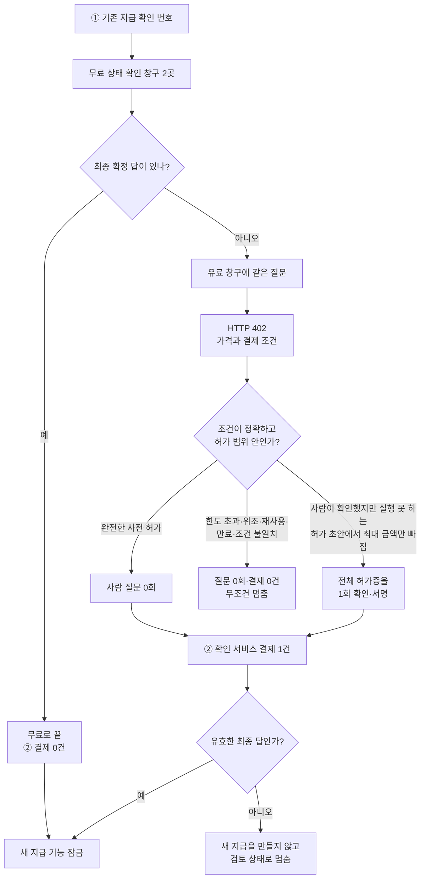
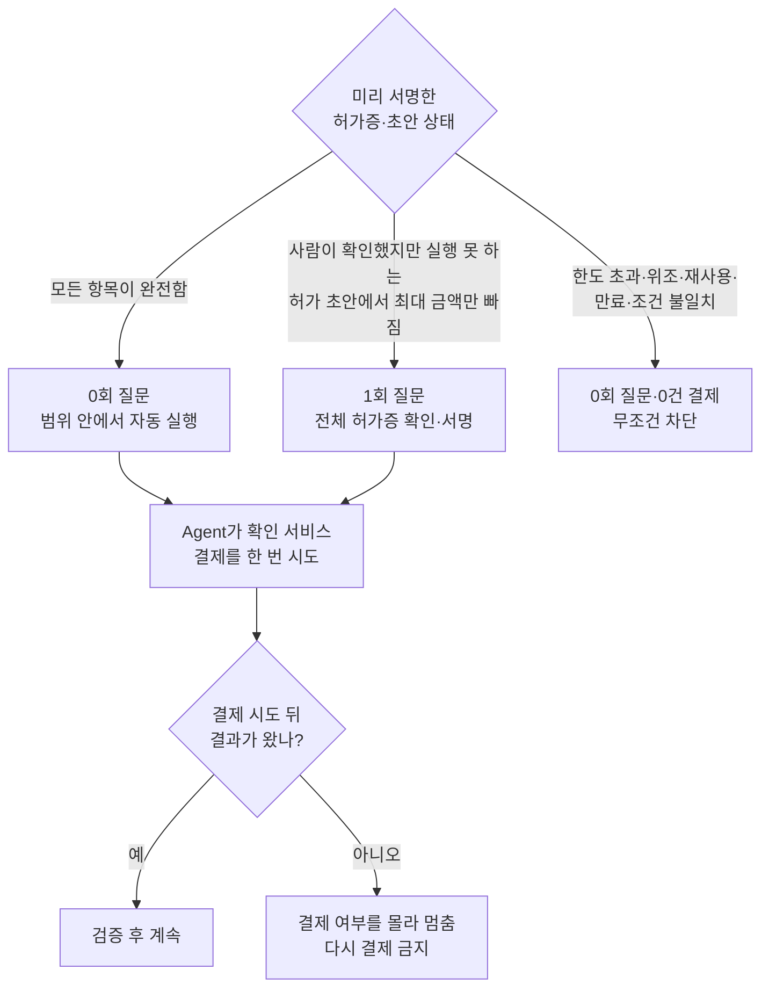
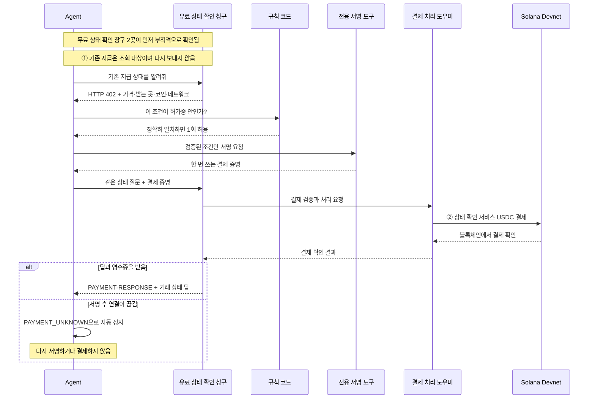
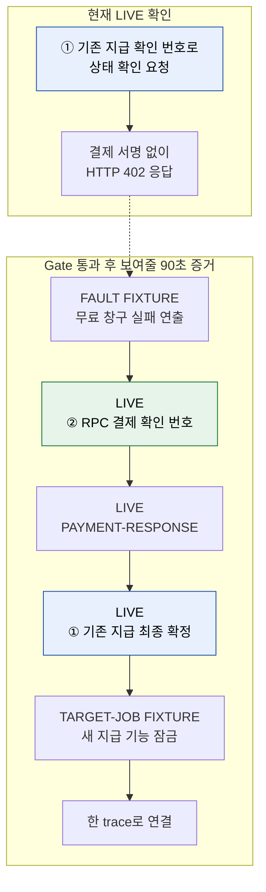
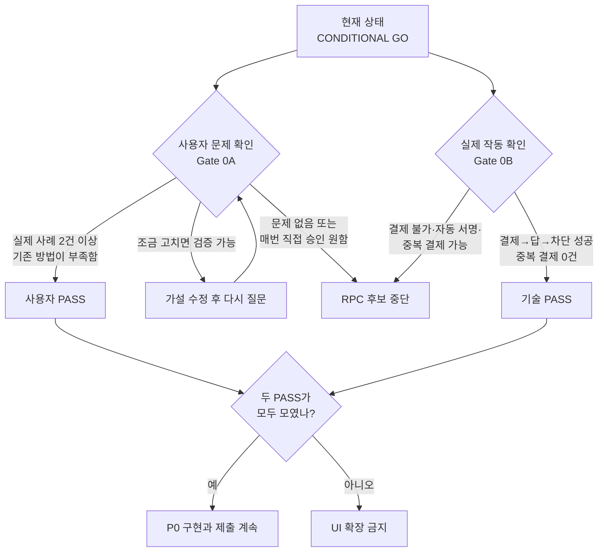

# Duplicate Payout Guard — 그림으로 이해하는 설명서

> 중학생도 이해할 수 있는 Mermaid 시각 설명 · Core PRD companion · 2026-08-02 KST

## 0. 딱 한 문장

**먼저 보낸 돈이 제대로 갔는지 확인해서, 같은 돈을 실수로 두 번 보내는 일을 막는다.**

이 Agent는 기존 지급을 다시 보내지 않는다. 무료 상태 확인 창구를 먼저 사용하고, 무료 확인만으로 부족할 때 허락된 범위 안에서 **상태 확인 서비스** 한 번을 산다.

> **현재 실제로 확인한 것은 HTTP 402 응답까지다.** 아래 결제·결과·재지급 차단 그림은 앞으로 Gate를 통과하며 증명해야 할 제품 계약이다.

원문: [Core PRD](rpc-rescue-core-prd.md) · [Technical PRD](../../.ouroboros/pm.md) · [현재 402 관측](evidence/quicknode-x402-probe.md)

## 먼저 알아둘 쉬운 말

| 기술 용어 | 이 문서에서 읽는 방법 |
|---|---|
| Agent | 목표를 받고 정해진 규칙 안에서 스스로 선택하고 실행하는 프로그램 |
| 기존 payout | 이미 먼저 보낸 돈 |
| replacement transaction | 같은 돈을 다시 보내는 새 거래 |
| RPC | 블록체인 상태를 물어보는 확인 창구 |
| signature | 거래를 찾아보는 고유 확인 번호; 비밀번호가 아님 |
| unsigned 요청 | 결제 서명을 아직 넣지 않은 요청 |
| finalized | 거래가 최종 확정됨 |
| x402 | “이 서비스를 쓰려면 먼저 결제하세요”라는 웹 응답 방식 |
| Devnet | 실제 돈 대신 연습용 자산을 쓰는 Solana 연습망 |
| USDC | 1달러 가치에 맞추도록 설계된 디지털 토큰; 여기서는 연습망 결제 수단 |
| mandate | Agent가 어디까지 돈을 써도 되는지 적은 서명된 허가증 |
| cap | 최대 사용 금액 |
| fixture | 실제 상황이라고 속이지 않고 표시한 데모용 연습 상황 |
| PAYMENT_UNKNOWN | 결제됐는지 몰라서 자동 실행을 멈춘 상태 |
| PAYMENT-RESPONSE | 결제가 처리됐다는 응답 영수증 |
| LIVE | 실제 네트워크에서 직접 확인한 것 |
| trace | 처음 판단부터 결과까지 이어 붙인 한 줄 기록 |
| Gate | 계속 만들지 판단하는 통과 시험 |
| CONDITIONAL GO | 두 Gate를 통과할 때만 계속 진행한다는 뜻 |

## 전체 지도

| 그림 | 답하는 질문 | 반드시 기억할 것 |
|---:|---|---|
| 1 | 왜 두 번 지급될 수 있을까? | 기존 지급 상태를 모르고 새 지급을 만들면 위험하다. |
| 2 | 누가 무슨 일을 할까? | Gemini는 말을 이해하고 규칙 코드는 돈을 통제한다. |
| 3 | Agent는 언제 돈을 쓸까? | 무료 확인이 먼저이며 필요하고 허용될 때만 결제한다. |
| 4 | 사람은 언제 등장할까? | 정상 0회, cap 하나만 없을 때 1회, 위반 때 0회다. |
| 5 | x402 결제 한 번은 어떻게 끝날까? | 결제와 유효한 답을 모두 확인해야 성공이다. |
| 6 | 지금 무엇을 증명했고 무엇이 남았을까? | 현재는 402까지만 LIVE다. |
| 7 | 계속 만들지 어떻게 결정할까? | 사용자 Gate와 기술 Gate를 모두 통과해야 한다. |

---

## 1. 왜 두 번 지급될 수 있을까?

### 한 줄 설명

먼저 보낸 돈의 상태를 모르고 새 거래를 만들면, 두 거래가 모두 성공해 돈이 두 번 나갈 수 있다.

### 학교 비유

급식비를 냈는지 기록이 안 보인다고 바로 한 번 더 내기 전에, 먼저 납부 기록을 확인하는 것과 같다.

그림에서 찾아야 할 요소:

- 조회 대상은 **① 기존 지급**이다.
- Agent는 payout을 다시 보내는 것이 아니라 상태를 먼저 묻는다.
- 최종 성공은 “RPC 답을 받음”이 아니라 **새 지급 생성을 막음**이다.

---

## 2. 누가 무슨 일을 할까?

### 한 줄 설명

Gemini는 사람의 말을 정리하고, 규칙 코드는 결제를 허용하거나 막으며, Solana는 실제 결제를 기록한다.

### 학교 비유

Gemini는 요청서를 읽어 정리하는 반장이고, 규칙 코드는 예산 규정을 검사하는 선생님이며, Solana는 모든 납부 내역이 남는 장부다.

역할 경계:

| 담당 | 해도 되는 일 | 하면 안 되는 일 |
|---|---|---|
| Gemini | 문장에서 거래 번호·기한·빠진 항목을 찾기 | 결제 한도 결정, 지갑 서명 |
| 규칙 코드 | 허가증·가격·기한·받는 곳을 정확히 검사 | Gemini의 자신감을 허가로 사용 |
| 전용 서명 도구 | 검사와 일치하는 결제를 한 번만 서명 | 다른 금액이나 다른 받는 곳 서명 |
| Target-job fixture | 새 지급 기능이 잠겼음을 데모 | 실제 운영 지급 시스템이라고 주장 |

---

## 3. Agent는 언제 돈을 쓸까?

### 한 줄 설명

무료 확인으로 충분하면 결제하지 않고, 무료 확인이 부족하면서 미리 허락한 범위 안일 때만 한 번 결제한다.

결정 순서가 중요한 이유:

1. 무료 답이 있으면 절대로 유료 402를 사지 않는다.
2. 402를 받아도 가격·코인·네트워크·받는 곳이 하나라도 다르면 멈춘다.
3. 유료 답이 애매해도 기존 지급을 자동으로 다시 보내지 않는다.

---

## 4. 사람은 언제 등장할까? — 0·1·0 규칙

### 한 줄 설명

정상 상황에는 묻지 않고, 허가증에서 최대 금액 하나만 빠졌을 때만 한 번 묻고, 규칙 위반은 질문 없이 막는다.

| 숫자 | 뜻 |
|---:|---|
| 0 | 미리 허락한 정상 결제를 매번 다시 승인하지 않는다. |
| 1 | 실행 권한이 없는 확인된 초안에 cap 하나만 없을 때 전체 허가증을 한 번 서명한다. |
| 0 | cap 초과·위조·재사용·만료는 “그래도 할까요?”라고 묻지 않고 막는다. |

중요: 이미 정한 cap보다 비싸다고 “한도를 높일까요?”라고 다시 권하지 않는다.

---

## 5. x402로 상태 확인 서비스 한 번 사기

### 한 줄 설명

HTTP 402는 가격표이고, Agent는 허가를 검사한 뒤 한 번만 서명하며, 결제 영수증과 실제 상태 답을 모두 받아야 구매가 끝난다.

**진입조건:** 무료 상태 확인 창구 두 곳이 모두 최종 확정 답을 주지 못한 경우에만 이 과정으로 들어온다.

반드시 지킬 안전 규칙:

- **① 기존 지급**과 **② 상태 확인 서비스 결제**는 서로 다른 거래 확인 번호다.
- 서명 도구는 가격·받는 곳·코인·네트워크·요청 내용이 모두 일치할 때 한 번만 작동한다.
- 결제가 됐을 수도 있는데 답을 잃어버렸다면 재시도하지 않는다.
- 결제 확인과 정확한 `finalized` 답이 모두 있어야 target job을 바꾼다.

---

## 6. 지금 확인한 것과 90초 안에 증명할 것

### 한 줄 설명

현재 LIVE로 확인한 것은 유료 조건을 돌려주는 HTTP 402까지이고, 실제 결제부터 재지급 차단까지는 아직 증명해야 한다.

### 90초 순서

| 시간 | 보여줄 것 | 진실 라벨 |
|---:|---|---|
| 0–12초 | 자연어 문제 → Gemini가 항목으로 정리 | LIVE 목표 |
| 12–45초 | 무료 실패 연출 → 402 → 질문 0회 → 결제 | FAULT FIXTURE + LIVE 목표 |
| 45–65초 | 결제 영수증 + 상태 답 → 새 지급 잠금 | LIVE 목표 + TARGET-JOB FIXTURE |
| 65–78초 | cap만 빠진 예외에서 질문 1회 후 자동 완주 | FIXTURE trace |
| 78–90초 | 두 확인 번호와 전체 로그, 안전 테스트 | LIVE/FIXTURE 각각 표시 |

절대로 바꾸면 안 되는 표현:

- 현재: **“402까지 관측했다.”**
- Gate 통과 후에만: **“결제부터 업무 차단까지 실제로 증명했다.”**
- 말하면 안 됨: “실제 Solana 장애를 복구했다”, “QuickNode가 항상 더 낫다.”

---

## 7. 계속 만들까, 멈출까? — 두 개의 Gate

### 한 줄 설명

실제 사용자가 이 문제를 겪는다는 증거와 실제 기술이 안전하게 작동한다는 증거가 모두 있어야 계속 만든다.

Gate에서 확인할 최소 증거:

| Gate | PASS에 필요한 것 | KILL 신호 |
|---|---|---|
| 0A 사용자 | 실제 incident 2건 이상, 기존 방법 부족, bounded 자동 결제 수용 | 2명 이상이 기존 방법으로 충분하거나 모든 결제를 직접 승인하고 싶어 함 |
| 0B 기술 | 402 → non-zero 결제 → 영수증 → 유효 답 → 재지급 차단, race에서도 결제 1건 이하 | 결제가 안 됨, 규칙 검사 전 자동 서명, 중복 결제, 계속 null 답 |

---

## 읽고 나서 스스로 답해보기

1. 이 Agent가 막으려는 가장 큰 실수는 무엇인가?
2. 언제 무료 확인으로 끝나고, 언제 유료 확인을 사는가?
3. 사람에게 질문하는 유일한 경우는 무엇인가?
4. ① 기존 지급과 ② 상태 확인 서비스 결제는 어떻게 다른가?
5. 현재 실제로 확인한 것과 아직 확인하지 못한 것은 무엇인가?

### 기대 답

1. 같은 지급을 두 번 만드는 실수.
2. 무료 창구가 최종 확정 답을 주면 결제 0건, 무료로 부족하고 허가 범위 안일 때만 결제 1건.
3. 결제 권한이 없는 확인된 초안에서 최대 사용 금액 하나만 빠졌을 때.
4. ①은 상태를 알아볼 대상이고, ②는 그 상태를 확인하는 서비스를 사는 별도의 작은 결제.
5. 현재는 HTTP 402까지 확인했고, 실제 결제·유료 답·재지급 차단·사용자 필요성은 아직 검증해야 함.

판정: 다섯 문항을 모두 자기 말로 답하고 두 거래를 혼동하지 않으면 설명서 PASS다. Agent가 기존 지급을 자동으로 다시 보낸다고 이해하거나 전체 제품이 이미 검증됐다고 이해하면 설명서를 수정해야 한다.
