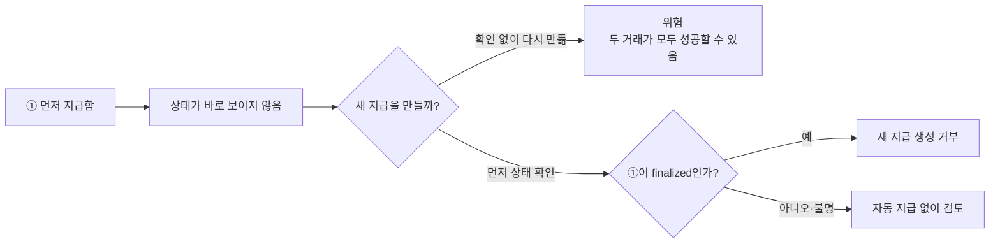
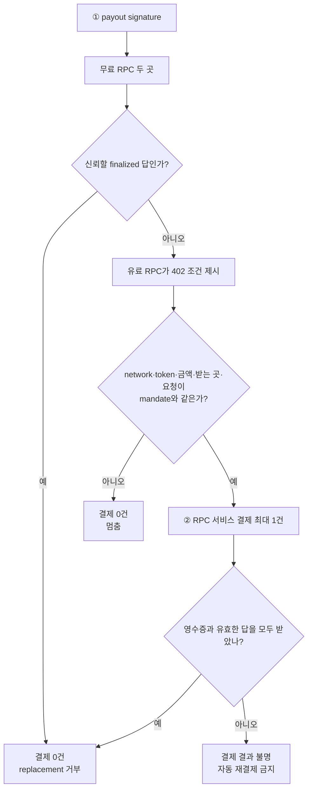
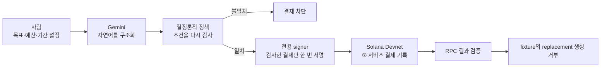
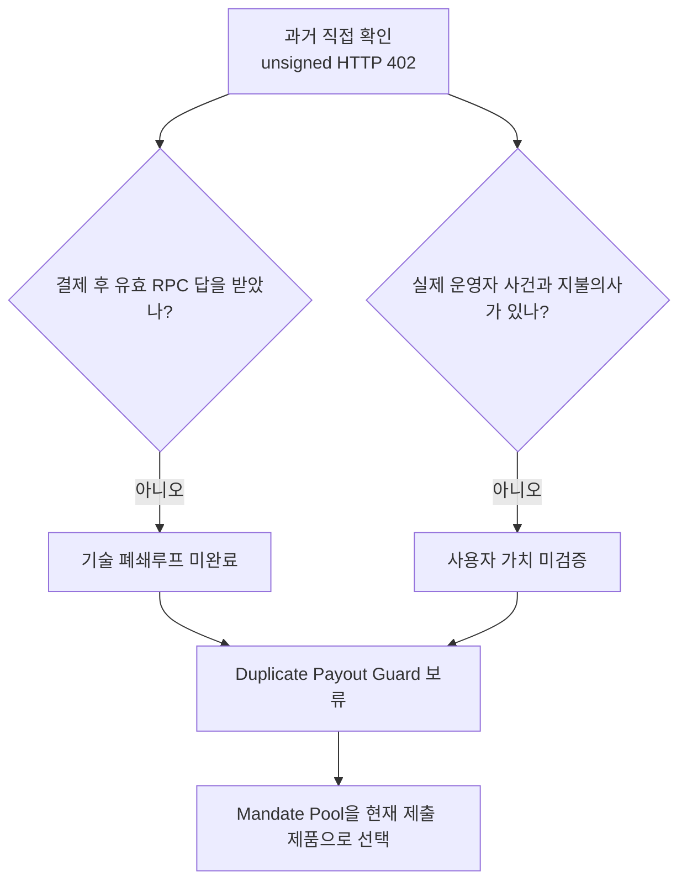
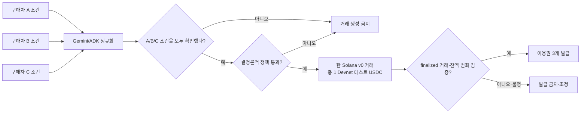
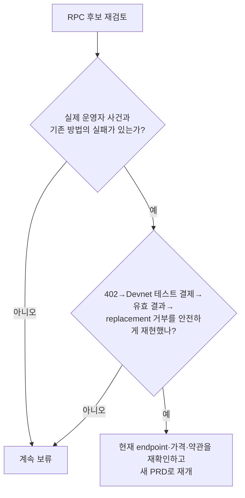

# Duplicate Payout Guard — 그림으로 읽는 보류안

- 한 문장: **먼저 보낸 돈의 상태를 확인해 같은 지급을 두 번 만드는 실수를 막는 아이디어다.**
- 현재 상태: 이 아이디어는 구현 제품이 아니라 **보류된 후보**다.
- 현재 제품: [Mandate Pool](../../product/mandate-pool/README.md). 세 구매자의 조건을 확인하고 총 1 Devnet 테스트 USDC를 한 거래로 공동 결제한다.
- 독자: 블록체인이나 x402를 처음 보는 사람, 아이디어 선택 이유를 검토하는 심사자.

이 문서는 과거 후보의 작동 원리와 보류 이유를 쉽게 설명한다. “이미 유료 RPC 결제와 재지급 차단을 성공했다”는 보고서가 아니다. 당시 저장소가 직접 확인한 범위는 unsigned HTTP 402 요구까지였다.

## 먼저 알아둘 말

| 말 | 쉬운 뜻 |
|---|---|
| Agent | 목표와 규칙을 받아 선택하고 실행하는 프로그램 |
| payout | 먼저 보낸 지급 |
| replacement payout | 먼저 보낸 돈이 안 갔다고 생각해 다시 만드는 지급 |
| RPC | Solana 상태를 물어보는 창구 |
| signature | 거래를 찾는 공개 확인 번호. 비밀번호가 아니다. |
| `finalized` | Solana가 거래를 최종 확정한 상태 |
| HTTP 402 | 서비스를 받기 전에 결제가 필요하다는 응답 |
| x402 | HTTP 402를 이용해 API 같은 디지털 자원을 건별 결제하는 방식 |
| mandate | Agent가 쓸 수 있는 금액·상대·기간을 적은 허가 범위 |
| Devnet | 금전 가치가 없는 테스트 토큰으로 연습하는 Solana 네트워크 |
| fixture | 실제 운영 상황과 구분해 표시한 데모용 상황 |
| reconciliation | 결제 결과가 불분명할 때 원장과 영수증을 대조하는 일 |

Circle은 testnet USDC가 금전 가치가 없고 실제 달러로 뒷받침되지 않는다고 명시한다. [Circle testnet 안내](https://developers.circle.com/stablecoins/usdc-contract-addresses)

## 1. 어떤 실수를 막으려 했나

급식비를 냈는데 학교 앱에 바로 표시되지 않는다고 생각해 보자. 확인 없이 다시 내면 두 번 낼 수 있다. 이 후보는 “다시 보내기” 전에 “먼저 보낸 돈이 확정됐는지 확인하기”를 제품의 한 가지 일로 잡았다.

Solana 공식 가이드는 최초 거래의 blockhash가 아직 유효한 동안 새 거래를 서명하면 둘 다 수락될 수 있으므로 재서명 전에 만료를 확인하라고 안내한다. 이 사실은 위험의 존재를 뒷받침하지만, 사람들이 유료 조회를 원한다는 증거는 아니다. [Solana 재시도 가이드](https://solana.com/developers/cookbook/transactions/retry)

## 2. Agent는 언제 돈을 쓰나

무료 확인이 먼저다. 무료로 충분하면 결제하지 않는다. 무료 결과가 사전 기준을 충족하지 못하고, 유료 조건이 사람이 미리 정한 mandate와 정확히 맞을 때만 유료 조회 한 건을 산다는 설계였다.

여기서 거래는 두 종류다.

- ①은 상태를 확인하려는 **기존 payout**이다.
- ②는 그 상태를 알려 주는 **RPC 서비스를 사는 결제**다.

두 signature를 혼동하면 데모도 안전 설명도 실패한다.

## 3. 사람과 AI는 무엇을 맡나

| 담당 | 맡는 일 | 맡지 않는 일 |
|---|---|---|
| 사람 | 최대 금액, network, token, payee, 만료를 먼저 정함 | 정상 범위의 provider 선택을 매번 승인 |
| Gemini | 사람의 문장에서 signature·기한·조건을 구조화 | 한도를 정하거나 지갑을 서명 |
| 정책 코드 | mandate와 실제 조건을 같은 입력이면 같은 결과로 검사 | LLM의 자신감을 결제 권한으로 사용 |
| signer | 정확히 검사된 메시지를 최대 한 번 서명 | 다른 금액·다른 받는 곳으로 바꿔 서명 |
| 사람의 사후 확인 | 결과 불명·분쟁을 조정 | 무결성 실패를 “그래도 승인”으로 우회 |

## 4. 왜 현재 제품이 되지 않았나

아이디어 설명이 그럴듯한 것과 제품이 검증된 것은 다르다.

보류 이유는 세 가지다.

1. HTTP 402는 가격표를 받았다는 뜻일 뿐 결제나 유료 결과의 성공이 아니다.
2. 유료 결과가 무료 결과보다 낫고 실제 업무를 바꾼다는 증거가 없었다.
3. 외부 RPC merchant의 가용성에 의존하면 해커톤 안에서 증거를 닫기 어렵다.

따라서 RPC 후보는 실패를 감추기 위해 fixture merchant를 핵심 증거로 쓰지 않고 보류했다.

## 5. 현재 Mandate Pool과 무엇이 다른가

Mandate Pool은 “세 사람의 서로 다른 조건을 하나의 공동 구매에서 모두 지킬 수 있는가?”를 증명한다.

| 비교 | RPC 보류안 | Mandate Pool |
|---|---|---|
| 한 문장 문제 | 먼저 보낸 돈을 확인해 중복 재지급을 막음 | 세 구매 조건을 보존하며 공동 구매 |
| 결제 대상 | 외부 RPC 조회 서비스 | 고정된 SignalDesk 이용권 fixture |
| 온체인 구조 | 서비스 결제 한 건 | A/B/C의 세 전송을 한 v0 거래에 묶음 |
| 외부 의존성 | 유료 endpoint fulfillment가 핵심 | 자체 catalog·정책·entitlement로 폐쇄루프 구성 |
| 현재 상태 | 보류 | 제출 제품 |

정상 데모 금액은 총 1 Devnet 테스트 USDC다. 정수 base unit을 잃지 않도록 A `0.333334`, B와 C는 각각 `0.333333`을 부담한다. 한 명의 cap이라도 부족하면 거래를 만들지 않는다.

## 6. 보류안에서 남긴 기술 원칙

제품은 바뀌었지만 다음 원칙은 Mandate Pool에 흡수됐다.

- LLM은 자연어를 구조화하고 후보를 제안하지만 결제 권한을 갖지 않는다.
- 사람의 승인은 canonical mandate hash와 만료에 묶는다.
- 정책 코드는 금액·상품·상대·만료를 다시 검사한다.
- 서명 전 실제 거래 원문을 독립 검증한다.
- 완전히 서명한 bytes를 저장한 뒤 동일 bytes만 재제출한다.
- 결과가 불명확하면 새 결제를 만들지 않고 `RECONCILIATION_REQUIRED`로 멈춘다.
- finalized 거래와 예상한 token 증감을 확인한 뒤에만 상품을 발급한다.

## 7. RPC 후보를 다시 열려면

UI나 발표 자료부터 만들지 않는다. 사용자 사건과 기술 폐쇄루프를 먼저 확보한다. 과거 [QuickNode probe](evidence/quicknode-x402-probe.md)는 당시 관측 기록일 뿐 현재 가용성의 보증이 아니다.

## 읽은 뒤 확인할 다섯 질문

1. 이 후보가 막으려던 실수는 무엇인가?
2. ① 기존 payout과 ② RPC 서비스 결제는 어떻게 다른가?
3. 언제 무료로 끝나고 언제 유료 조회를 사는가?
4. HTTP 402만으로 무엇을 주장할 수 없는가?
5. 현재 제출 제품은 무엇이며 정상 데모 금액은 얼마인가?

정답은 각각 `중복 재지급`, `조회 대상과 서비스 구매`, `무료 결과가 부족하고 mandate와 일치할 때만 구매`, `결제·fulfillment·사용자 가치`, `Mandate Pool과 총 1 Devnet 테스트 USDC`다.
